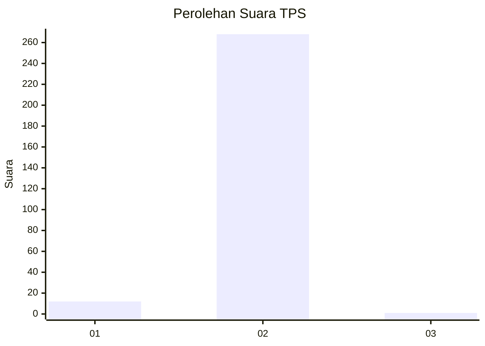
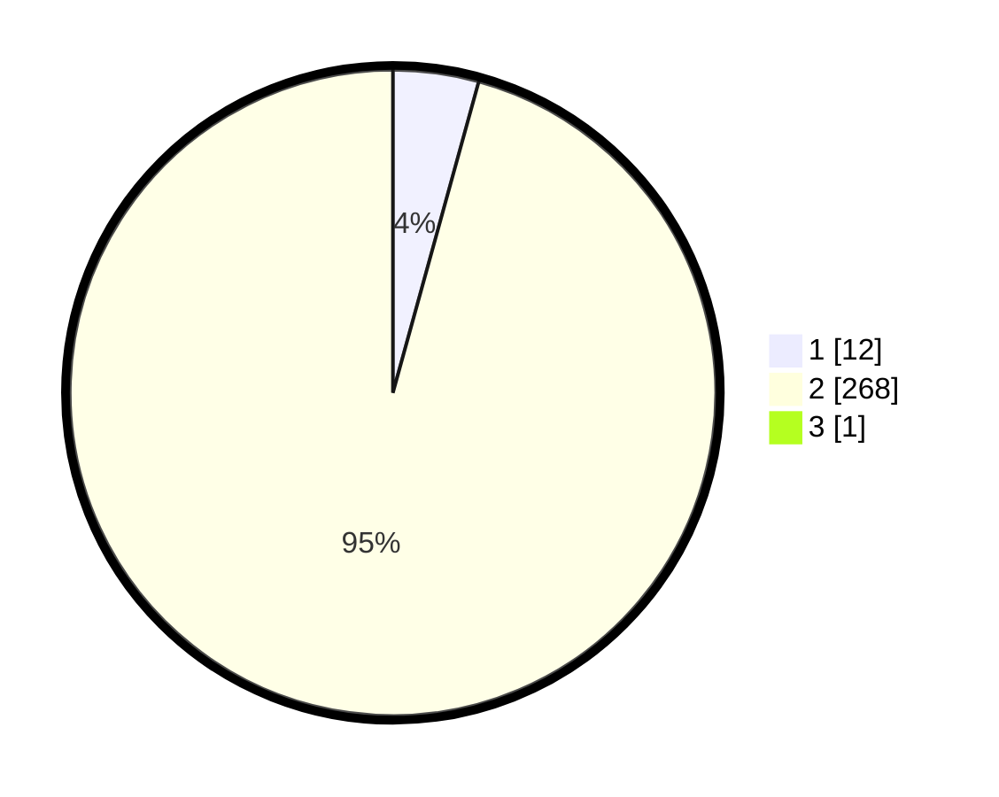

# Hasil

## Grafik

## Tabel

| No. | Nama Paslon    | Suara | Suara (raw) | Persentase |
|:--- |:-------------- | -----:| -----------:| ----------:|
| 1   | ANIES MUHAIMIN | 12    | [12][p-1]   | 4,27       |
| 2   | PRABOWO GIBRAN | 268   | [268][p-2]  | 95,37      |
| 3   | GANJAR MAHFUD  | 1     | [1][p-3]    | 0,36       |

[p-1]: https://github.com/gigit-pemilu/pemilu-2024/blob/main/pilpres/hitung-suara/sub/32-jawa-barat/sub/01-bogor/sub/05-babakan-madang/sub/2009-bojong-koneng/sub/034-tps/sub/paslon-1.txt
[p-2]: https://github.com/gigit-pemilu/pemilu-2024/blob/main/pilpres/hitung-suara/sub/32-jawa-barat/sub/01-bogor/sub/05-babakan-madang/sub/2009-bojong-koneng/sub/034-tps/sub/paslon-2.txt
[p-3]: https://github.com/gigit-pemilu/pemilu-2024/blob/main/pilpres/hitung-suara/sub/32-jawa-barat/sub/01-bogor/sub/05-babakan-madang/sub/2009-bojong-koneng/sub/034-tps/sub/paslon-3.txt

## Foto C Plano

https://sirekap-obj-formc.kpu.go.id/43a7/pemilu/ppwp/32/01/05/20/09/3201052009034-20240214-210132--57c6a9c4-bdc9-4af8-abed-b2599fe4f071.jpg

https://sirekap-obj-formc.kpu.go.id/43a7/pemilu/ppwp/32/01/05/20/09/3201052009034-20240214-210252--c6e4fbab-6985-427e-92e1-ecfbe6b57647.jpg

https://sirekap-obj-formc.kpu.go.id/43a7/pemilu/ppwp/32/01/05/20/09/3201052009034-20240214-210355--f8bac2f4-ab47-49dc-8681-96fe7a563d8d.jpg

## Metadata

| Key        | Value               |
| ---------- | ------------------- |
| Time Stamp | 2024-02-15 15:00:29 |

