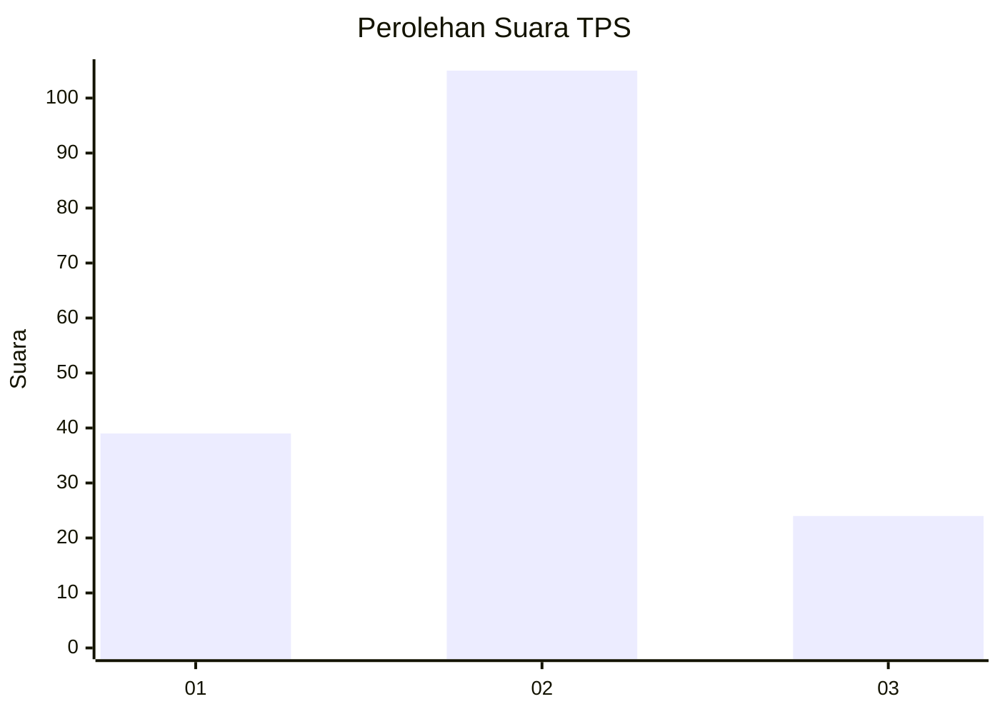
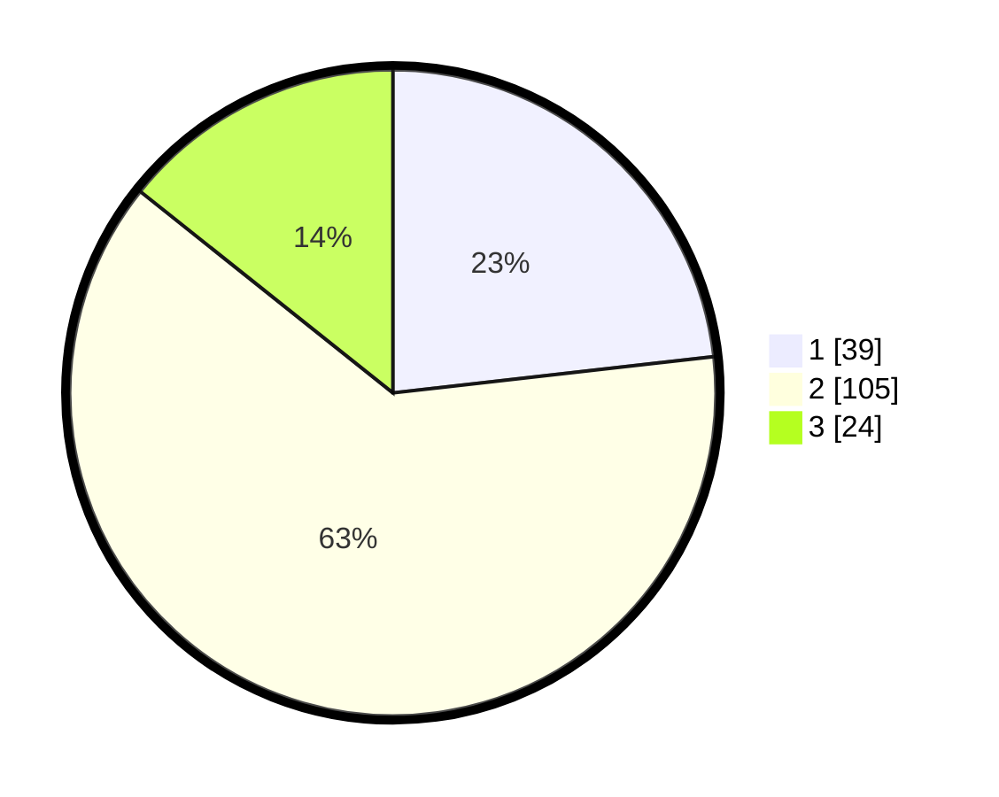

# Hasil

## Grafik

## Tabel

| No. | Nama Paslon    | Suara | Suara (raw) | Persentase |
|:--- |:-------------- | -----:| -----------:| ----------:|
| 1   | ANIES MUHAIMIN | 39    | [39][p-1]   | 23,21      |
| 2   | PRABOWO GIBRAN | 105   | [105][p-2]  | 62,50      |
| 3   | GANJAR MAHFUD  | 24    | [24][p-3]   | 14,29      |

[p-1]: https://github.com/gigit-pemilu/pemilu-2024/blob/main/pilpres/hitung-suara/sub/32-jawa-barat/sub/01-bogor/sub/06-jonggol/sub/2001-sukamaju/sub/006-tps/sub/paslon-1.txt
[p-2]: https://github.com/gigit-pemilu/pemilu-2024/blob/main/pilpres/hitung-suara/sub/32-jawa-barat/sub/01-bogor/sub/06-jonggol/sub/2001-sukamaju/sub/006-tps/sub/paslon-2.txt
[p-3]: https://github.com/gigit-pemilu/pemilu-2024/blob/main/pilpres/hitung-suara/sub/32-jawa-barat/sub/01-bogor/sub/06-jonggol/sub/2001-sukamaju/sub/006-tps/sub/paslon-3.txt

## Foto C Plano

https://sirekap-obj-formc.kpu.go.id/3e4a/pemilu/ppwp/32/01/06/20/01/3201062001006-20240214-211423--e16593b3-7f0e-4807-910d-c18beca2305f.jpg

https://sirekap-obj-formc.kpu.go.id/3e4a/pemilu/ppwp/32/01/06/20/01/3201062001006-20240214-204739--49aabb52-e9d0-4103-8faa-a57f3d651b2a.jpg

https://sirekap-obj-formc.kpu.go.id/3e4a/pemilu/ppwp/32/01/06/20/01/3201062001006-20240214-204911--62a62731-f29e-42f5-9136-0ff0fd0ae2c7.jpg

## Metadata

| Key        | Value               |
| ---------- | ------------------- |
| Time Stamp | 2024-02-15 16:00:26 |

