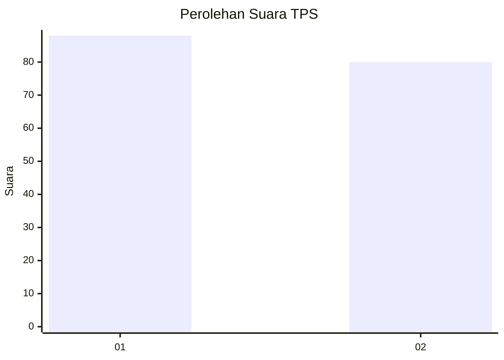
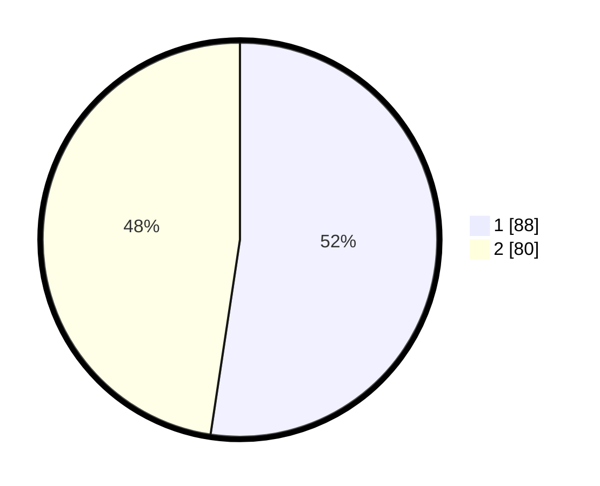

# Hasil

## Grafik

## Tabel

| No. | Nama Paslon    | Suara | Suara (raw) | Persentase |
|:--- |:-------------- | -----:| -----------:| ----------:|
| 1   | ANIES MUHAIMIN | 88    | [88][p-1]   | 52,38      |
| 2   | PRABOWO GIBRAN | 80    | [80][p-2]   | 47,62      |

[p-1]: https://github.com/gigit-pemilu/pemilu-2024-32-jawa-barat/blob/main/pilpres/hitung-suara/sub/32-jawa-barat/sub/01-bogor/sub/06-jonggol/sub/2001-sukamaju/sub/056-tps/sub/paslon-1.txt
[p-2]: https://github.com/gigit-pemilu/pemilu-2024-32-jawa-barat/blob/main/pilpres/hitung-suara/sub/32-jawa-barat/sub/01-bogor/sub/06-jonggol/sub/2001-sukamaju/sub/056-tps/sub/paslon-2.txt
[p-3]: https://github.com/gigit-pemilu/pemilu-2024-32-jawa-barat/blob/main/pilpres/hitung-suara/sub/32-jawa-barat/sub/01-bogor/sub/06-jonggol/sub/2001-sukamaju/sub/056-tps/sub/paslon-3.txt

## Foto C Plano

https://sirekap-obj-formc.kpu.go.id/305e/pemilu/ppwp/32/01/06/20/01/3201062001056-20240214-225738--39dee9e9-2bcb-4f8d-9297-c3f700a6aa4c.jpg

https://sirekap-obj-formc.kpu.go.id/305e/pemilu/ppwp/32/01/06/20/01/3201062001056-20240214-225636--c7ae93b2-3b38-4c16-a30d-766b7a95c1ae.jpg

https://sirekap-obj-formc.kpu.go.id/305e/pemilu/ppwp/32/01/06/20/01/3201062001056-20240214-225533--09c6e362-2bd9-48ca-858f-e08125186ad0.jpg

## Metadata

| Key        | Value               |
| ---------- | ------------------- |
| Time Stamp | 2024-02-24 22:31:28 |

