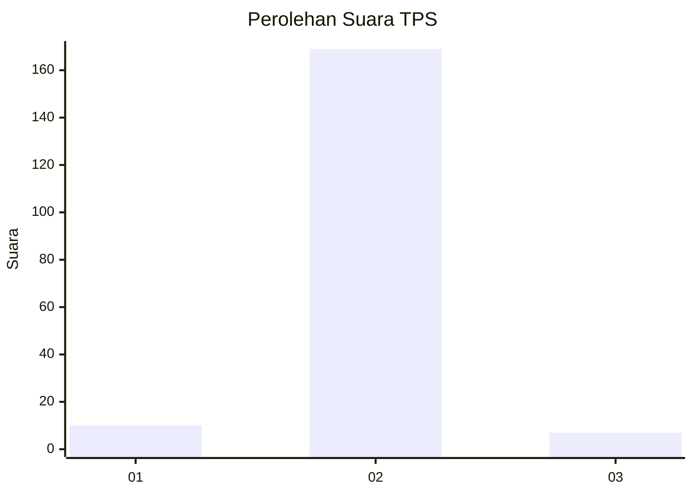
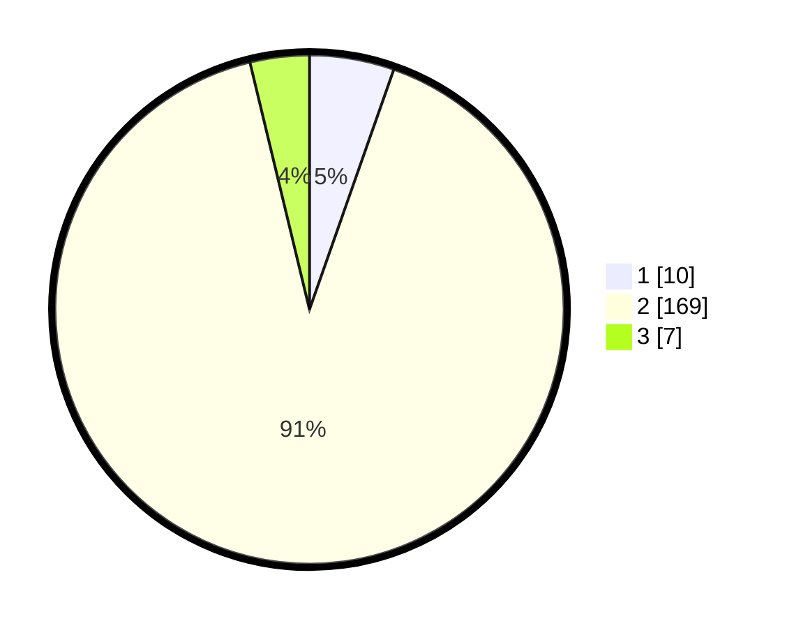

# Hasil

## Grafik

## Tabel

| No. | Nama Paslon    | Suara | Suara (raw) | Persentase |
|:--- |:-------------- | -----:| -----------:| ----------:|
| 1   | ANIES MUHAIMIN | 10    | [10][p-1]   | 5,38       |
| 2   | PRABOWO GIBRAN | 169   | [169][p-2]  | 90,86      |
| 3   | GANJAR MAHFUD  | 7     | [7][p-3]    | 3,76       |

[p-1]: https://github.com/gigit-pemilu/pemilu-2024/blob/main/pilpres/hitung-suara/sub/32-jawa-barat/sub/01-bogor/sub/06-jonggol/sub/2010-bendungan/sub/005-tps/sub/paslon-1.txt
[p-2]: https://github.com/gigit-pemilu/pemilu-2024/blob/main/pilpres/hitung-suara/sub/32-jawa-barat/sub/01-bogor/sub/06-jonggol/sub/2010-bendungan/sub/005-tps/sub/paslon-2.txt
[p-3]: https://github.com/gigit-pemilu/pemilu-2024/blob/main/pilpres/hitung-suara/sub/32-jawa-barat/sub/01-bogor/sub/06-jonggol/sub/2010-bendungan/sub/005-tps/sub/paslon-3.txt

## Foto C Plano

https://sirekap-obj-formc.kpu.go.id/1161/pemilu/ppwp/32/01/06/20/10/3201062010005-20240215-163358--6ba955d1-fcef-4b0f-9a7b-bf3e817c9227.jpg

https://sirekap-obj-formc.kpu.go.id/1161/pemilu/ppwp/32/01/06/20/10/3201062010005-20240215-164434--2c0704c0-f4cd-40c3-a06b-b6a1401c87dc.jpg

https://sirekap-obj-formc.kpu.go.id/1161/pemilu/ppwp/32/01/06/20/10/3201062010005-20240215-164627--775927e9-6a13-4624-9ff3-08fe7909cc3e.jpg

## Metadata

| Key        | Value               |
| ---------- | ------------------- |
| Time Stamp | 2024-02-15 22:30:27 |

