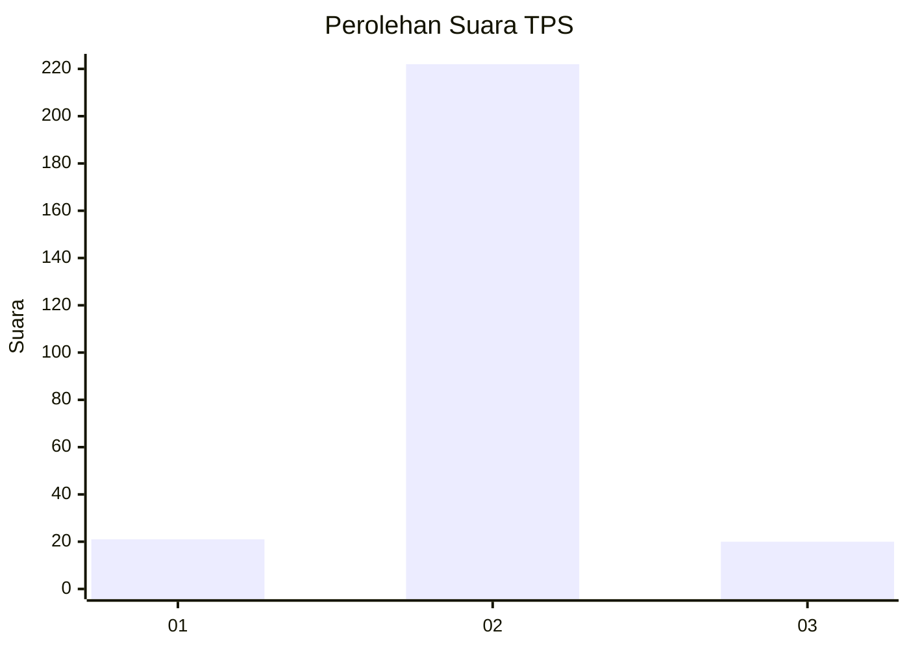
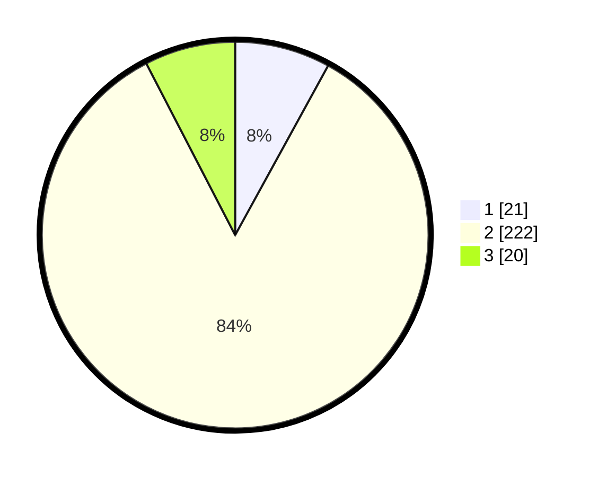

# Hasil

## Grafik

## Tabel

| No. | Nama Paslon    | Suara | Suara (raw) | Persentase |
|:--- |:-------------- | -----:| -----------:| ----------:|
| 1   | ANIES MUHAIMIN | 21    | [21][p-1]   | 7,98       |
| 2   | PRABOWO GIBRAN | 222   | [222][p-2]  | 84,41      |
| 3   | GANJAR MAHFUD  | 20    | [20][p-3]   | 7,60       |

[p-1]: https://github.com/gigit-pemilu/pemilu-2024/blob/main/pilpres/hitung-suara/sub/32-jawa-barat/sub/01-bogor/sub/06-jonggol/sub/2012-balekambang/sub/024-tps/sub/paslon-1.txt
[p-2]: https://github.com/gigit-pemilu/pemilu-2024/blob/main/pilpres/hitung-suara/sub/32-jawa-barat/sub/01-bogor/sub/06-jonggol/sub/2012-balekambang/sub/024-tps/sub/paslon-2.txt
[p-3]: https://github.com/gigit-pemilu/pemilu-2024/blob/main/pilpres/hitung-suara/sub/32-jawa-barat/sub/01-bogor/sub/06-jonggol/sub/2012-balekambang/sub/024-tps/sub/paslon-3.txt

## Foto C Plano

https://sirekap-obj-formc.kpu.go.id/f678/pemilu/ppwp/32/01/06/20/12/3201062012024-20240215-023800--cb47085c-48fd-4643-aed0-1614fb2f60a6.jpg

https://sirekap-obj-formc.kpu.go.id/f678/pemilu/ppwp/32/01/06/20/12/3201062012024-20240215-023851--fcd00f6f-4291-4fd7-9dc2-b542be999a37.jpg

https://sirekap-obj-formc.kpu.go.id/f678/pemilu/ppwp/32/01/06/20/12/3201062012024-20240215-023947--cea503f1-51cf-4226-819a-852489b26087.jpg

## Metadata

| Key        | Value               |
| ---------- | ------------------- |
| Time Stamp | 2024-02-16 16:25:10 |

