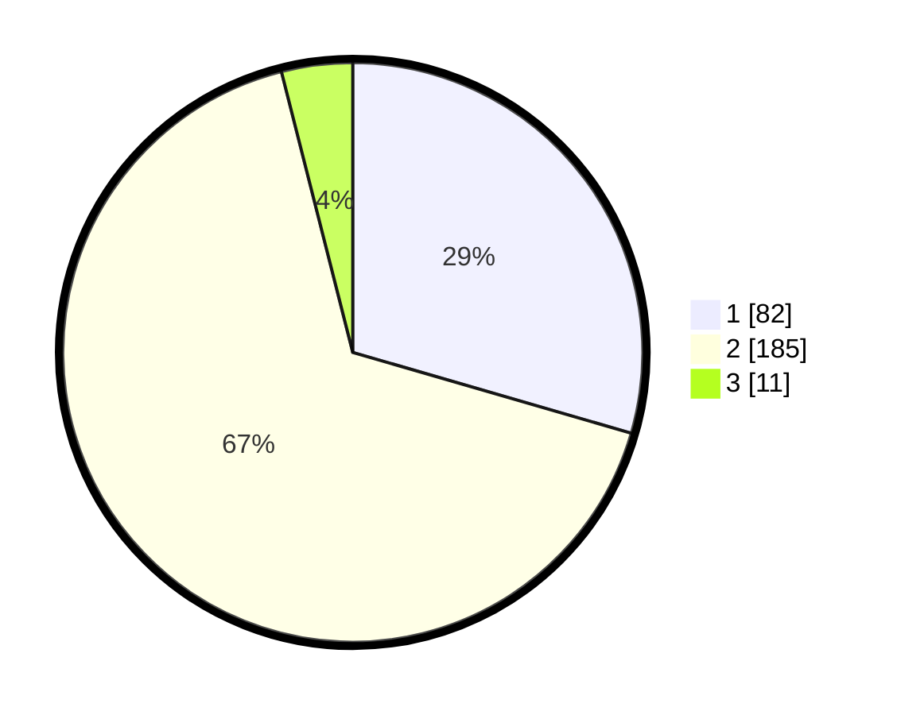

# Hasil

## Grafik

## Tabel

| No. | Nama Paslon    | Suara | Suara (raw) | Persentase |
|:--- |:-------------- | -----:| -----------:| ----------:|
| 1   | ANIES MUHAIMIN | 82    | [82][p-1]   | 29,50      |
| 2   | PRABOWO GIBRAN | 185   | [185][p-2]  | 66,55      |
| 3   | GANJAR MAHFUD  | 11    | [11][p-3]   | 3,96       |

[p-1]: https://github.com/gigit-pemilu/pemilu-2024/blob/main/pilpres/hitung-suara/sub/32-jawa-barat/sub/01-bogor/sub/07-cileungsi/sub/2002-mekarsari/sub/017-tps/sub/paslon-1.txt
[p-2]: https://github.com/gigit-pemilu/pemilu-2024/blob/main/pilpres/hitung-suara/sub/32-jawa-barat/sub/01-bogor/sub/07-cileungsi/sub/2002-mekarsari/sub/017-tps/sub/paslon-2.txt
[p-3]: https://github.com/gigit-pemilu/pemilu-2024/blob/main/pilpres/hitung-suara/sub/32-jawa-barat/sub/01-bogor/sub/07-cileungsi/sub/2002-mekarsari/sub/017-tps/sub/paslon-3.txt

## Foto C Plano

https://sirekap-obj-formc.kpu.go.id/35a3/pemilu/ppwp/32/01/07/20/02/3201072002017-20240214-205057--ff70ee64-8689-4e32-9f24-f6819735ec4e.jpg

https://sirekap-obj-formc.kpu.go.id/35a3/pemilu/ppwp/32/01/07/20/02/3201072002017-20240214-205403--9eabd113-1873-4f5c-a219-e996064bab0e.jpg

https://sirekap-obj-formc.kpu.go.id/35a3/pemilu/ppwp/32/01/07/20/02/3201072002017-20240214-211233--16914161-3cc2-4820-b33f-3382382e8ee7.jpg

## Metadata

| Key        | Value               |
| ---------- | ------------------- |
| Time Stamp | 2024-02-16 12:51:22 |

