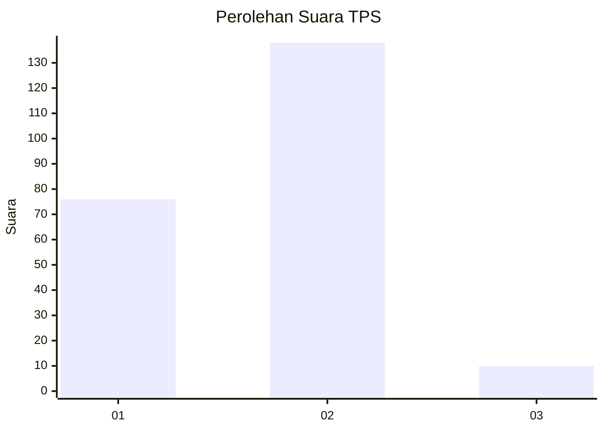
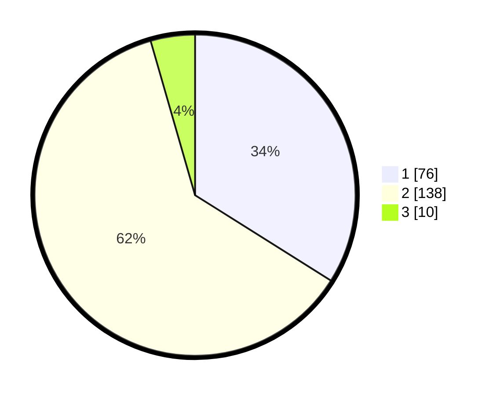

# Hasil

## Grafik

## Tabel

| No. | Nama Paslon    | Suara | Suara (raw) | Persentase |
|:--- |:-------------- | -----:| -----------:| ----------:|
| 1   | ANIES MUHAIMIN | 76    | [76][p-1]   | 33,93      |
| 2   | PRABOWO GIBRAN | 138   | [138][p-2]  | 61,61      |
| 3   | GANJAR MAHFUD  | 10    | [10][p-3]   | 4,46       |

[p-1]: https://github.com/gigit-pemilu/pemilu-2024/blob/main/pilpres/hitung-suara/sub/32-jawa-barat/sub/01-bogor/sub/08-cariu/sub/2001-karyamekar/sub/003-tps/sub/paslon-1.txt
[p-2]: https://github.com/gigit-pemilu/pemilu-2024/blob/main/pilpres/hitung-suara/sub/32-jawa-barat/sub/01-bogor/sub/08-cariu/sub/2001-karyamekar/sub/003-tps/sub/paslon-2.txt
[p-3]: https://github.com/gigit-pemilu/pemilu-2024/blob/main/pilpres/hitung-suara/sub/32-jawa-barat/sub/01-bogor/sub/08-cariu/sub/2001-karyamekar/sub/003-tps/sub/paslon-3.txt

## Foto C Plano

https://sirekap-obj-formc.kpu.go.id/11a8/pemilu/ppwp/32/01/08/20/01/3201082001003-20240215-050327--090c808f-bcf1-4953-a2cd-fe9a870987f0.jpg

https://sirekap-obj-formc.kpu.go.id/11a8/pemilu/ppwp/32/01/08/20/01/3201082001003-20240216-141136--3585e6ac-6f93-49f8-9e1a-e7224130b309.jpg

https://sirekap-obj-formc.kpu.go.id/11a8/pemilu/ppwp/32/01/08/20/01/3201082001003-20240214-210843--08e0f448-214d-49ee-a34d-a2c0df673228.jpg

## Metadata

| Key        | Value               |
| ---------- | ------------------- |
| Time Stamp | 2024-02-16 16:25:10 |

