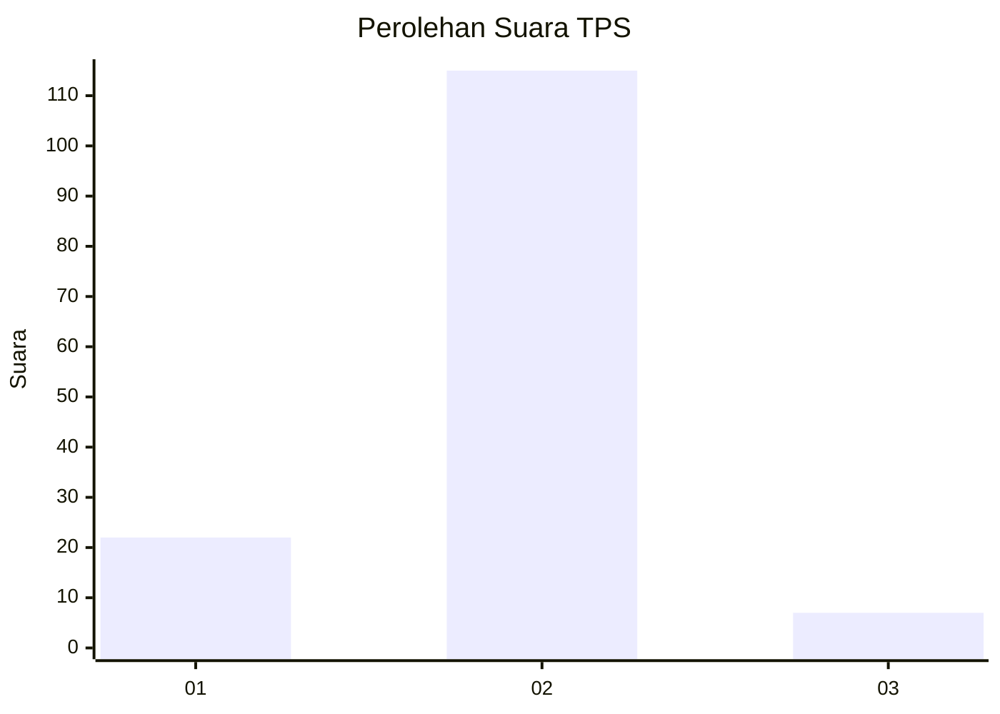
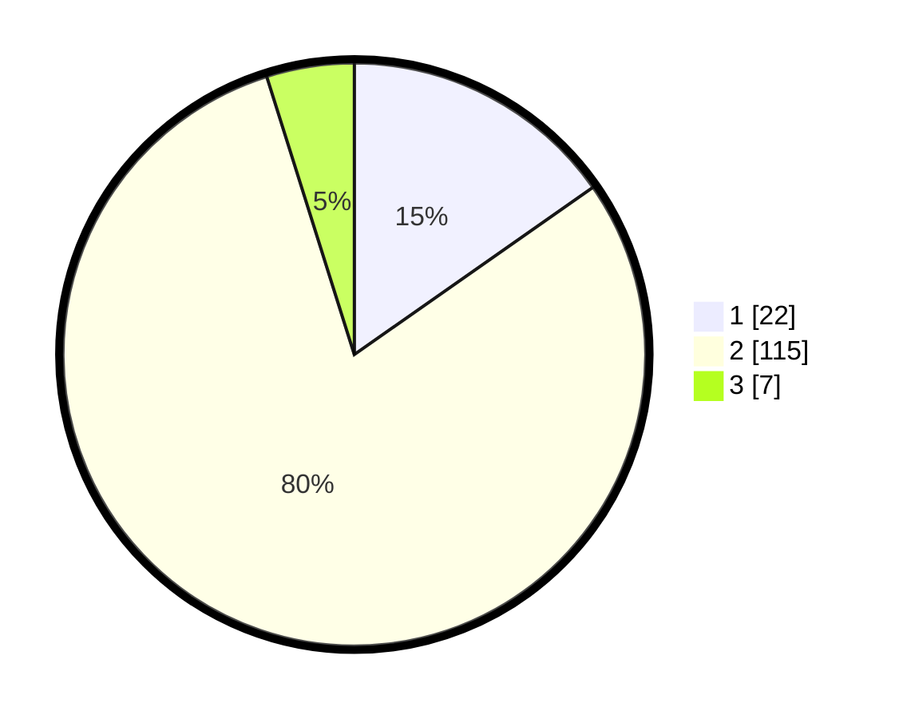

# Hasil

## Grafik

## Tabel

| No. | Nama Paslon    | Suara | Suara (raw) | Persentase |
|:--- |:-------------- | -----:| -----------:| ----------:|
| 1   | ANIES MUHAIMIN | 22    | [22][p-1]   | 15,28      |
| 2   | PRABOWO GIBRAN | 115   | [115][p-2]  | 79,86      |
| 3   | GANJAR MAHFUD  | 7     | [7][p-3]    | 4,86       |

[p-1]: https://github.com/gigit-pemilu/pemilu-2024/blob/main/pilpres/hitung-suara/sub/32-jawa-barat/sub/01-bogor/sub/08-cariu/sub/2001-karyamekar/sub/006-tps/sub/paslon-1.txt
[p-2]: https://github.com/gigit-pemilu/pemilu-2024/blob/main/pilpres/hitung-suara/sub/32-jawa-barat/sub/01-bogor/sub/08-cariu/sub/2001-karyamekar/sub/006-tps/sub/paslon-2.txt
[p-3]: https://github.com/gigit-pemilu/pemilu-2024/blob/main/pilpres/hitung-suara/sub/32-jawa-barat/sub/01-bogor/sub/08-cariu/sub/2001-karyamekar/sub/006-tps/sub/paslon-3.txt

## Foto C Plano

https://sirekap-obj-formc.kpu.go.id/a14c/pemilu/ppwp/32/01/08/20/01/3201082001006-20240215-103407--0f6bacf8-b723-43fb-88b4-5b4ce8634907.jpg

https://sirekap-obj-formc.kpu.go.id/a14c/pemilu/ppwp/32/01/08/20/01/3201082001006-20240215-103859--fb08c123-28ae-4285-8dbe-cdb9ed3e8f30.jpg

https://sirekap-obj-formc.kpu.go.id/a14c/pemilu/ppwp/32/01/08/20/01/3201082001006-20240215-104009--fd14628e-f0bf-4cbb-a39b-959e5f8a823a.jpg

## Metadata

| Key        | Value               |
| ---------- | ------------------- |
| Time Stamp | 2024-02-15 22:00:27 |

