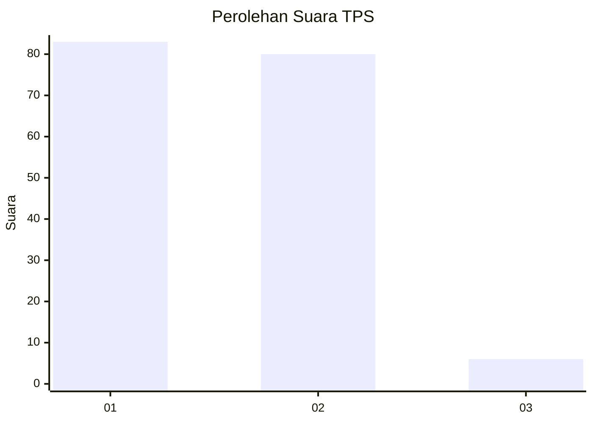
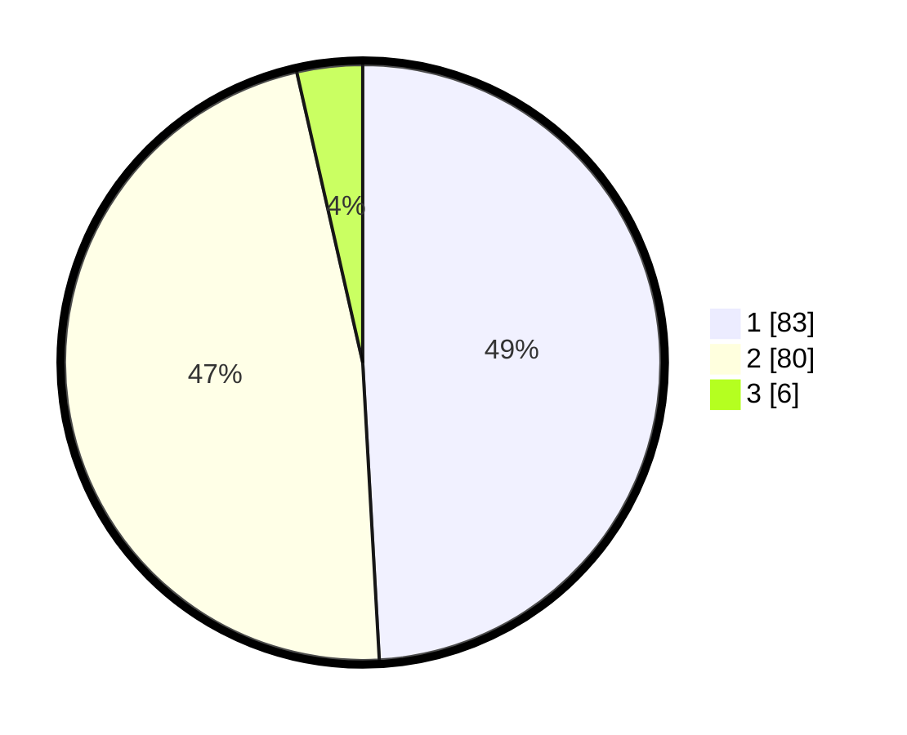

# Hasil

## Grafik

## Tabel

| No. | Nama Paslon    | Suara | Suara (raw) | Persentase |
|:--- |:-------------- | -----:| -----------:| ----------:|
| 1   | ANIES MUHAIMIN | 83    | [83][p-1]   | 49,11      |
| 2   | PRABOWO GIBRAN | 80    | [80][p-2]   | 47,34      |
| 3   | GANJAR MAHFUD  | 6     | [6][p-3]    | 3,55       |

[p-1]: https://github.com/gigit-pemilu/pemilu-2024-32-jawa-barat/blob/main/pilpres/hitung-suara/sub/32-jawa-barat/sub/01-bogor/sub/10-parung/sub/2001-parung/sub/001-tps/sub/paslon-1.txt
[p-2]: https://github.com/gigit-pemilu/pemilu-2024-32-jawa-barat/blob/main/pilpres/hitung-suara/sub/32-jawa-barat/sub/01-bogor/sub/10-parung/sub/2001-parung/sub/001-tps/sub/paslon-2.txt
[p-3]: https://github.com/gigit-pemilu/pemilu-2024-32-jawa-barat/blob/main/pilpres/hitung-suara/sub/32-jawa-barat/sub/01-bogor/sub/10-parung/sub/2001-parung/sub/001-tps/sub/paslon-3.txt

## Foto C Plano

https://sirekap-obj-formc.kpu.go.id/bce3/pemilu/ppwp/32/01/10/20/01/3201102001001-20240218-201339--afb21564-d58e-40fb-8590-90a3b7fe50a7.jpg

https://sirekap-obj-formc.kpu.go.id/bce3/pemilu/ppwp/32/01/10/20/01/3201102001001-20240218-200752--41db0ae9-0d1d-40db-ac26-a50242774e83.jpg

https://sirekap-obj-formc.kpu.go.id/bce3/pemilu/ppwp/32/01/10/20/01/3201102001001-20240218-201018--20857861-24bd-4b20-a559-359c42aa39d5.jpg

## Metadata

| Key        | Value               |
| ---------- | ------------------- |
| Time Stamp | 2024-02-20 11:00:00 |

