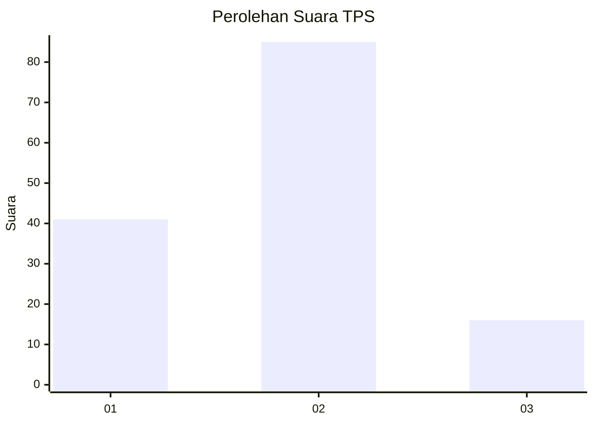
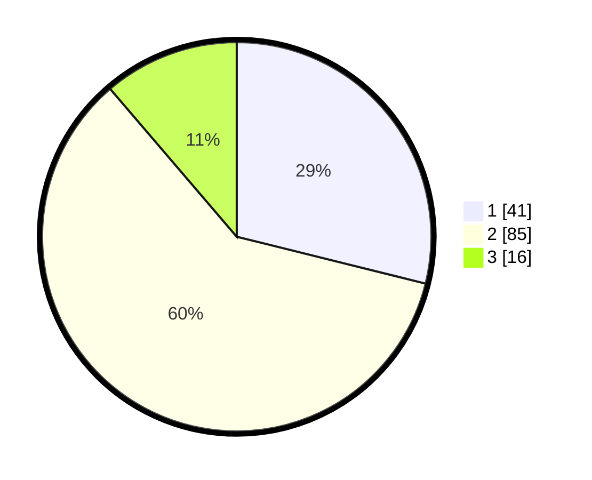

# Hasil

## Grafik

## Tabel

| No. | Nama Paslon    | Suara | Suara (raw) | Persentase |
|:--- |:-------------- | -----:| -----------:| ----------:|
| 1   | ANIES MUHAIMIN | 41    | [41][p-1]   | 28,87      |
| 2   | PRABOWO GIBRAN | 85    | [85][p-2]   | 59,86      |
| 3   | GANJAR MAHFUD  | 16    | [16][p-3]   | 11,27      |

[p-1]: https://github.com/gigit-pemilu/pemilu-2024-32-jawa-barat/blob/main/pilpres/hitung-suara/sub/32-jawa-barat/sub/01-bogor/sub/10-parung/sub/2001-parung/sub/006-tps/sub/paslon-1.txt
[p-2]: https://github.com/gigit-pemilu/pemilu-2024-32-jawa-barat/blob/main/pilpres/hitung-suara/sub/32-jawa-barat/sub/01-bogor/sub/10-parung/sub/2001-parung/sub/006-tps/sub/paslon-2.txt
[p-3]: https://github.com/gigit-pemilu/pemilu-2024-32-jawa-barat/blob/main/pilpres/hitung-suara/sub/32-jawa-barat/sub/01-bogor/sub/10-parung/sub/2001-parung/sub/006-tps/sub/paslon-3.txt

## Foto C Plano

https://sirekap-obj-formc.kpu.go.id/f356/pemilu/ppwp/32/01/10/20/01/3201102001006-20240214-234053--e6427a7e-4c3a-4198-b955-37fb4b8be733.jpg

https://sirekap-obj-formc.kpu.go.id/f356/pemilu/ppwp/32/01/10/20/01/3201102001006-20240214-234203--da211064-7502-452b-8047-dd146c8f0a06.jpg

https://sirekap-obj-formc.kpu.go.id/f356/pemilu/ppwp/32/01/10/20/01/3201102001006-20240214-234328--7c5de1d9-b43a-41d4-8676-c44dfde9a80e.jpg

## Metadata

| Key        | Value               |
| ---------- | ------------------- |
| Time Stamp | 2024-02-16 03:30:26 |

