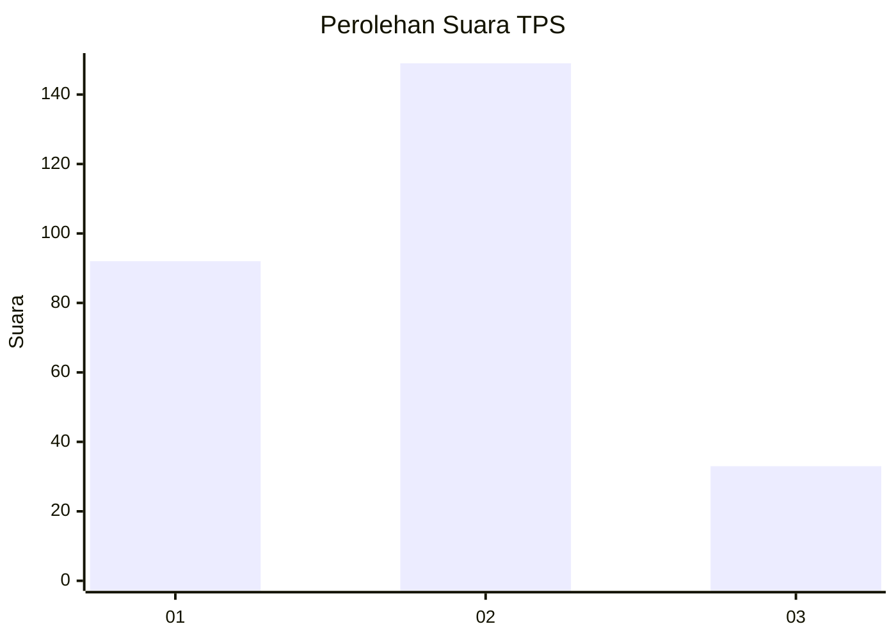
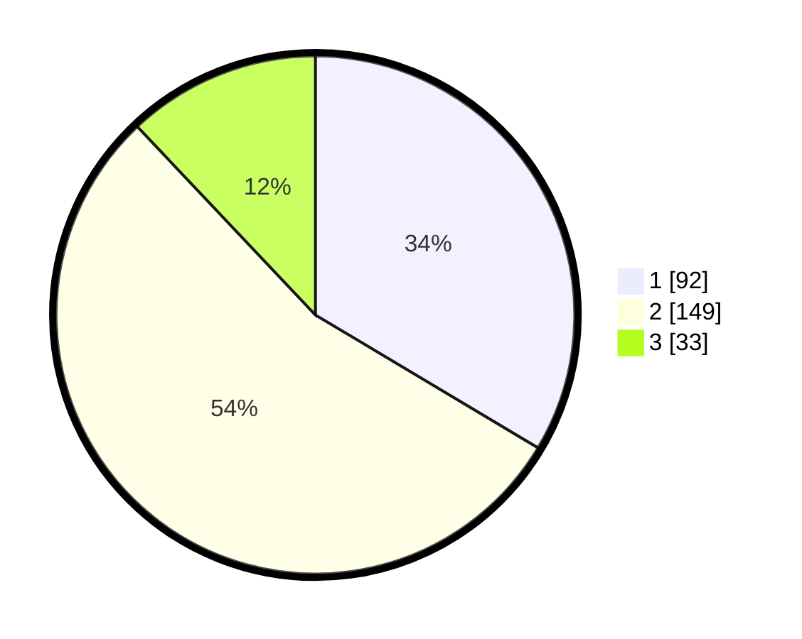

# Hasil

## Grafik

## Tabel

| No. | Nama Paslon    | Suara | Suara (raw) | Persentase |
|:--- |:-------------- | -----:| -----------:| ----------:|
| 1   | ANIES MUHAIMIN | 92    | [92][p-1]   | 33,58      |
| 2   | PRABOWO GIBRAN | 149   | [149][p-2]  | 54,38      |
| 3   | GANJAR MAHFUD  | 33    | [33][p-3]   | 12,04      |

[p-1]: https://github.com/gigit-pemilu/pemilu-2024/blob/main/pilpres/hitung-suara/sub/32-jawa-barat/sub/01-bogor/sub/10-parung/sub/2002-iwul/sub/008-tps/sub/paslon-1.txt
[p-2]: https://github.com/gigit-pemilu/pemilu-2024/blob/main/pilpres/hitung-suara/sub/32-jawa-barat/sub/01-bogor/sub/10-parung/sub/2002-iwul/sub/008-tps/sub/paslon-2.txt
[p-3]: https://github.com/gigit-pemilu/pemilu-2024/blob/main/pilpres/hitung-suara/sub/32-jawa-barat/sub/01-bogor/sub/10-parung/sub/2002-iwul/sub/008-tps/sub/paslon-3.txt

## Foto C Plano

https://sirekap-obj-formc.kpu.go.id/3573/pemilu/ppwp/32/01/10/20/02/3201102002008-20240214-232755--60ec7c21-fa68-40e0-932e-3ae4582e03fc.jpg

https://sirekap-obj-formc.kpu.go.id/3573/pemilu/ppwp/32/01/10/20/02/3201102002008-20240214-233052--aae3b513-6497-4dd8-9dac-ea054ac88cbf.jpg

https://sirekap-obj-formc.kpu.go.id/3573/pemilu/ppwp/32/01/10/20/02/3201102002008-20240214-233043--1fb93272-bdf9-4a72-871e-8ae1fee81b8a.jpg

## Metadata

| Key        | Value               |
| ---------- | ------------------- |
| Time Stamp | 2024-02-16 02:30:27 |

