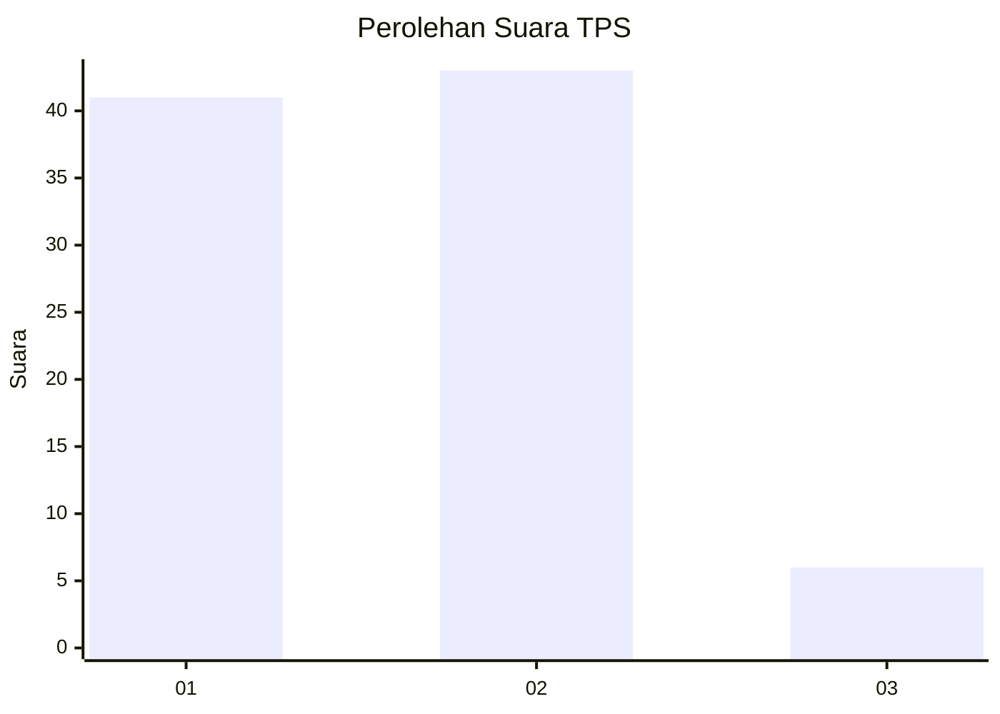
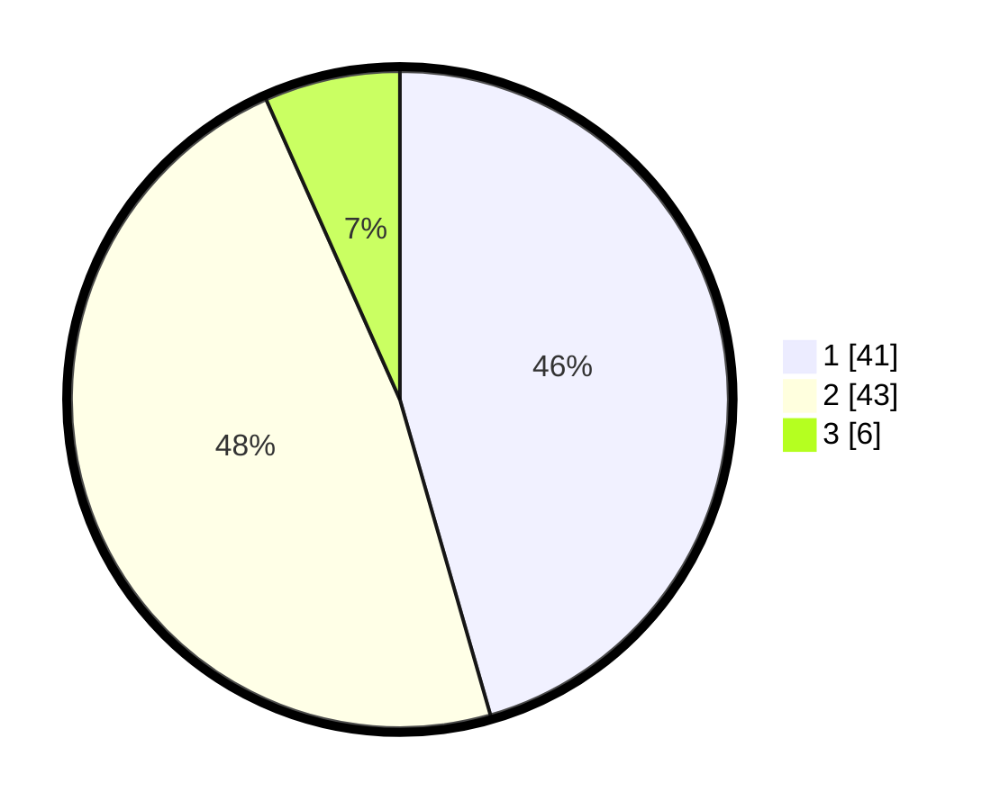

# Hasil

## Grafik

## Tabel

| No. | Nama Paslon    | Suara | Suara (raw) | Persentase |
|:--- |:-------------- | -----:| -----------:| ----------:|
| 1   | ANIES MUHAIMIN | 41    | [41][p-1]   | 45,56      |
| 2   | PRABOWO GIBRAN | 43    | [43][p-2]   | 47,78      |
| 3   | GANJAR MAHFUD  | 6     | [6][p-3]    | 6,67       |

[p-1]: https://github.com/gigit-pemilu/pemilu-2024/blob/main/pilpres/hitung-suara/sub/32-jawa-barat/sub/01-bogor/sub/10-parung/sub/2004-waru/sub/038-tps/sub/paslon-1.txt
[p-2]: https://github.com/gigit-pemilu/pemilu-2024/blob/main/pilpres/hitung-suara/sub/32-jawa-barat/sub/01-bogor/sub/10-parung/sub/2004-waru/sub/038-tps/sub/paslon-2.txt
[p-3]: https://github.com/gigit-pemilu/pemilu-2024/blob/main/pilpres/hitung-suara/sub/32-jawa-barat/sub/01-bogor/sub/10-parung/sub/2004-waru/sub/038-tps/sub/paslon-3.txt

## Foto C Plano

https://sirekap-obj-formc.kpu.go.id/f9a9/pemilu/ppwp/32/01/10/20/04/3201102004038-20240214-224913--f00861d4-151b-4643-bb14-8eabffe7d2c7.jpg

https://sirekap-obj-formc.kpu.go.id/f9a9/pemilu/ppwp/32/01/10/20/04/3201102004038-20240214-224820--b51f53dc-f86d-48d2-b66a-c189509b6d66.jpg

https://sirekap-obj-formc.kpu.go.id/f9a9/pemilu/ppwp/32/01/10/20/04/3201102004038-20240214-224848--5067c386-9fb3-4812-87aa-6213d318ec44.jpg

## Metadata

| Key        | Value               |
| ---------- | ------------------- |
| Time Stamp | 2024-02-16 03:00:26 |

