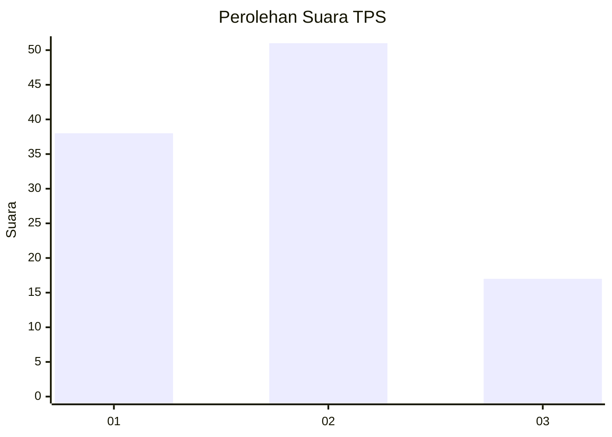
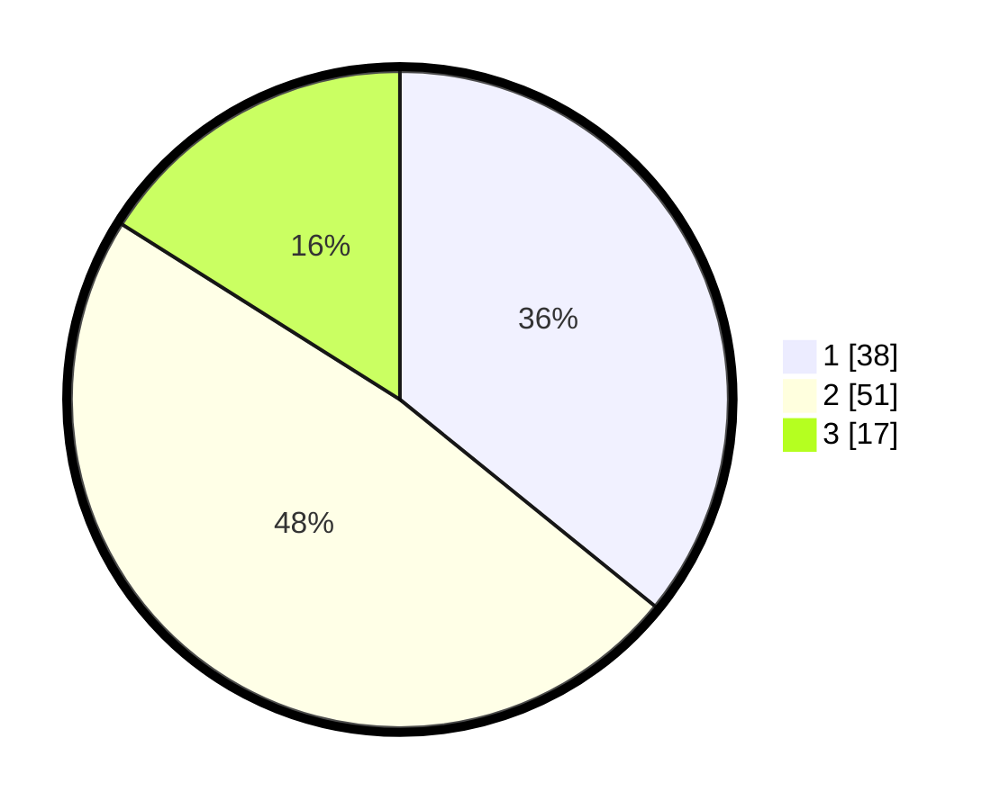

# Hasil

## Grafik

## Tabel

| No. | Nama Paslon    | Suara | Suara (raw) | Persentase |
|:--- |:-------------- | -----:| -----------:| ----------:|
| 1   | ANIES MUHAIMIN | 38    | [38][p-1]   | 35,85      |
| 2   | PRABOWO GIBRAN | 51    | [51][p-2]   | 48,11      |
| 3   | GANJAR MAHFUD  | 17    | [17][p-3]   | 16,04      |

[p-1]: https://github.com/gigit-pemilu/pemilu-2024-32-jawa-barat/blob/main/pilpres/hitung-suara/sub/32-jawa-barat/sub/01-bogor/sub/10-parung/sub/2004-waru/sub/052-tps/sub/paslon-1.txt
[p-2]: https://github.com/gigit-pemilu/pemilu-2024-32-jawa-barat/blob/main/pilpres/hitung-suara/sub/32-jawa-barat/sub/01-bogor/sub/10-parung/sub/2004-waru/sub/052-tps/sub/paslon-2.txt
[p-3]: https://github.com/gigit-pemilu/pemilu-2024-32-jawa-barat/blob/main/pilpres/hitung-suara/sub/32-jawa-barat/sub/01-bogor/sub/10-parung/sub/2004-waru/sub/052-tps/sub/paslon-3.txt

## Foto C Plano

https://sirekap-obj-formc.kpu.go.id/b048/pemilu/ppwp/32/01/10/20/04/3201102004052-20240218-082748--fca71bcd-e931-4b2f-a02f-e0adc9b244f9.jpg

https://sirekap-obj-formc.kpu.go.id/b048/pemilu/ppwp/32/01/10/20/04/3201102004052-20240214-235301--8c492258-8c64-419a-acd4-6f7f6fdd5811.jpg

https://sirekap-obj-formc.kpu.go.id/b048/pemilu/ppwp/32/01/10/20/04/3201102004052-20240214-235634--75e03fb5-4309-4a2a-947a-d0bbd646f271.jpg

## Metadata

| Key        | Value               |
| ---------- | ------------------- |
| Time Stamp | 2024-02-19 06:16:00 |

