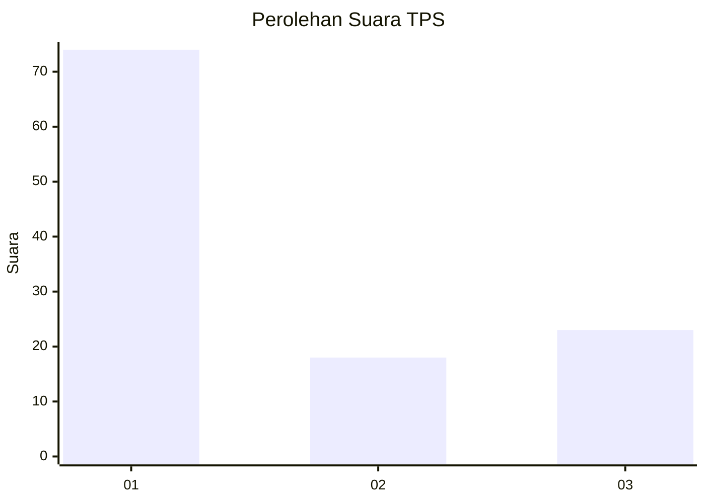
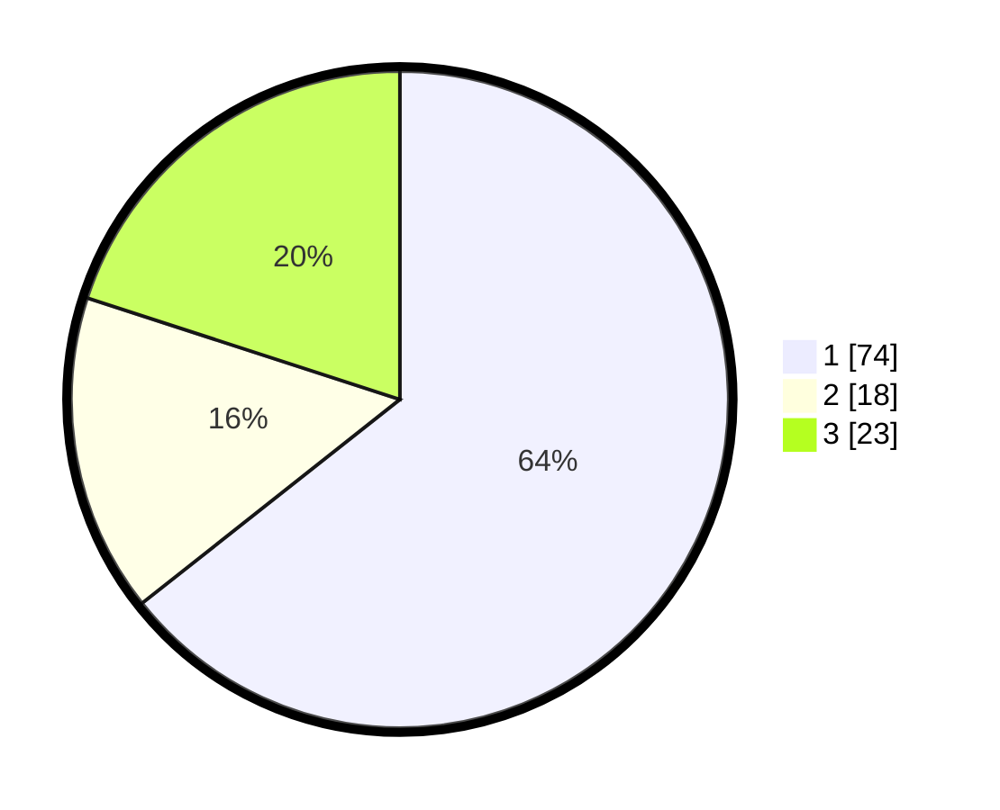

# Hasil

## Grafik

## Tabel

| No. | Nama Paslon    | Suara | Suara (raw) | Persentase |
|:--- |:-------------- | -----:| -----------:| ----------:|
| 1   | ANIES MUHAIMIN | 74    | [74][p-1]   | 64,35      |
| 2   | PRABOWO GIBRAN | 18    | [18][p-2]   | 15,65      |
| 3   | GANJAR MAHFUD  | 23    | [23][p-3]   | 20,00      |

[p-1]: https://github.com/gigit-pemilu/pemilu-2024-32-jawa-barat/blob/main/pilpres/hitung-suara/sub/32-jawa-barat/sub/01-bogor/sub/10-parung/sub/2006-pamegarsari/sub/002-tps/sub/paslon-1.txt
[p-2]: https://github.com/gigit-pemilu/pemilu-2024-32-jawa-barat/blob/main/pilpres/hitung-suara/sub/32-jawa-barat/sub/01-bogor/sub/10-parung/sub/2006-pamegarsari/sub/002-tps/sub/paslon-2.txt
[p-3]: https://github.com/gigit-pemilu/pemilu-2024-32-jawa-barat/blob/main/pilpres/hitung-suara/sub/32-jawa-barat/sub/01-bogor/sub/10-parung/sub/2006-pamegarsari/sub/002-tps/sub/paslon-3.txt

## Foto C Plano

https://sirekap-obj-formc.kpu.go.id/9531/pemilu/ppwp/32/01/10/20/06/3201102006002-20240219-083419--1147a5d1-c5c6-45c0-a28d-482eb806bc68.jpg

https://sirekap-obj-formc.kpu.go.id/9531/pemilu/ppwp/32/01/10/20/06/3201102006002-20240218-170325--1e2e4ab0-cc8d-428b-a027-990f892396ea.jpg

https://sirekap-obj-formc.kpu.go.id/9531/pemilu/ppwp/32/01/10/20/06/3201102006002-20240218-170451--5621d074-c865-4ea2-b169-aae98651fcc8.jpg

## Metadata

| Key        | Value               |
| ---------- | ------------------- |
| Time Stamp | 2024-02-20 13:00:00 |

