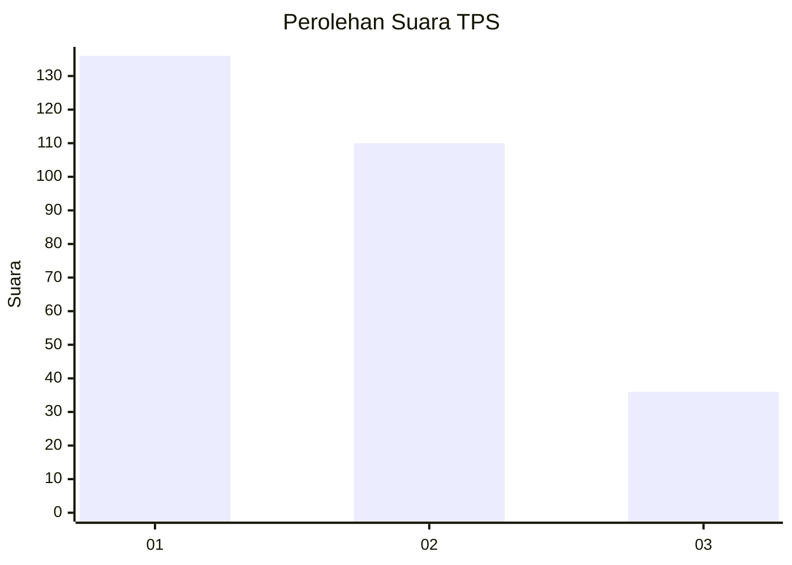
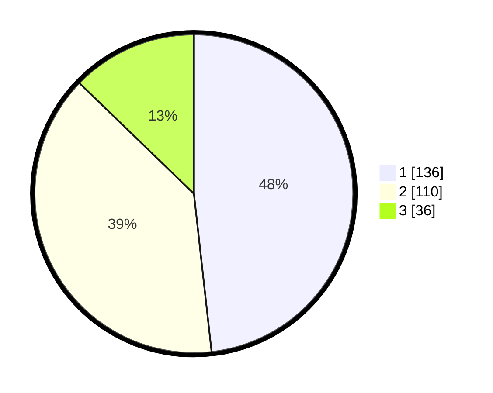

# Hasil

## Grafik

## Tabel

| No. | Nama Paslon    | Suara | Suara (raw) | Persentase |
|:--- |:-------------- | -----:| -----------:| ----------:|
| 1   | ANIES MUHAIMIN | 136   | [136][p-1]  | 48,23      |
| 2   | PRABOWO GIBRAN | 110   | [110][p-2]  | 39,01      |
| 3   | GANJAR MAHFUD  | 36    | [36][p-3]   | 12,77      |

[p-1]: https://github.com/gigit-pemilu/pemilu-2024-32-jawa-barat/blob/main/pilpres/hitung-suara/sub/32-jawa-barat/sub/01-bogor/sub/11-gunung-sindur/sub/2007-cibadung/sub/025-tps/sub/paslon-1.txt
[p-2]: https://github.com/gigit-pemilu/pemilu-2024-32-jawa-barat/blob/main/pilpres/hitung-suara/sub/32-jawa-barat/sub/01-bogor/sub/11-gunung-sindur/sub/2007-cibadung/sub/025-tps/sub/paslon-2.txt
[p-3]: https://github.com/gigit-pemilu/pemilu-2024-32-jawa-barat/blob/main/pilpres/hitung-suara/sub/32-jawa-barat/sub/01-bogor/sub/11-gunung-sindur/sub/2007-cibadung/sub/025-tps/sub/paslon-3.txt

## Foto C Plano

https://sirekap-obj-formc.kpu.go.id/25ff/pemilu/ppwp/32/01/11/20/07/3201112007025-20240214-230440--425e8079-47f1-4828-ab52-c917b27061fd.jpg

https://sirekap-obj-formc.kpu.go.id/25ff/pemilu/ppwp/32/01/11/20/07/3201112007025-20240214-230454--789811cb-ab7a-4a73-9f7b-9c5112888416.jpg

https://sirekap-obj-formc.kpu.go.id/25ff/pemilu/ppwp/32/01/11/20/07/3201112007025-20240214-230503--623e66f0-d28a-48d0-b59e-c881ecddfcb1.jpg

## Metadata

| Key        | Value               |
| ---------- | ------------------- |
| Time Stamp | 2024-02-16 16:25:10 |

