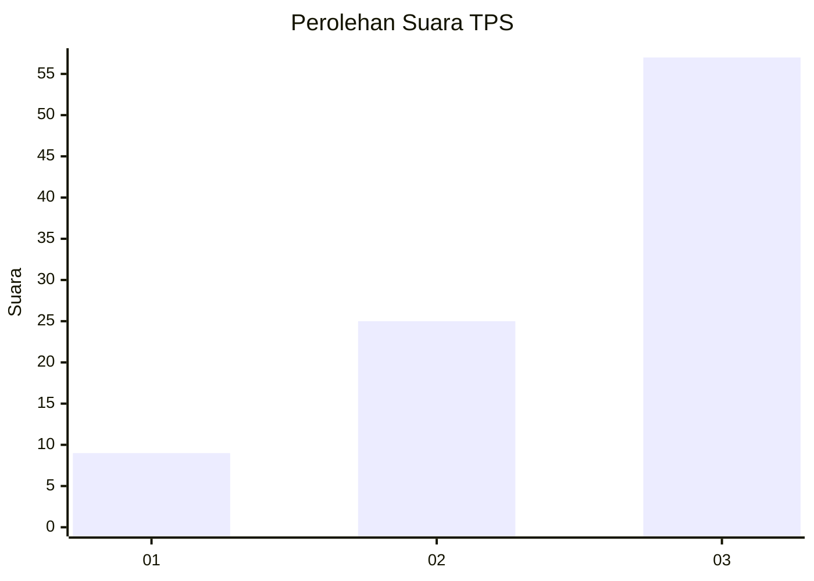
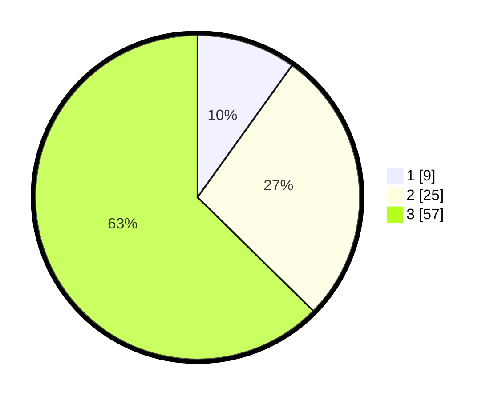

# Hasil

## Grafik

## Tabel

| No. | Nama Paslon    | Suara | Suara (raw) | Persentase |
|:--- |:-------------- | -----:| -----------:| ----------:|
| 1   | ANIES MUHAIMIN | 9     | [9][p-1]    | 9,89       |
| 2   | PRABOWO GIBRAN | 25    | [25][p-2]   | 27,47      |
| 3   | GANJAR MAHFUD  | 57    | [57][p-3]   | 62,64      |

[p-1]: https://github.com/gigit-pemilu/pemilu-2024/blob/main/pilpres/hitung-suara/sub/32-jawa-barat/sub/01-bogor/sub/11-gunung-sindur/sub/2008-cibinong/sub/908-tps/sub/paslon-1.txt
[p-2]: https://github.com/gigit-pemilu/pemilu-2024/blob/main/pilpres/hitung-suara/sub/32-jawa-barat/sub/01-bogor/sub/11-gunung-sindur/sub/2008-cibinong/sub/908-tps/sub/paslon-2.txt
[p-3]: https://github.com/gigit-pemilu/pemilu-2024/blob/main/pilpres/hitung-suara/sub/32-jawa-barat/sub/01-bogor/sub/11-gunung-sindur/sub/2008-cibinong/sub/908-tps/sub/paslon-3.txt

## Foto C Plano

https://sirekap-obj-formc.kpu.go.id/8481/pemilu/ppwp/32/01/11/20/08/3201112008908-20240214-201440--dba3cbe4-a87f-4f7e-988f-90afe75a7ed6.jpg

https://sirekap-obj-formc.kpu.go.id/8481/pemilu/ppwp/32/01/11/20/08/3201112008908-20240214-201445--bc296e1a-f0a8-436d-9a2d-e15cabcd443f.jpg

https://sirekap-obj-formc.kpu.go.id/8481/pemilu/ppwp/32/01/11/20/08/3201112008908-20240214-214220--8639fb2d-c7b8-4f45-bfe8-7318ecf079b3.jpg

## Metadata

| Key        | Value               |
| ---------- | ------------------- |
| Time Stamp | 2024-02-16 21:01:00 |

