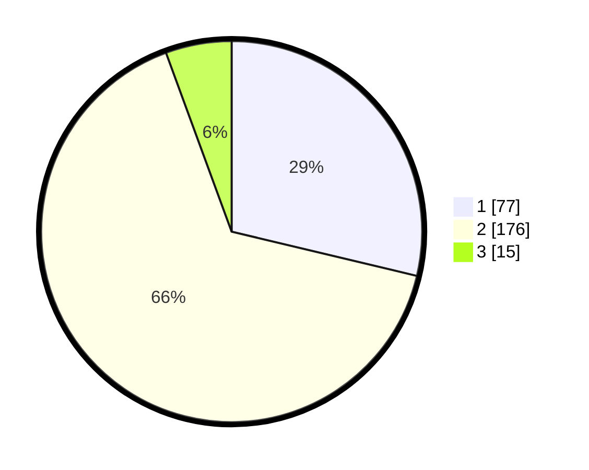

# Hasil

## Grafik

## Tabel

| No. | Nama Paslon    | Suara | Suara (raw) | Persentase |
|:--- |:-------------- | -----:| -----------:| ----------:|
| 1   | ANIES MUHAIMIN | 77    | [77][p-1]   | 28,73      |
| 2   | PRABOWO GIBRAN | 176   | [176][p-2]  | 65,67      |
| 3   | GANJAR MAHFUD  | 15    | [15][p-3]   | 5,60       |

[p-1]: https://github.com/gigit-pemilu/pemilu-2024/blob/main/pilpres/hitung-suara/sub/32-jawa-barat/sub/01-bogor/sub/12-kemang/sub/2005-semplak-barat/sub/004-tps/sub/paslon-1.txt
[p-2]: https://github.com/gigit-pemilu/pemilu-2024/blob/main/pilpres/hitung-suara/sub/32-jawa-barat/sub/01-bogor/sub/12-kemang/sub/2005-semplak-barat/sub/004-tps/sub/paslon-2.txt
[p-3]: https://github.com/gigit-pemilu/pemilu-2024/blob/main/pilpres/hitung-suara/sub/32-jawa-barat/sub/01-bogor/sub/12-kemang/sub/2005-semplak-barat/sub/004-tps/sub/paslon-3.txt

## Foto C Plano

https://sirekap-obj-formc.kpu.go.id/ac6c/pemilu/ppwp/32/01/12/20/05/3201122005004-20240214-204211--2ed2f301-660f-4940-9547-9cac53886ff2.jpg

https://sirekap-obj-formc.kpu.go.id/ac6c/pemilu/ppwp/32/01/12/20/05/3201122005004-20240214-204345--065ca403-b6f9-478b-9acc-1c795d3eb2f5.jpg

https://sirekap-obj-formc.kpu.go.id/ac6c/pemilu/ppwp/32/01/12/20/05/3201122005004-20240214-204505--eaa00274-4a19-4961-8ec5-debb83099093.jpg

## Metadata

| Key        | Value               |
| ---------- | ------------------- |
| Time Stamp | 2024-02-20 14:00:00 |

