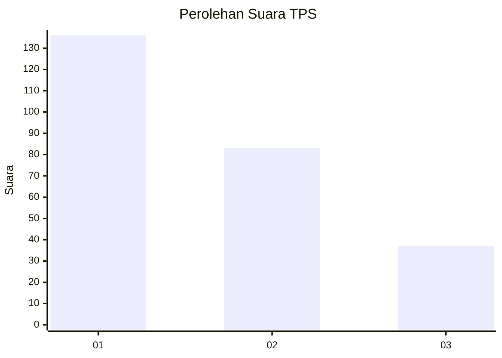
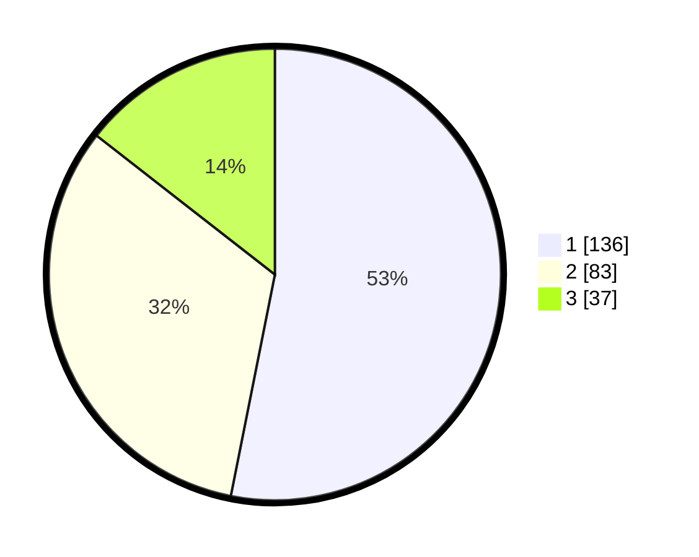

# Hasil

## Grafik

## Tabel

| No. | Nama Paslon    | Suara | Suara (raw) | Persentase |
|:--- |:-------------- | -----:| -----------:| ----------:|
| 1   | ANIES MUHAIMIN | 136   | [136][p-1]  | 53,13      |
| 2   | PRABOWO GIBRAN | 83    | [83][p-2]   | 32,42      |
| 3   | GANJAR MAHFUD  | 37    | [37][p-3]   | 14,45      |

[p-1]: https://github.com/gigit-pemilu/pemilu-2024/blob/main/pilpres/hitung-suara/sub/32-jawa-barat/sub/01-bogor/sub/12-kemang/sub/2007-jampang/sub/004-tps/sub/paslon-1.txt
[p-2]: https://github.com/gigit-pemilu/pemilu-2024/blob/main/pilpres/hitung-suara/sub/32-jawa-barat/sub/01-bogor/sub/12-kemang/sub/2007-jampang/sub/004-tps/sub/paslon-2.txt
[p-3]: https://github.com/gigit-pemilu/pemilu-2024/blob/main/pilpres/hitung-suara/sub/32-jawa-barat/sub/01-bogor/sub/12-kemang/sub/2007-jampang/sub/004-tps/sub/paslon-3.txt

## Foto C Plano

https://sirekap-obj-formc.kpu.go.id/bbc2/pemilu/ppwp/32/01/12/20/07/3201122007004-20240215-010610--e3cd6e9c-d8c3-470e-9c2b-348b1da3f1ac.jpg

https://sirekap-obj-formc.kpu.go.id/bbc2/pemilu/ppwp/32/01/12/20/07/3201122007004-20240214-141633--1c9fe708-e447-4eb2-a75d-887dce580794.jpg

https://sirekap-obj-formc.kpu.go.id/bbc2/pemilu/ppwp/32/01/12/20/07/3201122007004-20240215-010730--4eccc26b-2ae8-442a-b0e7-2d0320248892.jpg

## Metadata

| Key        | Value               |
| ---------- | ------------------- |
| Time Stamp | 2024-02-20 15:00:00 |

