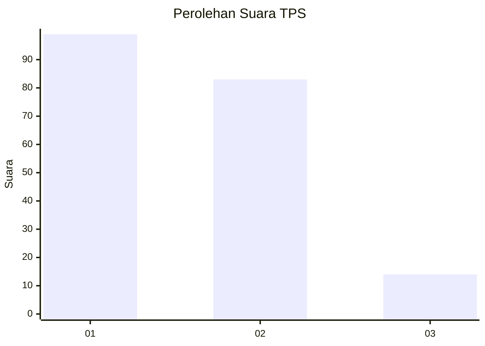
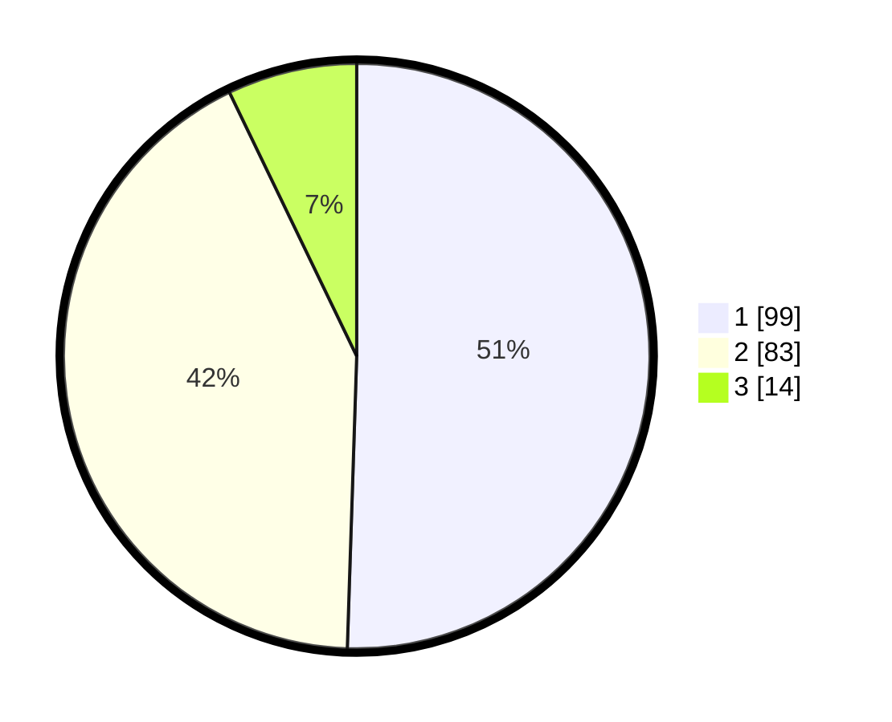

# Hasil

## Grafik

## Tabel

| No. | Nama Paslon    | Suara | Suara (raw) | Persentase |
|:--- |:-------------- | -----:| -----------:| ----------:|
| 1   | ANIES MUHAIMIN | 99    | [99][p-1]   | 50,51      |
| 2   | PRABOWO GIBRAN | 83    | [83][p-2]   | 42,35      |
| 3   | GANJAR MAHFUD  | 14    | [14][p-3]   | 7,14       |

[p-1]: https://github.com/gigit-pemilu/pemilu-2024-32-jawa-barat/blob/main/pilpres/hitung-suara/sub/32-jawa-barat/sub/01-bogor/sub/13-bojong-gede/sub/1007-pabuaran/sub/002-tps/sub/paslon-1.txt
[p-2]: https://github.com/gigit-pemilu/pemilu-2024-32-jawa-barat/blob/main/pilpres/hitung-suara/sub/32-jawa-barat/sub/01-bogor/sub/13-bojong-gede/sub/1007-pabuaran/sub/002-tps/sub/paslon-2.txt
[p-3]: https://github.com/gigit-pemilu/pemilu-2024-32-jawa-barat/blob/main/pilpres/hitung-suara/sub/32-jawa-barat/sub/01-bogor/sub/13-bojong-gede/sub/1007-pabuaran/sub/002-tps/sub/paslon-3.txt

## Foto C Plano

https://sirekap-obj-formc.kpu.go.id/f3c6/pemilu/ppwp/32/01/13/10/07/3201131007002-20240216-101525--d830256a-f373-47f6-a753-27e09ffe8a92.jpg

https://sirekap-obj-formc.kpu.go.id/f3c6/pemilu/ppwp/32/01/13/10/07/3201131007002-20240214-204038--c4a6f3a1-88d0-47e6-b80f-3352edb27447.jpg

https://sirekap-obj-formc.kpu.go.id/f3c6/pemilu/ppwp/32/01/13/10/07/3201131007002-20240214-204200--3011cc8f-bd1f-488e-b112-13759c9076ca.jpg

## Metadata

| Key        | Value               |
| ---------- | ------------------- |
| Time Stamp | 2024-02-16 13:00:29 |

