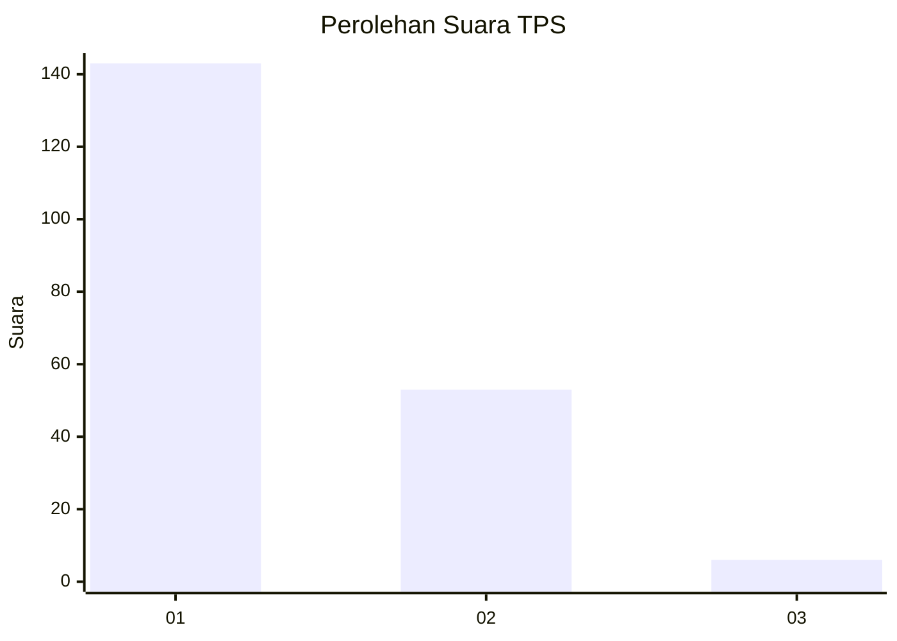
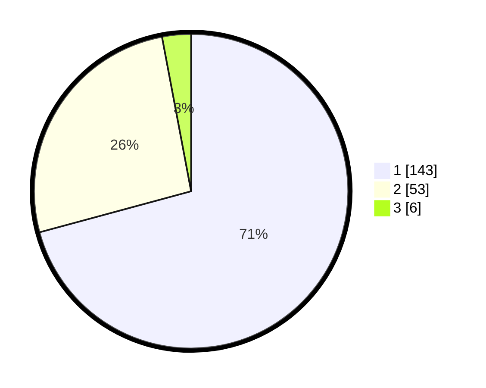

# Hasil

## Grafik

## Tabel

| No. | Nama Paslon    | Suara | Suara (raw) | Persentase |
|:--- |:-------------- | -----:| -----------:| ----------:|
| 1   | ANIES MUHAIMIN | 143   | [143][p-1]  | 70,79      |
| 2   | PRABOWO GIBRAN | 53    | [53][p-2]   | 26,24      |
| 3   | GANJAR MAHFUD  | 6     | [6][p-3]    | 2,97       |

[p-1]: https://github.com/gigit-pemilu/pemilu-2024/blob/main/pilpres/hitung-suara/sub/32-jawa-barat/sub/01-bogor/sub/13-bojong-gede/sub/1007-pabuaran/sub/066-tps/sub/paslon-1.txt
[p-2]: https://github.com/gigit-pemilu/pemilu-2024/blob/main/pilpres/hitung-suara/sub/32-jawa-barat/sub/01-bogor/sub/13-bojong-gede/sub/1007-pabuaran/sub/066-tps/sub/paslon-2.txt
[p-3]: https://github.com/gigit-pemilu/pemilu-2024/blob/main/pilpres/hitung-suara/sub/32-jawa-barat/sub/01-bogor/sub/13-bojong-gede/sub/1007-pabuaran/sub/066-tps/sub/paslon-3.txt

## Foto C Plano

https://sirekap-obj-formc.kpu.go.id/ea68/pemilu/ppwp/32/01/13/10/07/3201131007066-20240214-155316--34a52d7d-7726-4009-b7ab-ce343b17385f.jpg

https://sirekap-obj-formc.kpu.go.id/ea68/pemilu/ppwp/32/01/13/10/07/3201131007066-20240214-155047--83eb0a9c-f916-4a55-87b4-a72469dd99cb.jpg

https://sirekap-obj-formc.kpu.go.id/ea68/pemilu/ppwp/32/01/13/10/07/3201131007066-20240214-155553--bf7f94a2-6254-41fa-9e83-86c42a1be7b9.jpg

## Metadata

| Key        | Value               |
| ---------- | ------------------- |
| Time Stamp | 2024-02-14 21:46:01 |

