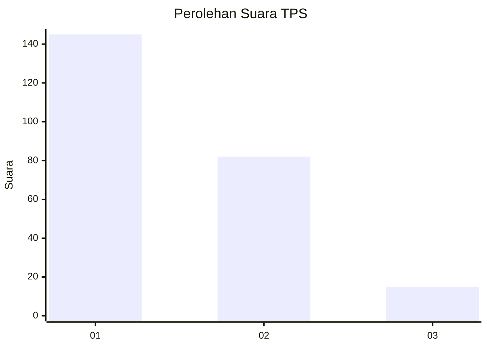
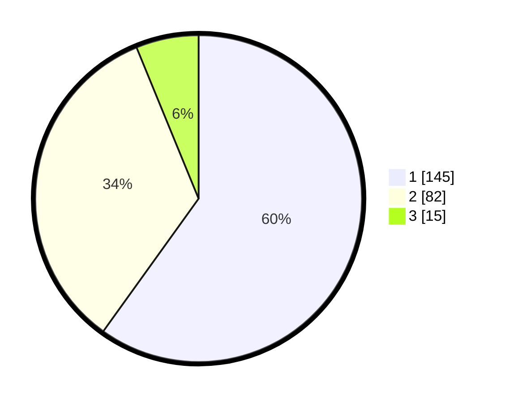

# Hasil

## Grafik

## Tabel

| No. | Nama Paslon    | Suara | Suara (raw) | Persentase |
|:--- |:-------------- | -----:| -----------:| ----------:|
| 1   | ANIES MUHAIMIN | 145   | [145][p-1]  | 59,92      |
| 2   | PRABOWO GIBRAN | 82    | [82][p-2]   | 33,88      |
| 3   | GANJAR MAHFUD  | 15    | [15][p-3]   | 6,20       |

[p-1]: https://github.com/gigit-pemilu/pemilu-2024-32-jawa-barat/blob/main/pilpres/hitung-suara/sub/32-jawa-barat/sub/01-bogor/sub/13-bojong-gede/sub/2004-ragajaya/sub/019-tps/sub/paslon-1.txt
[p-2]: https://github.com/gigit-pemilu/pemilu-2024-32-jawa-barat/blob/main/pilpres/hitung-suara/sub/32-jawa-barat/sub/01-bogor/sub/13-bojong-gede/sub/2004-ragajaya/sub/019-tps/sub/paslon-2.txt
[p-3]: https://github.com/gigit-pemilu/pemilu-2024-32-jawa-barat/blob/main/pilpres/hitung-suara/sub/32-jawa-barat/sub/01-bogor/sub/13-bojong-gede/sub/2004-ragajaya/sub/019-tps/sub/paslon-3.txt

## Foto C Plano

https://sirekap-obj-formc.kpu.go.id/f9f4/pemilu/ppwp/32/01/13/20/04/3201132004019-20240215-023723--ff876ad5-a436-4c7c-a40b-a68766f05348.jpg

https://sirekap-obj-formc.kpu.go.id/f9f4/pemilu/ppwp/32/01/13/20/04/3201132004019-20240215-024030--88fc763c-4fae-48e5-8d8c-68433139fb81.jpg

https://sirekap-obj-formc.kpu.go.id/f9f4/pemilu/ppwp/32/01/13/20/04/3201132004019-20240215-024256--ae01f83b-1eaf-48b1-9810-ec926129e0dc.jpg

## Metadata

| Key        | Value               |
| ---------- | ------------------- |
| Time Stamp | 2024-02-16 21:01:00 |

