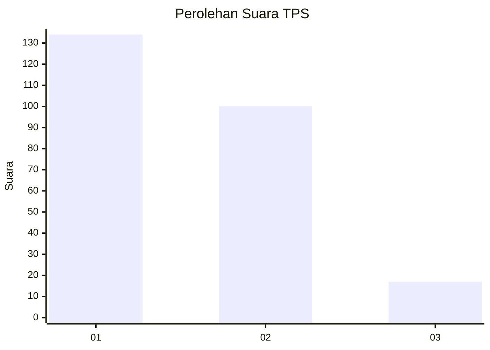
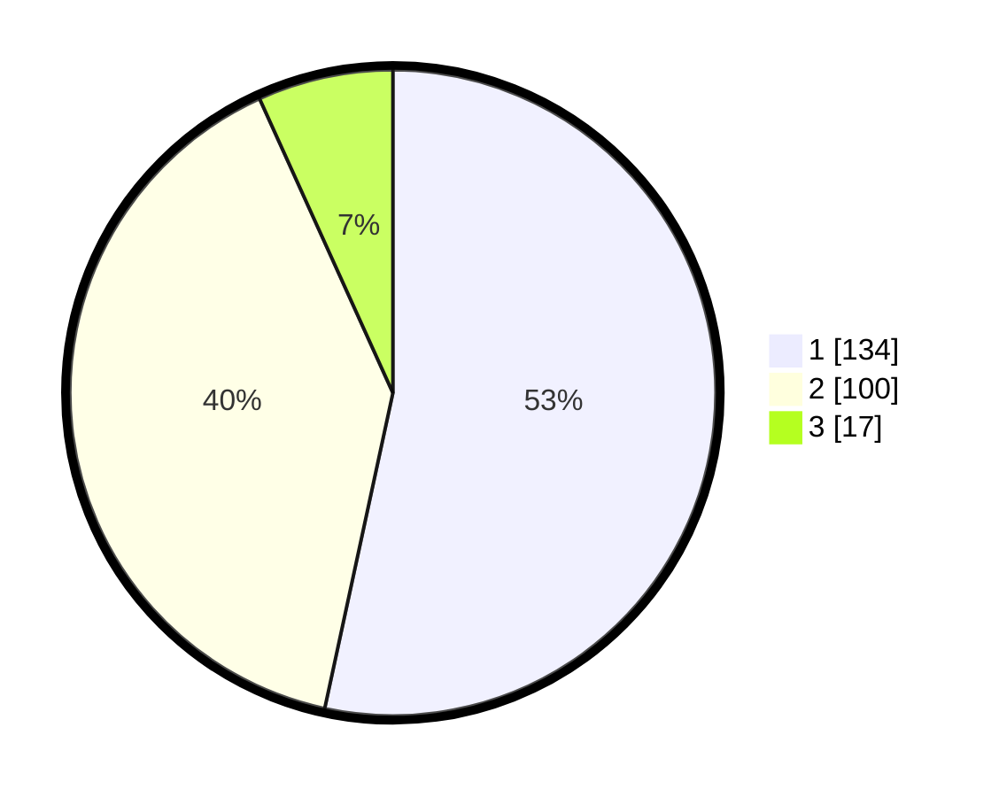

# Hasil

## Grafik

## Tabel

| No. | Nama Paslon    | Suara | Suara (raw) | Persentase |
|:--- |:-------------- | -----:| -----------:| ----------:|
| 1   | ANIES MUHAIMIN | 134   | [134][p-1]  | 53,39      |
| 2   | PRABOWO GIBRAN | 100   | [100][p-2]  | 39,84      |
| 3   | GANJAR MAHFUD  | 17    | [17][p-3]   | 6,77       |

[p-1]: https://github.com/gigit-pemilu/pemilu-2024/blob/main/pilpres/hitung-suara/sub/32-jawa-barat/sub/01-bogor/sub/13-bojong-gede/sub/2005-kedungwaringin/sub/061-tps/sub/paslon-1.txt
[p-2]: https://github.com/gigit-pemilu/pemilu-2024/blob/main/pilpres/hitung-suara/sub/32-jawa-barat/sub/01-bogor/sub/13-bojong-gede/sub/2005-kedungwaringin/sub/061-tps/sub/paslon-2.txt
[p-3]: https://github.com/gigit-pemilu/pemilu-2024/blob/main/pilpres/hitung-suara/sub/32-jawa-barat/sub/01-bogor/sub/13-bojong-gede/sub/2005-kedungwaringin/sub/061-tps/sub/paslon-3.txt

## Foto C Plano

https://sirekap-obj-formc.kpu.go.id/64d4/pemilu/ppwp/32/01/13/20/05/3201132005061-20240215-194226--0874d636-16a1-4c5b-b01d-118b8ba30909.jpg

https://sirekap-obj-formc.kpu.go.id/64d4/pemilu/ppwp/32/01/13/20/05/3201132005061-20240214-224008--f747a96f-c7cc-4260-a3a7-3ffae0ccec8c.jpg

https://sirekap-obj-formc.kpu.go.id/64d4/pemilu/ppwp/32/01/13/20/05/3201132005061-20240214-224129--7bcd46a2-d268-4a1e-8b71-d841149b5fac.jpg

## Metadata

| Key        | Value               |
| ---------- | ------------------- |
| Time Stamp | 2024-02-16 21:01:00 |

