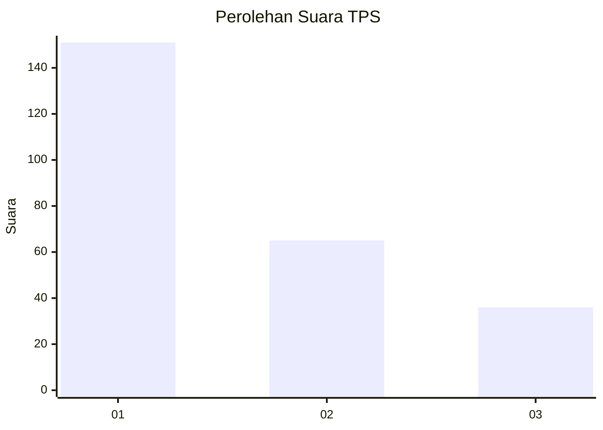
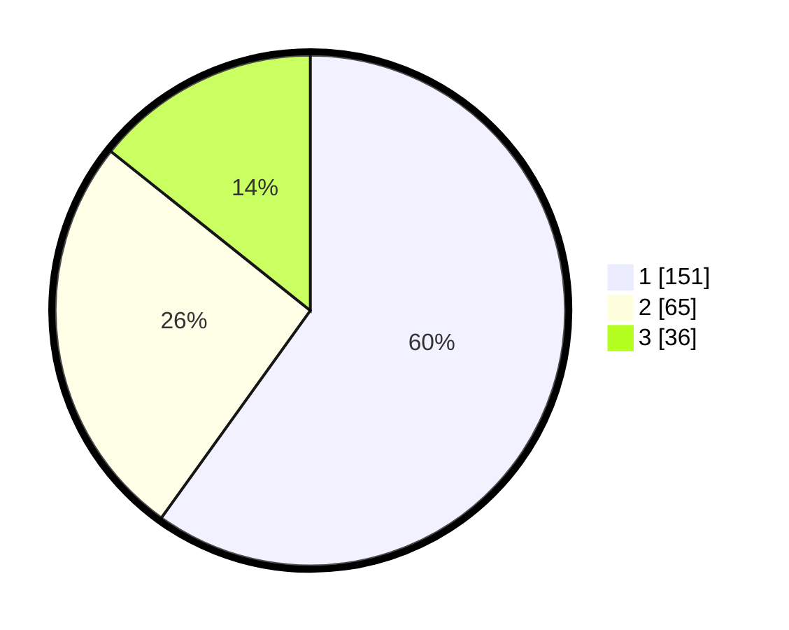

# Hasil

## Grafik

## Tabel

| No. | Nama Paslon    | Suara | Suara (raw) | Persentase |
|:--- |:-------------- | -----:| -----------:| ----------:|
| 1   | ANIES MUHAIMIN | 151   | [151][p-1]  | 59,92      |
| 2   | PRABOWO GIBRAN | 65    | [65][p-2]   | 25,79      |
| 3   | GANJAR MAHFUD  | 36    | [36][p-3]   | 14,29      |

[p-1]: https://github.com/gigit-pemilu/pemilu-2024/blob/main/pilpres/hitung-suara/sub/32-jawa-barat/sub/01-bogor/sub/13-bojong-gede/sub/2009-bojonggede/sub/101-tps/sub/paslon-1.txt
[p-2]: https://github.com/gigit-pemilu/pemilu-2024/blob/main/pilpres/hitung-suara/sub/32-jawa-barat/sub/01-bogor/sub/13-bojong-gede/sub/2009-bojonggede/sub/101-tps/sub/paslon-2.txt
[p-3]: https://github.com/gigit-pemilu/pemilu-2024/blob/main/pilpres/hitung-suara/sub/32-jawa-barat/sub/01-bogor/sub/13-bojong-gede/sub/2009-bojonggede/sub/101-tps/sub/paslon-3.txt

## Foto C Plano

https://sirekap-obj-formc.kpu.go.id/cd32/pemilu/ppwp/32/01/13/20/09/3201132009101-20240215-001104--e322da98-34d9-4ec0-af10-f4f8ab74183a.jpg

https://sirekap-obj-formc.kpu.go.id/cd32/pemilu/ppwp/32/01/13/20/09/3201132009101-20240215-001533--d9cf9ead-cabd-4c87-a6d2-f6dee9bb880a.jpg

https://sirekap-obj-formc.kpu.go.id/cd32/pemilu/ppwp/32/01/13/20/09/3201132009101-20240215-001707--2c866992-a741-445e-8fdf-c264e80d2548.jpg

## Metadata

| Key        | Value               |
| ---------- | ------------------- |
| Time Stamp | 2024-02-16 16:25:10 |

