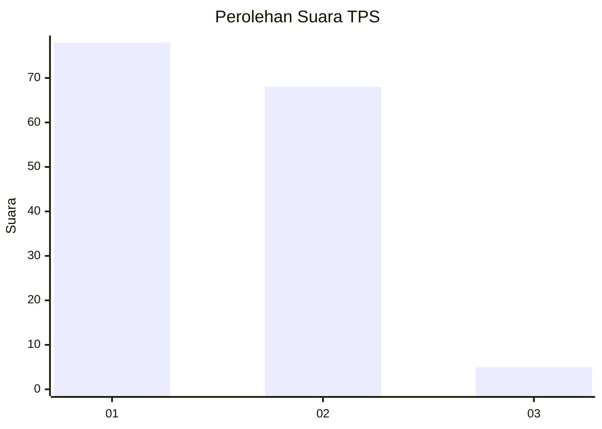
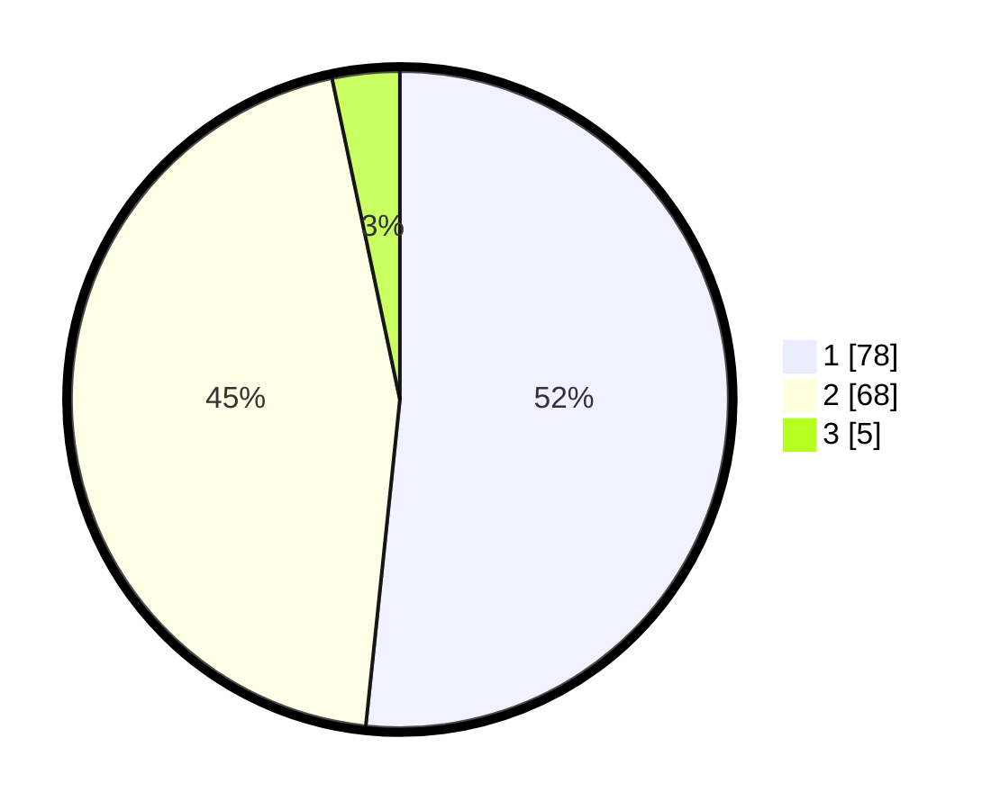

# Hasil

## Grafik

## Tabel

| No. | Nama Paslon    | Suara | Suara (raw) | Persentase |
|:--- |:-------------- | -----:| -----------:| ----------:|
| 1   | ANIES MUHAIMIN | 78    | [78][p-1]   | 51,66      |
| 2   | PRABOWO GIBRAN | 68    | [68][p-2]   | 45,03      |
| 3   | GANJAR MAHFUD  | 5     | [5][p-3]    | 3,31       |

[p-1]: https://github.com/gigit-pemilu/pemilu-2024/blob/main/pilpres/hitung-suara/sub/32-jawa-barat/sub/01-bogor/sub/14-leuwiliang/sub/2001-leuwiliang/sub/001-tps/sub/paslon-1.txt
[p-2]: https://github.com/gigit-pemilu/pemilu-2024/blob/main/pilpres/hitung-suara/sub/32-jawa-barat/sub/01-bogor/sub/14-leuwiliang/sub/2001-leuwiliang/sub/001-tps/sub/paslon-2.txt
[p-3]: https://github.com/gigit-pemilu/pemilu-2024/blob/main/pilpres/hitung-suara/sub/32-jawa-barat/sub/01-bogor/sub/14-leuwiliang/sub/2001-leuwiliang/sub/001-tps/sub/paslon-3.txt

## Foto C Plano

https://sirekap-obj-formc.kpu.go.id/7abd/pemilu/ppwp/32/01/14/20/01/3201142001001-20240214-225044--792f2d27-f4dd-4c0f-be76-29d26672118f.jpg

https://sirekap-obj-formc.kpu.go.id/7abd/pemilu/ppwp/32/01/14/20/01/3201142001001-20240214-225237--0a1b2108-a0c5-491e-b9b5-5898d6e601ad.jpg

https://sirekap-obj-formc.kpu.go.id/7abd/pemilu/ppwp/32/01/14/20/01/3201142001001-20240214-213814--945adc83-6589-424a-b82a-7d5282995c73.jpg

## Metadata

| Key        | Value               |
| ---------- | ------------------- |
| Time Stamp | 2024-02-16 12:51:22 |

