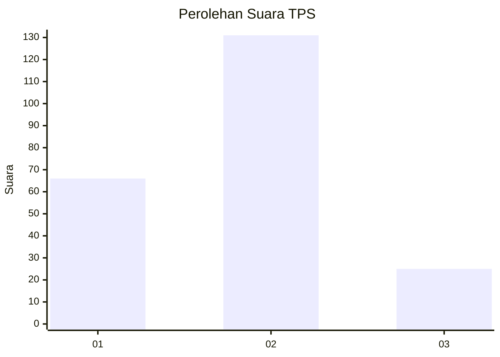
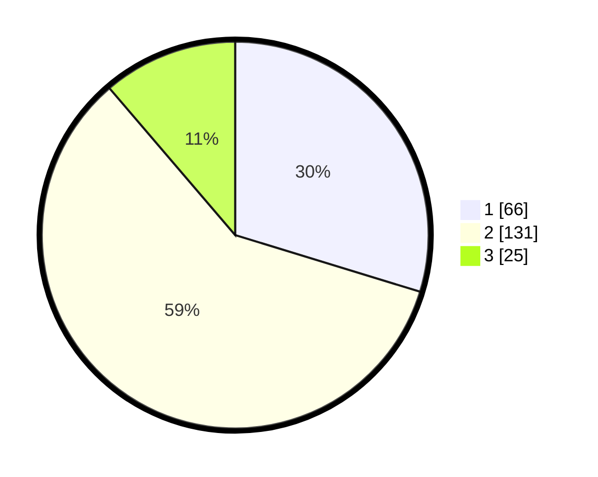

# Hasil

## Grafik

## Tabel

| No. | Nama Paslon    | Suara | Suara (raw) | Persentase |
|:--- |:-------------- | -----:| -----------:| ----------:|
| 1   | ANIES MUHAIMIN | 66    | [66][p-1]   | 29,73      |
| 2   | PRABOWO GIBRAN | 131   | [131][p-2]  | 59,01      |
| 3   | GANJAR MAHFUD  | 25    | [25][p-3]   | 11,26      |

[p-1]: https://github.com/gigit-pemilu/pemilu-2024/blob/main/pilpres/hitung-suara/sub/32-jawa-barat/sub/01-bogor/sub/15-ciampea/sub/2008-cibadak/sub/007-tps/sub/paslon-1.txt
[p-2]: https://github.com/gigit-pemilu/pemilu-2024/blob/main/pilpres/hitung-suara/sub/32-jawa-barat/sub/01-bogor/sub/15-ciampea/sub/2008-cibadak/sub/007-tps/sub/paslon-2.txt
[p-3]: https://github.com/gigit-pemilu/pemilu-2024/blob/main/pilpres/hitung-suara/sub/32-jawa-barat/sub/01-bogor/sub/15-ciampea/sub/2008-cibadak/sub/007-tps/sub/paslon-3.txt

## Foto C Plano

https://sirekap-obj-formc.kpu.go.id/37ab/pemilu/ppwp/32/01/15/20/08/3201152008007-20240215-015627--5cb8d9a8-8037-4561-8cb3-31806aa8a432.jpg

https://sirekap-obj-formc.kpu.go.id/37ab/pemilu/ppwp/32/01/15/20/08/3201152008007-20240214-221739--ffd9f237-789a-4e77-999c-c80c2e9b81a6.jpg

https://sirekap-obj-formc.kpu.go.id/37ab/pemilu/ppwp/32/01/15/20/08/3201152008007-20240215-015723--584a600c-01e0-4015-9c4c-7d9cd65c3cd2.jpg

## Metadata

| Key        | Value               |
| ---------- | ------------------- |
| Time Stamp | 2024-02-15 15:00:29 |

