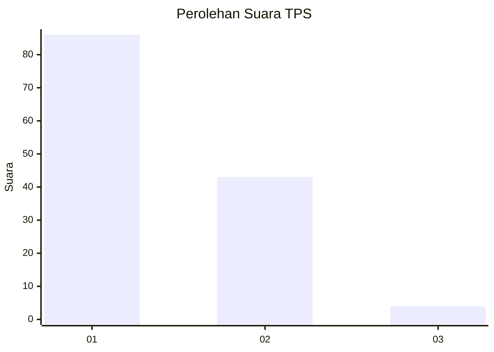
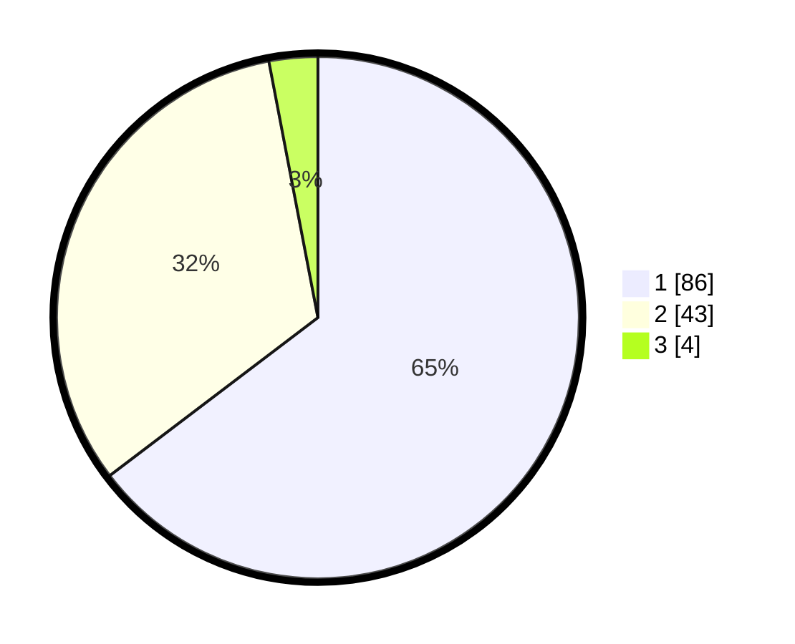

# Hasil

## Grafik

## Tabel

| No. | Nama Paslon    | Suara | Suara (raw) | Persentase |
|:--- |:-------------- | -----:| -----------:| ----------:|
| 1   | ANIES MUHAIMIN | 86    | [86][p-1]   | 64,66      |
| 2   | PRABOWO GIBRAN | 43    | [43][p-2]   | 32,33      |
| 3   | GANJAR MAHFUD  | 4     | [4][p-3]    | 3,01       |

[p-1]: https://github.com/gigit-pemilu/pemilu-2024/blob/main/pilpres/hitung-suara/sub/32-jawa-barat/sub/01-bogor/sub/15-ciampea/sub/2010-cihideunghilir/sub/030-tps/sub/paslon-1.txt
[p-2]: https://github.com/gigit-pemilu/pemilu-2024/blob/main/pilpres/hitung-suara/sub/32-jawa-barat/sub/01-bogor/sub/15-ciampea/sub/2010-cihideunghilir/sub/030-tps/sub/paslon-2.txt
[p-3]: https://github.com/gigit-pemilu/pemilu-2024/blob/main/pilpres/hitung-suara/sub/32-jawa-barat/sub/01-bogor/sub/15-ciampea/sub/2010-cihideunghilir/sub/030-tps/sub/paslon-3.txt

## Foto C Plano

https://sirekap-obj-formc.kpu.go.id/ac6f/pemilu/ppwp/32/01/15/20/10/3201152010030-20240215-003228--22d19136-d7b3-45b5-bdfc-91839b78ba28.jpg

https://sirekap-obj-formc.kpu.go.id/ac6f/pemilu/ppwp/32/01/15/20/10/3201152010030-20240215-003241--1d4b1aba-4541-4769-a38f-e6f3de7299ec.jpg

https://sirekap-obj-formc.kpu.go.id/ac6f/pemilu/ppwp/32/01/15/20/10/3201152010030-20240215-003247--7aa4cbdf-39e7-4871-b171-a9a3bfcc6088.jpg

## Metadata

| Key        | Value               |
| ---------- | ------------------- |
| Time Stamp | 2024-02-16 08:00:28 |

