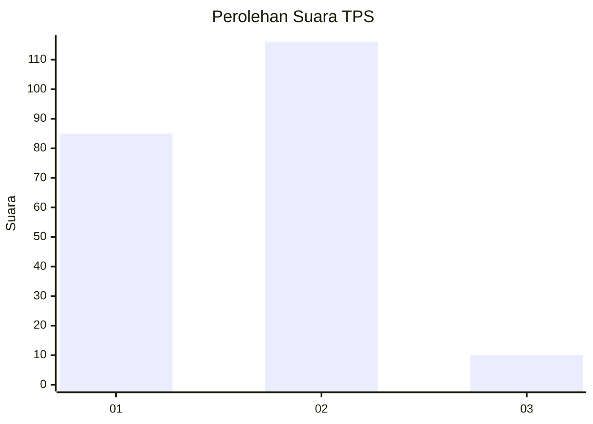
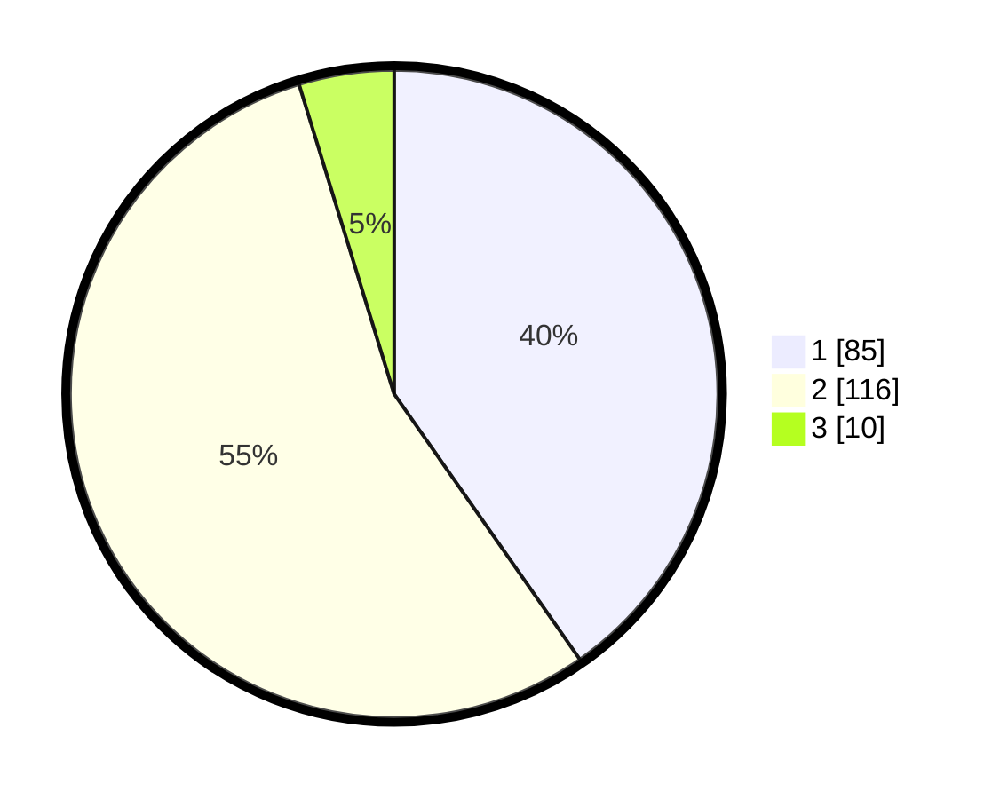

# Hasil

## Grafik

## Tabel

| No. | Nama Paslon    | Suara | Suara (raw) | Persentase |
|:--- |:-------------- | -----:| -----------:| ----------:|
| 1   | ANIES MUHAIMIN | 85    | [85][p-1]   | 40,28      |
| 2   | PRABOWO GIBRAN | 116   | [116][p-2]  | 54,98      |
| 3   | GANJAR MAHFUD  | 10    | [10][p-3]   | 4,74       |

[p-1]: https://github.com/gigit-pemilu/pemilu-2024/blob/main/pilpres/hitung-suara/sub/32-jawa-barat/sub/01-bogor/sub/16-cibungbulang/sub/2008-cimanggu-ii/sub/010-tps/sub/paslon-1.txt
[p-2]: https://github.com/gigit-pemilu/pemilu-2024/blob/main/pilpres/hitung-suara/sub/32-jawa-barat/sub/01-bogor/sub/16-cibungbulang/sub/2008-cimanggu-ii/sub/010-tps/sub/paslon-2.txt
[p-3]: https://github.com/gigit-pemilu/pemilu-2024/blob/main/pilpres/hitung-suara/sub/32-jawa-barat/sub/01-bogor/sub/16-cibungbulang/sub/2008-cimanggu-ii/sub/010-tps/sub/paslon-3.txt

## Foto C Plano

https://sirekap-obj-formc.kpu.go.id/29fb/pemilu/ppwp/32/01/16/20/08/3201162008010-20240214-220640--39998906-c0c7-4067-bc3b-d2bde4ec4ac1.jpg

https://sirekap-obj-formc.kpu.go.id/29fb/pemilu/ppwp/32/01/16/20/08/3201162008010-20240214-221026--6a9efd05-36fd-48f8-a7f5-d141e5894b3d.jpg

https://sirekap-obj-formc.kpu.go.id/29fb/pemilu/ppwp/32/01/16/20/08/3201162008010-20240214-221209--b9cf4fd5-d01e-46f9-a0c0-6861503321a3.jpg

## Metadata

| Key        | Value               |
| ---------- | ------------------- |
| Time Stamp | 2024-02-16 21:01:00 |

