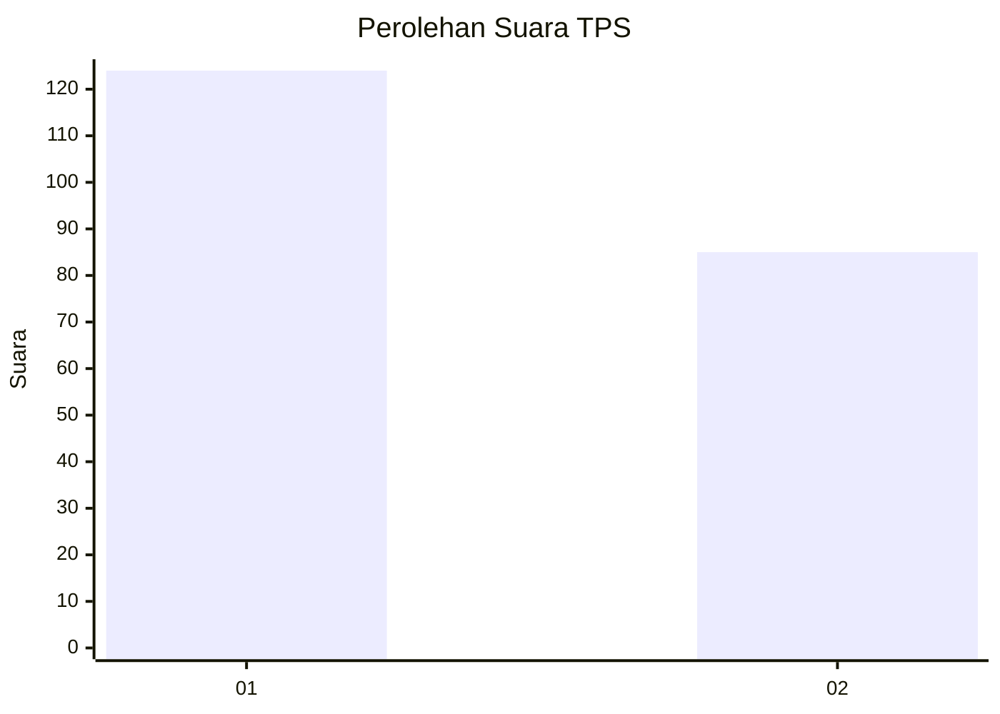
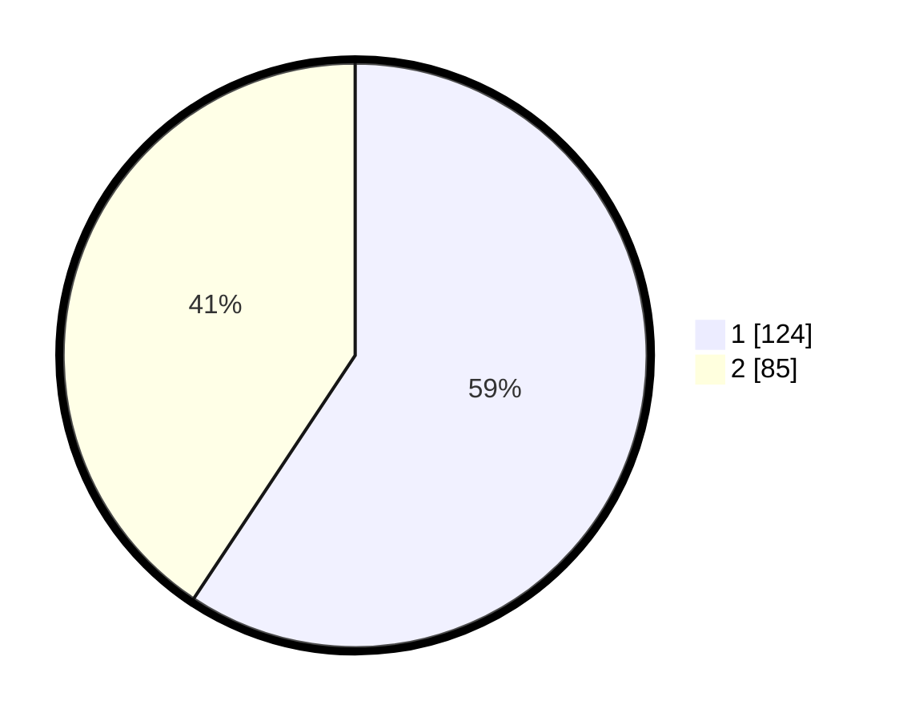

# Hasil

## Grafik

## Tabel

| No. | Nama Paslon    | Suara | Suara (raw) | Persentase |
|:--- |:-------------- | -----:| -----------:| ----------:|
| 1   | ANIES MUHAIMIN | 124   | [124][p-1]  | 59,33      |
| 2   | PRABOWO GIBRAN | 85    | [85][p-2]   | 40,67      |

[p-1]: https://github.com/gigit-pemilu/pemilu-2024/blob/main/pilpres/hitung-suara/sub/32-jawa-barat/sub/01-bogor/sub/17-pamijahan/sub/2008-pamijahan/sub/029-tps/sub/paslon-1.txt
[p-2]: https://github.com/gigit-pemilu/pemilu-2024/blob/main/pilpres/hitung-suara/sub/32-jawa-barat/sub/01-bogor/sub/17-pamijahan/sub/2008-pamijahan/sub/029-tps/sub/paslon-2.txt
[p-3]: https://github.com/gigit-pemilu/pemilu-2024/blob/main/pilpres/hitung-suara/sub/32-jawa-barat/sub/01-bogor/sub/17-pamijahan/sub/2008-pamijahan/sub/029-tps/sub/paslon-3.txt

## Foto C Plano

https://sirekap-obj-formc.kpu.go.id/a826/pemilu/ppwp/32/01/17/20/08/3201172008029-20240215-150159--b883f623-95b7-434c-888b-4f8dbac1e430.jpg

https://sirekap-obj-formc.kpu.go.id/a826/pemilu/ppwp/32/01/17/20/08/3201172008029-20240215-150311--957378c2-9389-4521-b318-1c20fa6270ae.jpg

https://sirekap-obj-formc.kpu.go.id/a826/pemilu/ppwp/32/01/17/20/08/3201172008029-20240215-150444--eff22df1-5c7c-4a2d-bc18-63ae93394ca2.jpg

## Metadata

| Key        | Value               |
| ---------- | ------------------- |
| Time Stamp | 2024-02-25 16:00:00 |

