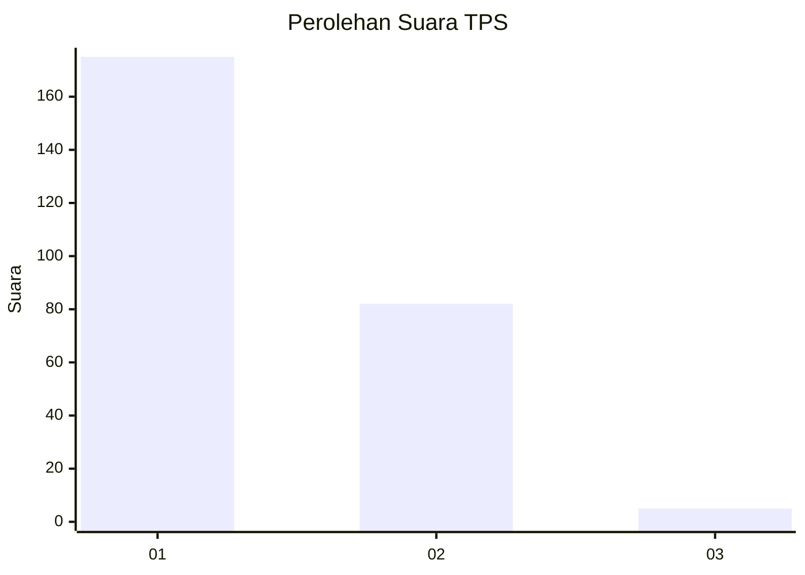
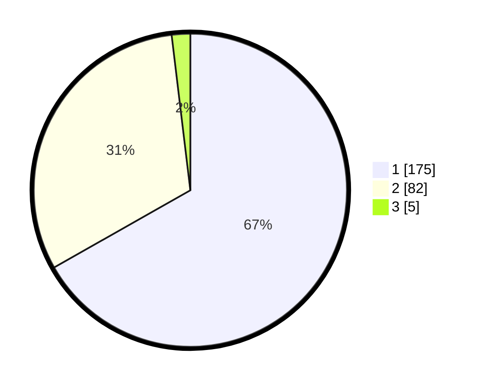

# Hasil

## Grafik

## Tabel

| No. | Nama Paslon    | Suara | Suara (raw) | Persentase |
|:--- |:-------------- | -----:| -----------:| ----------:|
| 1   | ANIES MUHAIMIN | 175   | [175][p-1]  | 66,79      |
| 2   | PRABOWO GIBRAN | 82    | [82][p-2]   | 31,30      |
| 3   | GANJAR MAHFUD  | 5     | [5][p-3]    | 1,91       |

[p-1]: https://github.com/gigit-pemilu/pemilu-2024-32-jawa-barat/blob/main/pilpres/hitung-suara/sub/32-jawa-barat/sub/01-bogor/sub/17-pamijahan/sub/2009-cibening/sub/023-tps/sub/paslon-1.txt
[p-2]: https://github.com/gigit-pemilu/pemilu-2024-32-jawa-barat/blob/main/pilpres/hitung-suara/sub/32-jawa-barat/sub/01-bogor/sub/17-pamijahan/sub/2009-cibening/sub/023-tps/sub/paslon-2.txt
[p-3]: https://github.com/gigit-pemilu/pemilu-2024-32-jawa-barat/blob/main/pilpres/hitung-suara/sub/32-jawa-barat/sub/01-bogor/sub/17-pamijahan/sub/2009-cibening/sub/023-tps/sub/paslon-3.txt

## Foto C Plano

https://sirekap-obj-formc.kpu.go.id/103a/pemilu/ppwp/32/01/17/20/09/3201172009023-20240215-105239--50423588-f3f7-4ba7-9c51-b1816baa82cb.jpg

https://sirekap-obj-formc.kpu.go.id/103a/pemilu/ppwp/32/01/17/20/09/3201172009023-20240215-105632--fea8c36a-fdea-4b7c-b9ef-ffdbb6cb9aa3.jpg

https://sirekap-obj-formc.kpu.go.id/103a/pemilu/ppwp/32/01/17/20/09/3201172009023-20240215-105759--54b57d82-42d7-421b-8366-d4ddcc9b943e.jpg

## Metadata

| Key        | Value               |
| ---------- | ------------------- |
| Time Stamp | 2024-02-16 21:01:00 |

