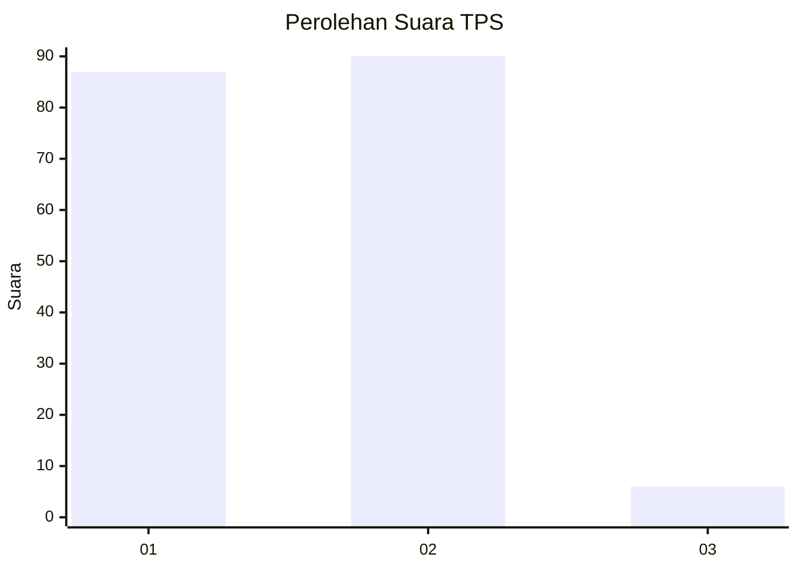
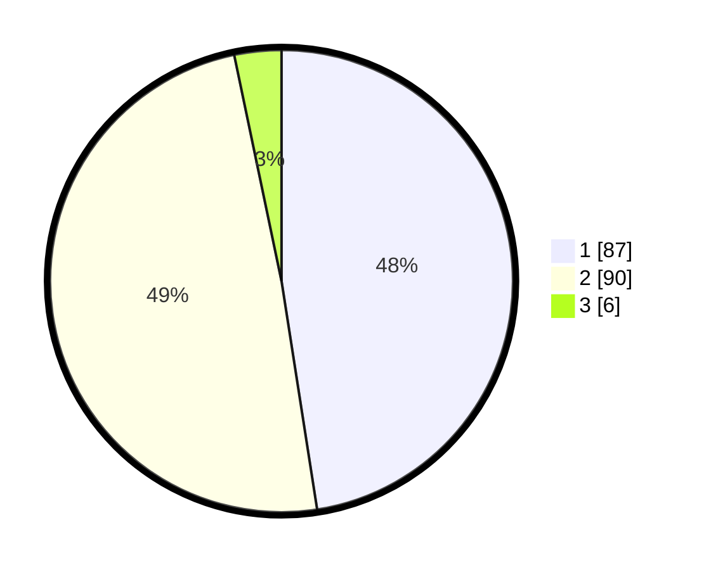

# Hasil

## Grafik

## Tabel

| No. | Nama Paslon    | Suara | Suara (raw) | Persentase |
|:--- |:-------------- | -----:| -----------:| ----------:|
| 1   | ANIES MUHAIMIN | 87    | [87][p-1]   | 47,54      |
| 2   | PRABOWO GIBRAN | 90    | [90][p-2]   | 49,18      |
| 3   | GANJAR MAHFUD  | 6     | [6][p-3]    | 3,28       |

[p-1]: https://github.com/gigit-pemilu/pemilu-2024/blob/main/pilpres/hitung-suara/sub/32-jawa-barat/sub/01-bogor/sub/17-pamijahan/sub/2010-gunungbunder-i/sub/001-tps/sub/paslon-1.txt
[p-2]: https://github.com/gigit-pemilu/pemilu-2024/blob/main/pilpres/hitung-suara/sub/32-jawa-barat/sub/01-bogor/sub/17-pamijahan/sub/2010-gunungbunder-i/sub/001-tps/sub/paslon-2.txt
[p-3]: https://github.com/gigit-pemilu/pemilu-2024/blob/main/pilpres/hitung-suara/sub/32-jawa-barat/sub/01-bogor/sub/17-pamijahan/sub/2010-gunungbunder-i/sub/001-tps/sub/paslon-3.txt

## Foto C Plano

https://sirekap-obj-formc.kpu.go.id/8e42/pemilu/ppwp/32/01/17/20/10/3201172010001-20240215-085940--d2f919ec-eb58-4818-928f-fde4a3fe194d.jpg

https://sirekap-obj-formc.kpu.go.id/8e42/pemilu/ppwp/32/01/17/20/10/3201172010001-20240215-070520--58be387c-c76d-4e16-b732-05af359cd304.jpg

https://sirekap-obj-formc.kpu.go.id/8e42/pemilu/ppwp/32/01/17/20/10/3201172010001-20240214-201359--4a458171-7c49-4005-9b6a-1ac7c4508afd.jpg

## Metadata

| Key        | Value               |
| ---------- | ------------------- |
| Time Stamp | 2024-02-16 21:01:00 |

