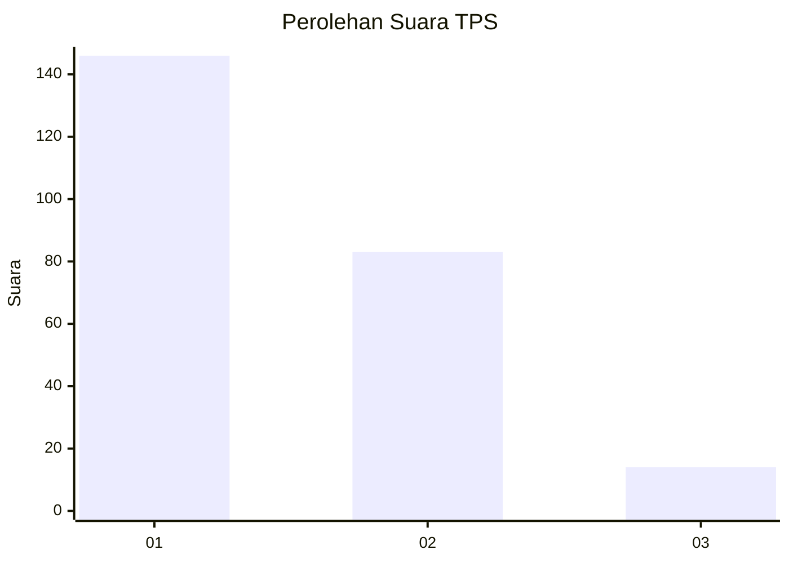
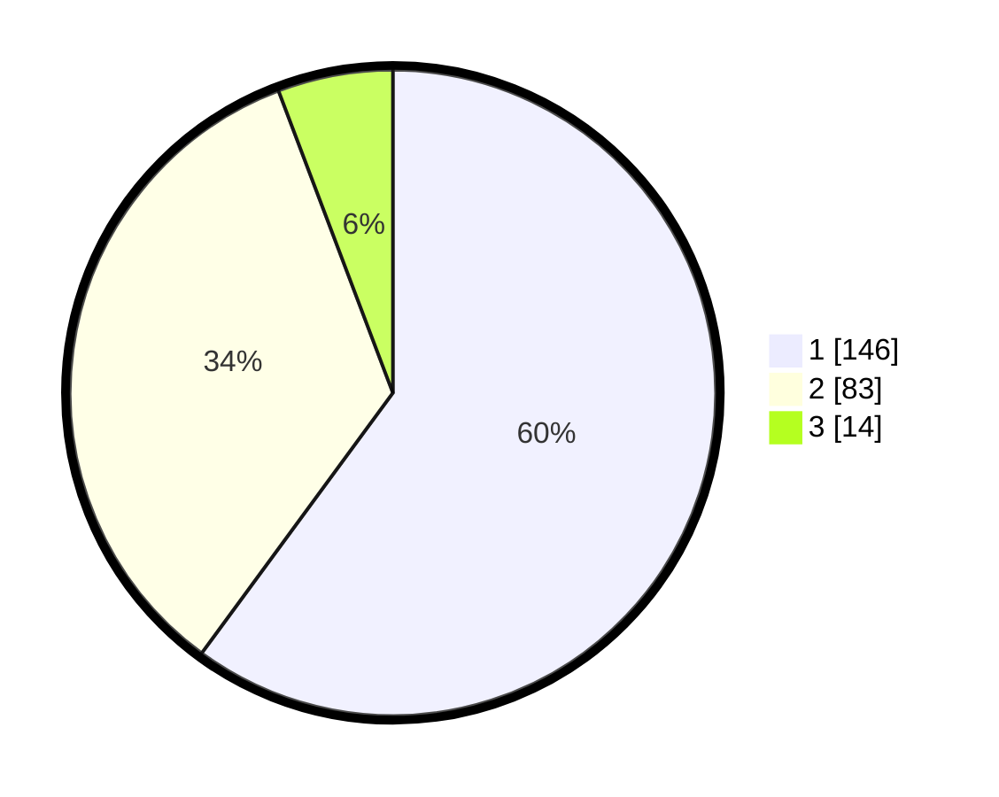

# Hasil

## Grafik

## Tabel

| No. | Nama Paslon    | Suara | Suara (raw) | Persentase |
|:--- |:-------------- | -----:| -----------:| ----------:|
| 1   | ANIES MUHAIMIN | 146   | [146][p-1]  | 60,08      |
| 2   | PRABOWO GIBRAN | 83    | [83][p-2]   | 34,16      |
| 3   | GANJAR MAHFUD  | 14    | [14][p-3]   | 5,76       |

[p-1]: https://github.com/gigit-pemilu/pemilu-2024/blob/main/pilpres/hitung-suara/sub/32-jawa-barat/sub/01-bogor/sub/17-pamijahan/sub/2014-gunungsari/sub/009-tps/sub/paslon-1.txt
[p-2]: https://github.com/gigit-pemilu/pemilu-2024/blob/main/pilpres/hitung-suara/sub/32-jawa-barat/sub/01-bogor/sub/17-pamijahan/sub/2014-gunungsari/sub/009-tps/sub/paslon-2.txt
[p-3]: https://github.com/gigit-pemilu/pemilu-2024/blob/main/pilpres/hitung-suara/sub/32-jawa-barat/sub/01-bogor/sub/17-pamijahan/sub/2014-gunungsari/sub/009-tps/sub/paslon-3.txt

## Foto C Plano

https://sirekap-obj-formc.kpu.go.id/16de/pemilu/ppwp/32/01/17/20/14/3201172014009-20240214-225355--8ee76bc4-df27-4ab4-b0e6-3c6368bacca1.jpg

https://sirekap-obj-formc.kpu.go.id/16de/pemilu/ppwp/32/01/17/20/14/3201172014009-20240214-225843--98d16c11-05c5-420d-a0d6-addacb8866ec.jpg

https://sirekap-obj-formc.kpu.go.id/16de/pemilu/ppwp/32/01/17/20/14/3201172014009-20240214-230049--6c688148-69aa-4ec7-969e-8ace0c350e77.jpg

## Metadata

| Key        | Value               |
| ---------- | ------------------- |
| Time Stamp | 2024-02-16 21:01:00 |

