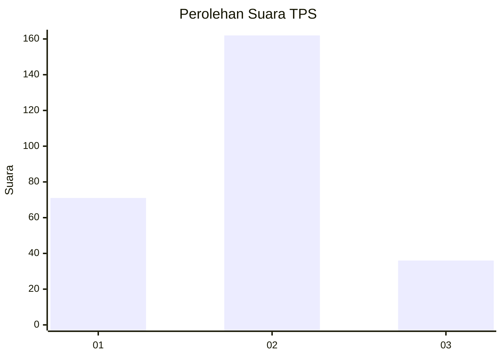
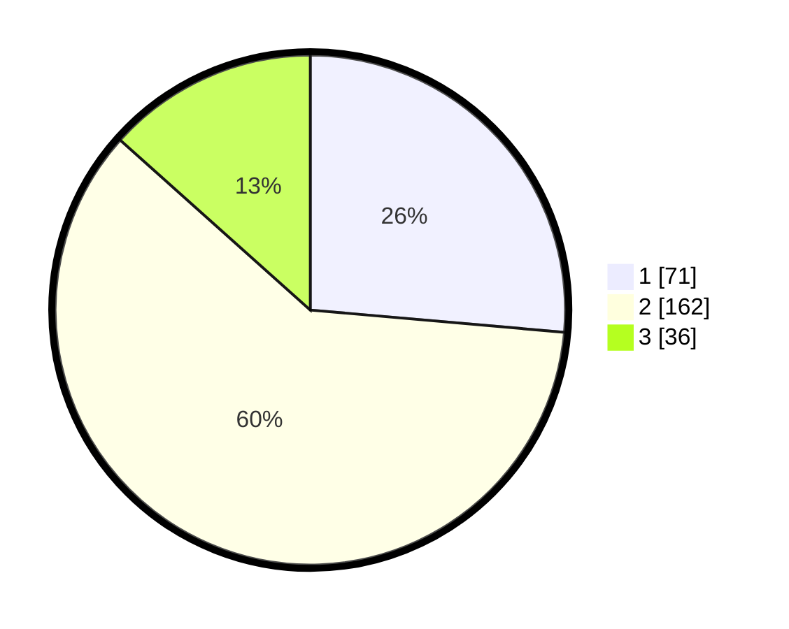

# Hasil

## Grafik

## Tabel

| No. | Nama Paslon    | Suara | Suara (raw) | Persentase |
|:--- |:-------------- | -----:| -----------:| ----------:|
| 1   | ANIES MUHAIMIN | 71    | [71][p-1]   | 26,39      |
| 2   | PRABOWO GIBRAN | 162   | [162][p-2]  | 60,22      |
| 3   | GANJAR MAHFUD  | 36    | [36][p-3]   | 13,38      |

[p-1]: https://github.com/gigit-pemilu/pemilu-2024/blob/main/pilpres/hitung-suara/sub/32-jawa-barat/sub/01-bogor/sub/18-rumpin/sub/2005-cibodas/sub/024-tps/sub/paslon-1.txt
[p-2]: https://github.com/gigit-pemilu/pemilu-2024/blob/main/pilpres/hitung-suara/sub/32-jawa-barat/sub/01-bogor/sub/18-rumpin/sub/2005-cibodas/sub/024-tps/sub/paslon-2.txt
[p-3]: https://github.com/gigit-pemilu/pemilu-2024/blob/main/pilpres/hitung-suara/sub/32-jawa-barat/sub/01-bogor/sub/18-rumpin/sub/2005-cibodas/sub/024-tps/sub/paslon-3.txt

## Foto C Plano

https://sirekap-obj-formc.kpu.go.id/1495/pemilu/ppwp/32/01/18/20/05/3201182005024-20240214-234720--549dec2e-5d6c-4d7f-85a1-c6035c6d8b9e.jpg

https://sirekap-obj-formc.kpu.go.id/1495/pemilu/ppwp/32/01/18/20/05/3201182005024-20240214-234844--2515a16d-2c92-441b-82ea-015dd1facfd7.jpg

https://sirekap-obj-formc.kpu.go.id/1495/pemilu/ppwp/32/01/18/20/05/3201182005024-20240214-235038--2a399c4e-834c-4752-864f-16d1904f273d.jpg

## Metadata

| Key        | Value               |
| ---------- | ------------------- |
| Time Stamp | 2024-02-16 21:01:00 |

