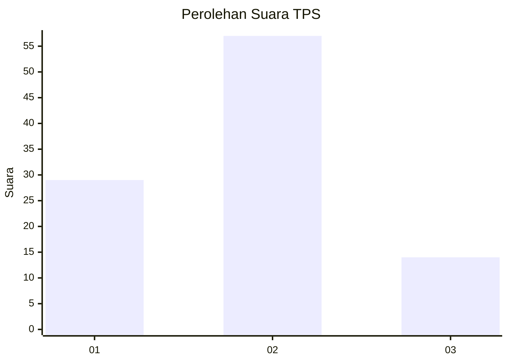
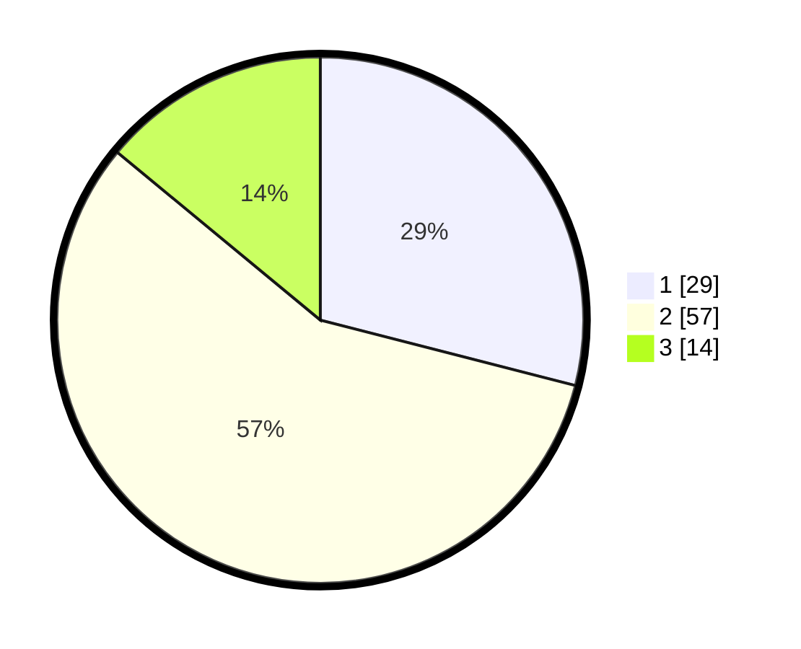

# Hasil

## Grafik

## Tabel

| No. | Nama Paslon    | Suara | Suara (raw) | Persentase |
|:--- |:-------------- | -----:| -----------:| ----------:|
| 1   | ANIES MUHAIMIN | 29    | [29][p-1]   | 29,00      |
| 2   | PRABOWO GIBRAN | 57    | [57][p-2]   | 57,00      |
| 3   | GANJAR MAHFUD  | 14    | [14][p-3]   | 14,00      |

[p-1]: https://github.com/gigit-pemilu/pemilu-2024-32-jawa-barat/blob/main/pilpres/hitung-suara/sub/32-jawa-barat/sub/01-bogor/sub/18-rumpin/sub/2006-rabak/sub/044-tps/sub/paslon-1.txt
[p-2]: https://github.com/gigit-pemilu/pemilu-2024-32-jawa-barat/blob/main/pilpres/hitung-suara/sub/32-jawa-barat/sub/01-bogor/sub/18-rumpin/sub/2006-rabak/sub/044-tps/sub/paslon-2.txt
[p-3]: https://github.com/gigit-pemilu/pemilu-2024-32-jawa-barat/blob/main/pilpres/hitung-suara/sub/32-jawa-barat/sub/01-bogor/sub/18-rumpin/sub/2006-rabak/sub/044-tps/sub/paslon-3.txt

## Foto C Plano

https://sirekap-obj-formc.kpu.go.id/3e88/pemilu/ppwp/32/01/18/20/06/3201182006044-20240217-210912--31fdc779-70ce-415d-bcea-c73a31d2d1f9.jpg

https://sirekap-obj-formc.kpu.go.id/3e88/pemilu/ppwp/32/01/18/20/06/3201182006044-20240217-211019--c8fa053b-be15-4cbf-a8ee-5a3d2bd7c009.jpg

https://sirekap-obj-formc.kpu.go.id/3e88/pemilu/ppwp/32/01/18/20/06/3201182006044-20240217-211121--514a2c87-2659-45e5-b884-0caa34f7697e.jpg

## Metadata

| Key        | Value               |
| ---------- | ------------------- |
| Time Stamp | 2024-02-22 15:00:00 |

