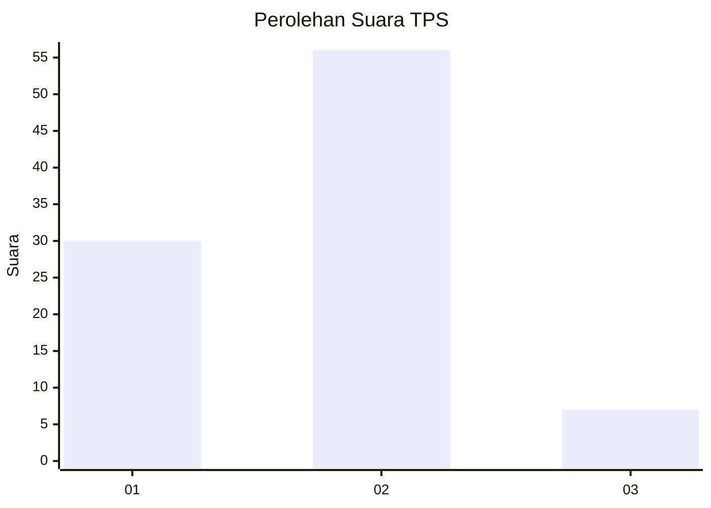
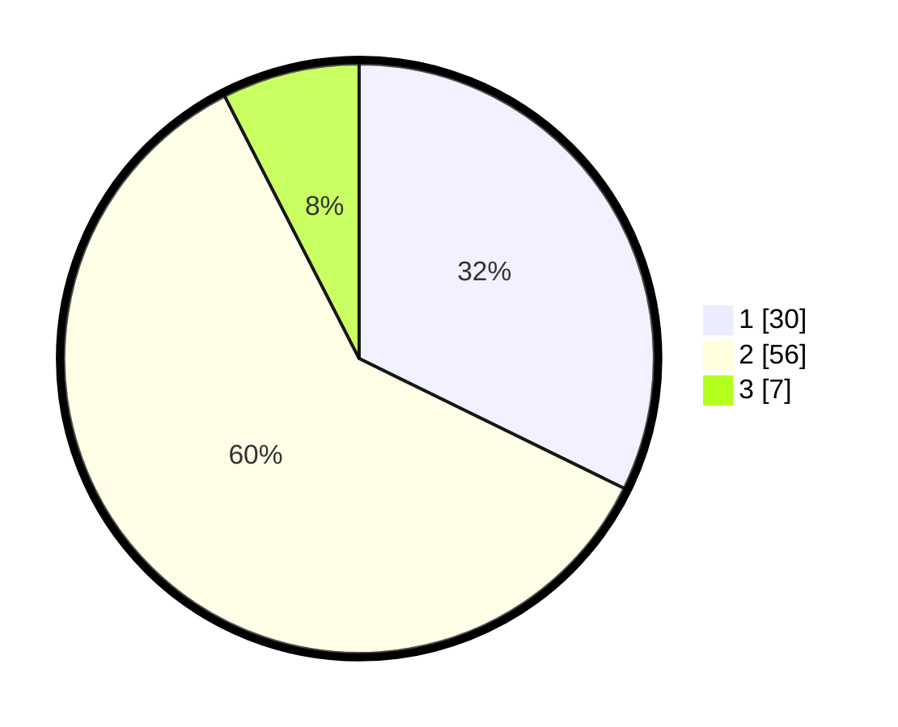

# Hasil

## Grafik

## Tabel

| No. | Nama Paslon    | Suara | Suara (raw) | Persentase |
|:--- |:-------------- | -----:| -----------:| ----------:|
| 1   | ANIES MUHAIMIN | 30    | [30][p-1]   | 32,26      |
| 2   | PRABOWO GIBRAN | 56    | [56][p-2]   | 60,22      |
| 3   | GANJAR MAHFUD  | 7     | [7][p-3]    | 7,53       |

[p-1]: https://github.com/gigit-pemilu/pemilu-2024/blob/main/pilpres/hitung-suara/sub/32-jawa-barat/sub/01-bogor/sub/18-rumpin/sub/2009-sukasari/sub/044-tps/sub/paslon-1.txt
[p-2]: https://github.com/gigit-pemilu/pemilu-2024/blob/main/pilpres/hitung-suara/sub/32-jawa-barat/sub/01-bogor/sub/18-rumpin/sub/2009-sukasari/sub/044-tps/sub/paslon-2.txt
[p-3]: https://github.com/gigit-pemilu/pemilu-2024/blob/main/pilpres/hitung-suara/sub/32-jawa-barat/sub/01-bogor/sub/18-rumpin/sub/2009-sukasari/sub/044-tps/sub/paslon-3.txt

## Foto C Plano

https://sirekap-obj-formc.kpu.go.id/f014/pemilu/ppwp/32/01/18/20/09/3201182009044-20240218-152945--3398f6df-88ed-4af1-9d8f-ed37a3228ca0.jpg

https://sirekap-obj-formc.kpu.go.id/f014/pemilu/ppwp/32/01/18/20/09/3201182009044-20240218-153020--816bded8-b444-4fdb-a024-ee7cece3beeb.jpg

https://sirekap-obj-formc.kpu.go.id/f014/pemilu/ppwp/32/01/18/20/09/3201182009044-20240215-033303--78a0614a-27e1-4ffa-a170-465c26956f36.jpg

## Metadata

| Key        | Value               |
| ---------- | ------------------- |
| Time Stamp | 2024-02-22 16:00:00 |

