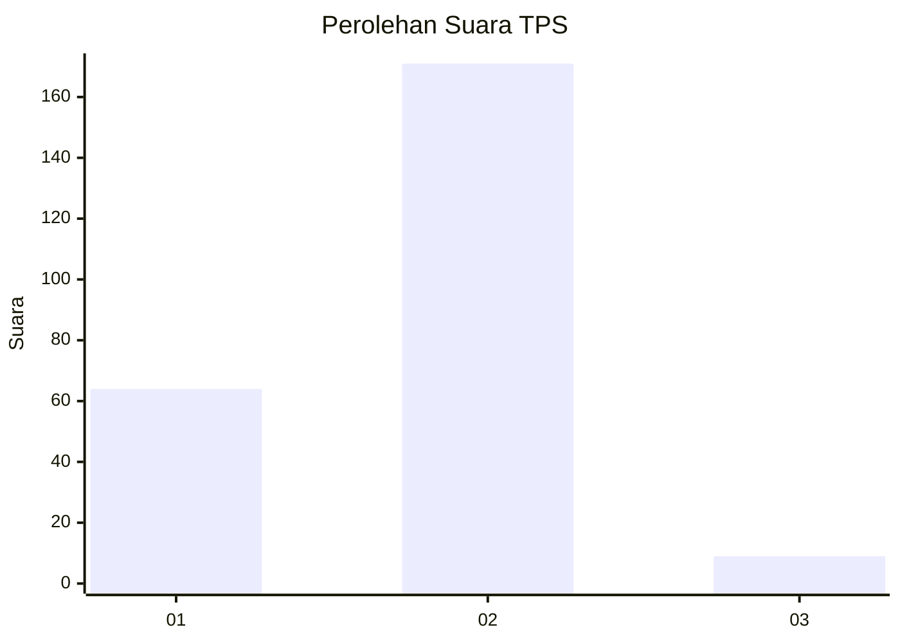
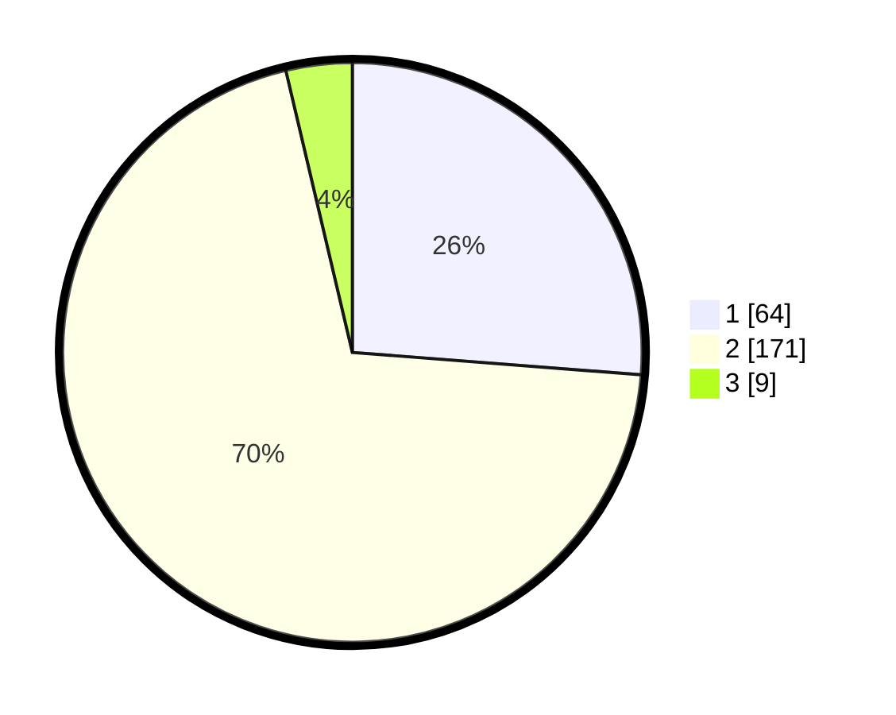

# Hasil

## Grafik

## Tabel

| No. | Nama Paslon    | Suara | Suara (raw) | Persentase |
|:--- |:-------------- | -----:| -----------:| ----------:|
| 1   | ANIES MUHAIMIN | 64    | [64][p-1]   | 26,23      |
| 2   | PRABOWO GIBRAN | 171   | [171][p-2]  | 70,08      |
| 3   | GANJAR MAHFUD  | 9     | [9][p-3]    | 3,69       |

[p-1]: https://github.com/gigit-pemilu/pemilu-2024/blob/main/pilpres/hitung-suara/sub/32-jawa-barat/sub/01-bogor/sub/19-jasinga/sub/2007-cikopomayak/sub/006-tps/sub/paslon-1.txt
[p-2]: https://github.com/gigit-pemilu/pemilu-2024/blob/main/pilpres/hitung-suara/sub/32-jawa-barat/sub/01-bogor/sub/19-jasinga/sub/2007-cikopomayak/sub/006-tps/sub/paslon-2.txt
[p-3]: https://github.com/gigit-pemilu/pemilu-2024/blob/main/pilpres/hitung-suara/sub/32-jawa-barat/sub/01-bogor/sub/19-jasinga/sub/2007-cikopomayak/sub/006-tps/sub/paslon-3.txt

## Foto C Plano

https://sirekap-obj-formc.kpu.go.id/4d0f/pemilu/ppwp/32/01/19/20/07/3201192007006-20240215-015216--83238540-6b48-4605-a306-27982a5fddc3.jpg

https://sirekap-obj-formc.kpu.go.id/4d0f/pemilu/ppwp/32/01/19/20/07/3201192007006-20240215-015400--ebdd4433-c27e-47bd-a6a3-8f5b299c58f9.jpg

https://sirekap-obj-formc.kpu.go.id/4d0f/pemilu/ppwp/32/01/19/20/07/3201192007006-20240215-015525--cd6d71a9-8f7b-4837-82c7-6b9fa3d02c5f.jpg

## Metadata

| Key        | Value               |
| ---------- | ------------------- |
| Time Stamp | 2024-02-16 16:25:10 |

