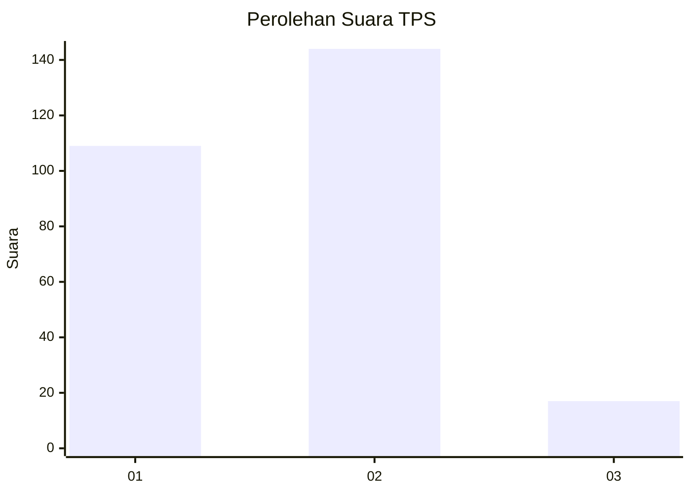

# Hasil

## Grafik

## Tabel

| No. | Nama Paslon    | Suara | Suara (raw) | Persentase |
|:--- |:-------------- | -----:| -----------:| ----------:|
| 1   | ANIES MUHAIMIN | 109   | [109][p-1]  | 40,37      |
| 2   | PRABOWO GIBRAN | 144   | [144][p-2]  | 53,33      |
| 3   | GANJAR MAHFUD  | 17    | [17][p-3]   | 6,30       |

[p-1]: https://github.com/gigit-pemilu/pemilu-2024-32-jawa-barat/blob/main/pilpres/hitung-suara/sub/32-jawa-barat/sub/01-bogor/sub/20-parung-panjang/sub/2008-cibunar/sub/004-tps/sub/paslon-1.txt
[p-2]: https://github.com/gigit-pemilu/pemilu-2024-32-jawa-barat/blob/main/pilpres/hitung-suara/sub/32-jawa-barat/sub/01-bogor/sub/20-parung-panjang/sub/2008-cibunar/sub/004-tps/sub/paslon-2.txt
[p-3]: https://github.com/gigit-pemilu/pemilu-2024-32-jawa-barat/blob/main/pilpres/hitung-suara/sub/32-jawa-barat/sub/01-bogor/sub/20-parung-panjang/sub/2008-cibunar/sub/004-tps/sub/paslon-3.txt

## Foto C Plano

https://sirekap-obj-formc.kpu.go.id/82c2/pemilu/ppwp/32/01/20/20/08/3201202008004-20240216-221619--0f927cd3-3001-49de-b341-a83a9620164d.jpg

https://sirekap-obj-formc.kpu.go.id/82c2/pemilu/ppwp/32/01/20/20/08/3201202008004-20240216-232055--65bb18fd-c349-4fce-89ca-b3bebeb0fd2e.jpg

https://sirekap-obj-formc.kpu.go.id/82c2/pemilu/ppwp/32/01/20/20/08/3201202008004-20240216-123918--76b4f109-3275-41af-8326-deb6aab458bf.jpg

## Metadata

| Key        | Value               |
| ---------- | ------------------- |
| Time Stamp | 2024-02-22 15:00:00 |

