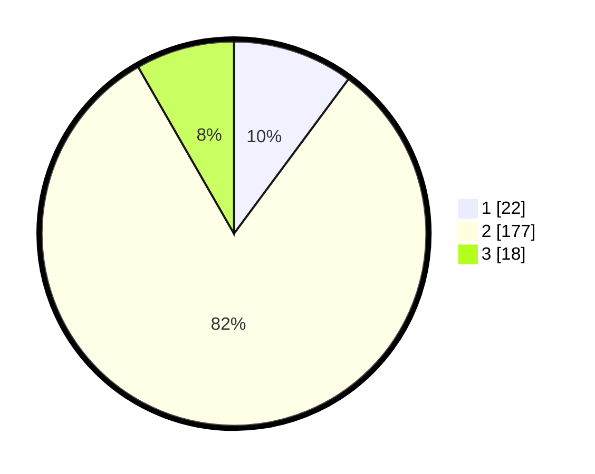

# Hasil

## Grafik

## Tabel

| No. | Nama Paslon    | Suara | Suara (raw) | Persentase |
|:--- |:-------------- | -----:| -----------:| ----------:|
| 1   | ANIES MUHAIMIN | 22    | [22][p-1]   | 10,14      |
| 2   | PRABOWO GIBRAN | 177   | [177][p-2]  | 81,57      |
| 3   | GANJAR MAHFUD  | 18    | [18][p-3]   | 8,29       |

[p-1]: https://github.com/gigit-pemilu/pemilu-2024/blob/main/pilpres/hitung-suara/sub/32-jawa-barat/sub/01-bogor/sub/20-parung-panjang/sub/2008-cibunar/sub/020-tps/sub/paslon-1.txt
[p-2]: https://github.com/gigit-pemilu/pemilu-2024/blob/main/pilpres/hitung-suara/sub/32-jawa-barat/sub/01-bogor/sub/20-parung-panjang/sub/2008-cibunar/sub/020-tps/sub/paslon-2.txt
[p-3]: https://github.com/gigit-pemilu/pemilu-2024/blob/main/pilpres/hitung-suara/sub/32-jawa-barat/sub/01-bogor/sub/20-parung-panjang/sub/2008-cibunar/sub/020-tps/sub/paslon-3.txt

## Foto C Plano

https://sirekap-obj-formc.kpu.go.id/5a4b/pemilu/ppwp/32/01/20/20/08/3201202008020-20240218-131758--b467b2b3-8950-4904-aa35-22b9e0fa4297.jpg

https://sirekap-obj-formc.kpu.go.id/5a4b/pemilu/ppwp/32/01/20/20/08/3201202008020-20240218-131927--82ba5e20-6fef-41fd-89e6-2ec7b6235e5b.jpg

https://sirekap-obj-formc.kpu.go.id/5a4b/pemilu/ppwp/32/01/20/20/08/3201202008020-20240218-132023--2740f2dd-1f91-4718-94d2-02627a6e6c6e.jpg

## Metadata

| Key        | Value               |
| ---------- | ------------------- |
| Time Stamp | 2024-02-22 15:00:00 |

## DATA PEMILIH TETAP

Jumlah pemilih dalam DPT: **299**.
 * L: **857**.
 * P: **542**.

## DATA PENGGUNA HAK PILIH

Jumlah pengguna hak pilih dalam DPT: **243**.
 * L: **887**.
 * P: **626**.

Jumlah pengguna hak pilih dalam DPTb: **884**.
 * L: **886**.
 * P: **888**.

Jumlah pengguna hak pilih dalam DPK: **3**.
 * L: **82**.
 * P: **8**.

Jumlah pengguna hak pilih: **869**.
 * L: **825**.
 * P: **635**.

## JUMLAH SUARA SAH DAN TIDAK SAH

JUMLAH SELURUH SUARA SAH: **227**.

JUMLAH SUARA TIDAK SAH: **33**.

JUMLAH SELURUH SUARA SAH DAN SUARA TIDAK SAH: **260**.

