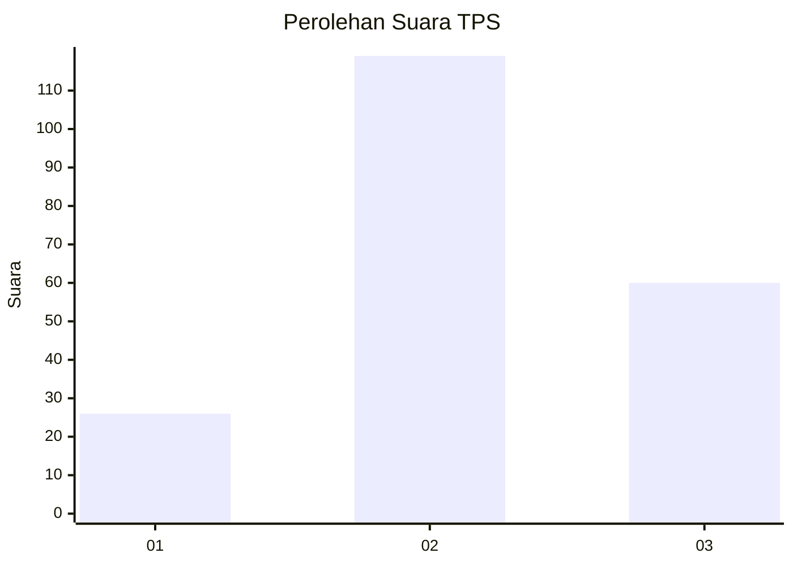
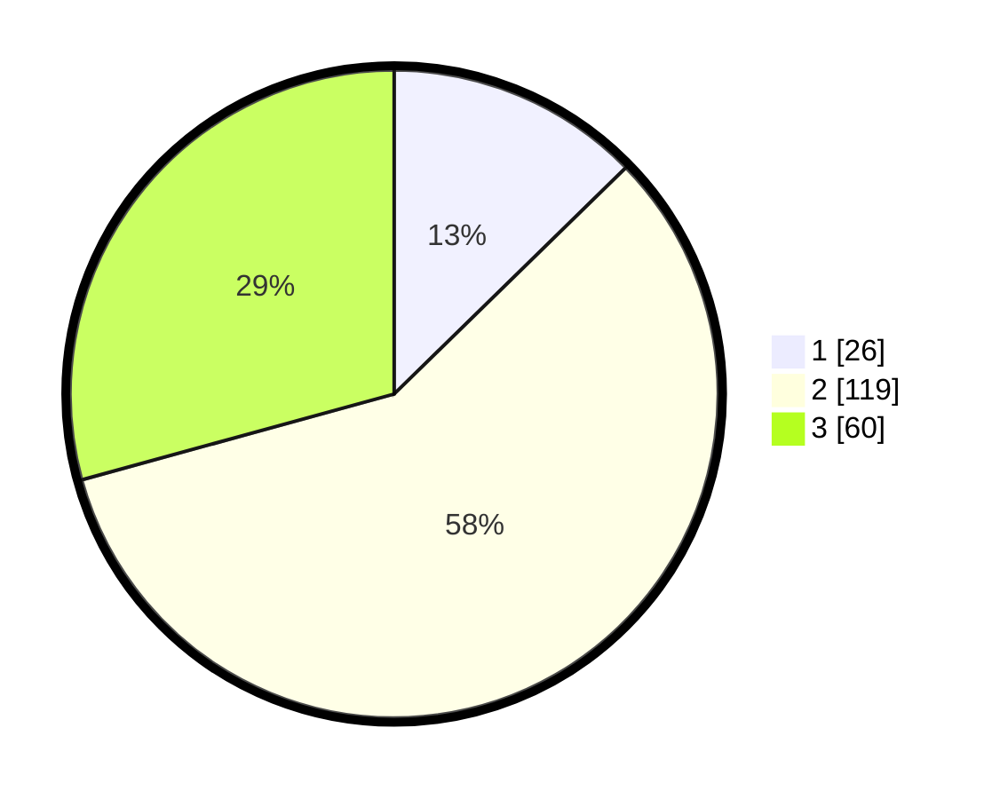

# Hasil

## Grafik

## Tabel

| No. | Nama Paslon    | Suara | Suara (raw) | Persentase |
|:--- |:-------------- | -----:| -----------:| ----------:|
| 1   | ANIES MUHAIMIN | 26    | [26][p-1]   | 12,68      |
| 2   | PRABOWO GIBRAN | 119   | [119][p-2]  | 58,05      |
| 3   | GANJAR MAHFUD  | 60    | [60][p-3]   | 29,27      |

[p-1]: https://github.com/gigit-pemilu/pemilu-2024/blob/main/pilpres/hitung-suara/sub/32-jawa-barat/sub/01-bogor/sub/21-nanggung/sub/2001-malasari/sub/001-tps/sub/paslon-1.txt
[p-2]: https://github.com/gigit-pemilu/pemilu-2024/blob/main/pilpres/hitung-suara/sub/32-jawa-barat/sub/01-bogor/sub/21-nanggung/sub/2001-malasari/sub/001-tps/sub/paslon-2.txt
[p-3]: https://github.com/gigit-pemilu/pemilu-2024/blob/main/pilpres/hitung-suara/sub/32-jawa-barat/sub/01-bogor/sub/21-nanggung/sub/2001-malasari/sub/001-tps/sub/paslon-3.txt

## Foto C Plano

https://sirekap-obj-formc.kpu.go.id/0d4d/pemilu/ppwp/32/01/21/20/01/3201212001001-20240215-040640--b69c0261-efd7-48f6-ae73-1b7be9323315.jpg

https://sirekap-obj-formc.kpu.go.id/0d4d/pemilu/ppwp/32/01/21/20/01/3201212001001-20240215-045535--8be5d3bc-7190-4290-90f8-a972e4551975.jpg

https://sirekap-obj-formc.kpu.go.id/0d4d/pemilu/ppwp/32/01/21/20/01/3201212001001-20240215-040856--238cc499-6157-4734-a347-9cd9fad0f6f9.jpg

## Metadata

| Key        | Value               |
| ---------- | ------------------- |
| Time Stamp | 2024-02-16 09:00:28 |

