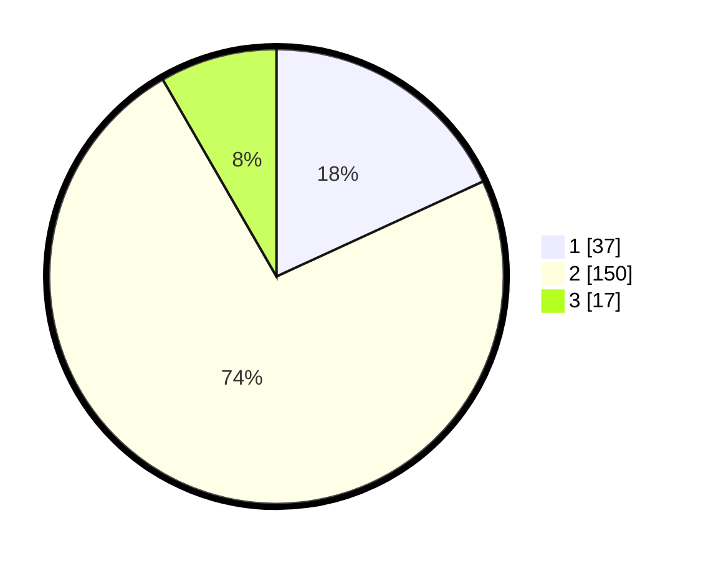

# Hasil

## Grafik

## Tabel

| No. | Nama Paslon    | Suara | Suara (raw) | Persentase |
|:--- |:-------------- | -----:| -----------:| ----------:|
| 1   | ANIES MUHAIMIN | 37    | [37][p-1]   | 18,14      |
| 2   | PRABOWO GIBRAN | 150   | [150][p-2]  | 73,53      |
| 3   | GANJAR MAHFUD  | 17    | [17][p-3]   | 8,33       |

[p-1]: https://github.com/gigit-pemilu/pemilu-2024-32-jawa-barat/blob/main/pilpres/hitung-suara/sub/32-jawa-barat/sub/01-bogor/sub/21-nanggung/sub/2001-malasari/sub/003-tps/sub/paslon-1.txt
[p-2]: https://github.com/gigit-pemilu/pemilu-2024-32-jawa-barat/blob/main/pilpres/hitung-suara/sub/32-jawa-barat/sub/01-bogor/sub/21-nanggung/sub/2001-malasari/sub/003-tps/sub/paslon-2.txt
[p-3]: https://github.com/gigit-pemilu/pemilu-2024-32-jawa-barat/blob/main/pilpres/hitung-suara/sub/32-jawa-barat/sub/01-bogor/sub/21-nanggung/sub/2001-malasari/sub/003-tps/sub/paslon-3.txt

## Foto C Plano

https://sirekap-obj-formc.kpu.go.id/ab7b/pemilu/ppwp/32/01/21/20/01/3201212001003-20240214-232655--9b854f23-7175-47a6-afca-ffaf72dabd17.jpg

https://sirekap-obj-formc.kpu.go.id/ab7b/pemilu/ppwp/32/01/21/20/01/3201212001003-20240214-232757--8f17bc81-8cd1-4697-8624-9b0e7c4947d8.jpg

https://sirekap-obj-formc.kpu.go.id/ab7b/pemilu/ppwp/32/01/21/20/01/3201212001003-20240214-232837--4da86404-97e7-4b0f-a65d-25da7628b92b.jpg

## Metadata

| Key        | Value               |
| ---------- | ------------------- |
| Time Stamp | 2024-02-16 09:00:28 |

