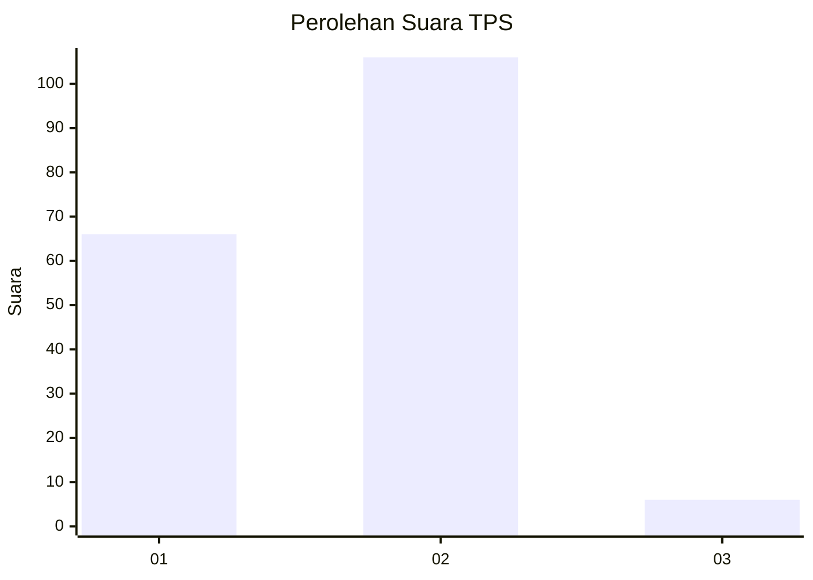
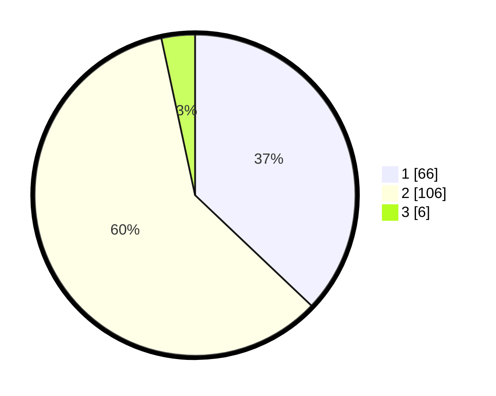

# Hasil

## Grafik

## Tabel

| No. | Nama Paslon    | Suara | Suara (raw) | Persentase |
|:--- |:-------------- | -----:| -----------:| ----------:|
| 1   | ANIES MUHAIMIN | 66    | [66][p-1]   | 37,08      |
| 2   | PRABOWO GIBRAN | 106   | [106][p-2]  | 59,55      |
| 3   | GANJAR MAHFUD  | 6     | [6][p-3]    | 3,37       |

[p-1]: https://github.com/gigit-pemilu/pemilu-2024/blob/main/pilpres/hitung-suara/sub/32-jawa-barat/sub/01-bogor/sub/21-nanggung/sub/2001-malasari/sub/004-tps/sub/paslon-1.txt
[p-2]: https://github.com/gigit-pemilu/pemilu-2024/blob/main/pilpres/hitung-suara/sub/32-jawa-barat/sub/01-bogor/sub/21-nanggung/sub/2001-malasari/sub/004-tps/sub/paslon-2.txt
[p-3]: https://github.com/gigit-pemilu/pemilu-2024/blob/main/pilpres/hitung-suara/sub/32-jawa-barat/sub/01-bogor/sub/21-nanggung/sub/2001-malasari/sub/004-tps/sub/paslon-3.txt

## Foto C Plano

https://sirekap-obj-formc.kpu.go.id/930c/pemilu/ppwp/32/01/21/20/01/3201212001004-20240214-214513--b83169ee-db70-44b4-8def-c6b09327afd6.jpg

https://sirekap-obj-formc.kpu.go.id/930c/pemilu/ppwp/32/01/21/20/01/3201212001004-20240214-214654--f92a355c-3c62-4087-a2b1-35f12d9bd6ef.jpg

https://sirekap-obj-formc.kpu.go.id/930c/pemilu/ppwp/32/01/21/20/01/3201212001004-20240214-214758--3d0e850b-31b6-4ef8-be69-1146cdae387d.jpg

## Metadata

| Key        | Value               |
| ---------- | ------------------- |
| Time Stamp | 2024-02-16 09:00:28 |

