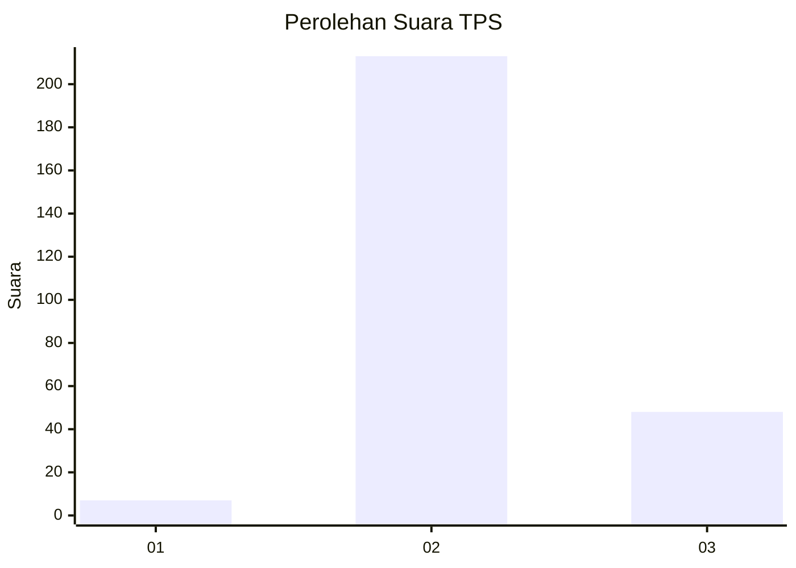

# Hasil

## Grafik

## Tabel

| No. | Nama Paslon    | Suara | Suara (raw) | Persentase |
|:--- |:-------------- | -----:| -----------:| ----------:|
| 1   | ANIES MUHAIMIN | 7     | [7][p-1]    | 2,61       |
| 2   | PRABOWO GIBRAN | 213   | [213][p-2]  | 79,48      |
| 3   | GANJAR MAHFUD  | 48    | [48][p-3]   | 17,91      |

[p-1]: https://github.com/gigit-pemilu/pemilu-2024-32-jawa-barat/blob/main/pilpres/hitung-suara/sub/32-jawa-barat/sub/01-bogor/sub/21-nanggung/sub/2001-malasari/sub/020-tps/sub/paslon-1.txt
[p-2]: https://github.com/gigit-pemilu/pemilu-2024-32-jawa-barat/blob/main/pilpres/hitung-suara/sub/32-jawa-barat/sub/01-bogor/sub/21-nanggung/sub/2001-malasari/sub/020-tps/sub/paslon-2.txt
[p-3]: https://github.com/gigit-pemilu/pemilu-2024-32-jawa-barat/blob/main/pilpres/hitung-suara/sub/32-jawa-barat/sub/01-bogor/sub/21-nanggung/sub/2001-malasari/sub/020-tps/sub/paslon-3.txt

## Foto C Plano

https://sirekap-obj-formc.kpu.go.id/0d3b/pemilu/ppwp/32/01/21/20/01/3201212001020-20240214-213640--beac9985-bdd2-4e30-847a-a1c6536fdc74.jpg

https://sirekap-obj-formc.kpu.go.id/0d3b/pemilu/ppwp/32/01/21/20/01/3201212001020-20240214-231156--602d636d-bf4e-4d56-976d-7bfe78f4ade5.jpg

https://sirekap-obj-formc.kpu.go.id/0d3b/pemilu/ppwp/32/01/21/20/01/3201212001020-20240214-213710--0c817521-b81c-4e34-9188-cfca9b084212.jpg

## Metadata

| Key        | Value               |
| ---------- | ------------------- |
| Time Stamp | 2024-02-16 09:30:28 |

