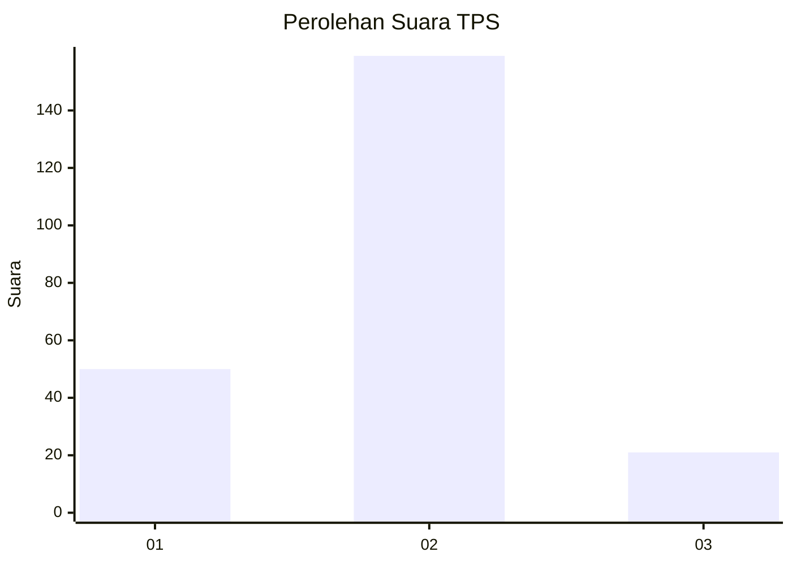

# Hasil

## Grafik

## Tabel

| No. | Nama Paslon    | Suara | Suara (raw) | Persentase |
|:--- |:-------------- | -----:| -----------:| ----------:|
| 1   | ANIES MUHAIMIN | 50    | [50][p-1]   | 21,74      |
| 2   | PRABOWO GIBRAN | 159   | [159][p-2]  | 69,13      |
| 3   | GANJAR MAHFUD  | 21    | [21][p-3]   | 9,13       |

[p-1]: https://github.com/gigit-pemilu/pemilu-2024/blob/main/pilpres/hitung-suara/sub/32-jawa-barat/sub/01-bogor/sub/21-nanggung/sub/2004-bantarkaret/sub/013-tps/sub/paslon-1.txt
[p-2]: https://github.com/gigit-pemilu/pemilu-2024/blob/main/pilpres/hitung-suara/sub/32-jawa-barat/sub/01-bogor/sub/21-nanggung/sub/2004-bantarkaret/sub/013-tps/sub/paslon-2.txt
[p-3]: https://github.com/gigit-pemilu/pemilu-2024/blob/main/pilpres/hitung-suara/sub/32-jawa-barat/sub/01-bogor/sub/21-nanggung/sub/2004-bantarkaret/sub/013-tps/sub/paslon-3.txt

## Foto C Plano

https://sirekap-obj-formc.kpu.go.id/0224/pemilu/ppwp/32/01/21/20/04/3201212004013-20240216-181414--86b57d83-7e8f-45b1-8e83-067600c60edb.jpg

https://sirekap-obj-formc.kpu.go.id/0224/pemilu/ppwp/32/01/21/20/04/3201212004013-20240216-181422--4f3b10a9-5856-4bef-8b18-5ddf17530c51.jpg

https://sirekap-obj-formc.kpu.go.id/0224/pemilu/ppwp/32/01/21/20/04/3201212004013-20240216-181436--ea835ea1-b1cc-4416-8210-c7ed21e5fe36.jpg

## Metadata

| Key        | Value               |
| ---------- | ------------------- |
| Time Stamp | 2024-02-24 22:31:28 |

## DATA PEMILIH TETAP

Jumlah pemilih dalam DPT: **345**.
 * L: **605**.
 * P: **175**.

## DATA PENGGUNA HAK PILIH

Jumlah pengguna hak pilih dalam DPT: **230**.
 * L: **567**.
 * P: **112**.

Jumlah pengguna hak pilih dalam DPTb: **87**.
 * L: **0**.
 * P: **0**.

Jumlah pengguna hak pilih dalam DPK: **74**.
 * L: **3**.
 * P: **7**.

Jumlah pengguna hak pilih: **279**.
 * L: **230**.
 * P: **284**.

## JUMLAH SUARA SAH DAN TIDAK SAH

JUMLAH SELURUH SUARA SAH: **230**.

JUMLAH SUARA TIDAK SAH: **9**.

JUMLAH SELURUH SUARA SAH DAN SUARA TIDAK SAH: **239**.

