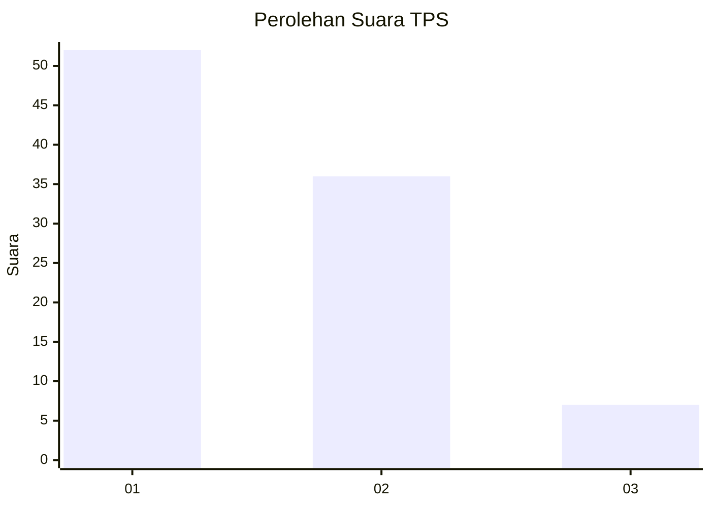
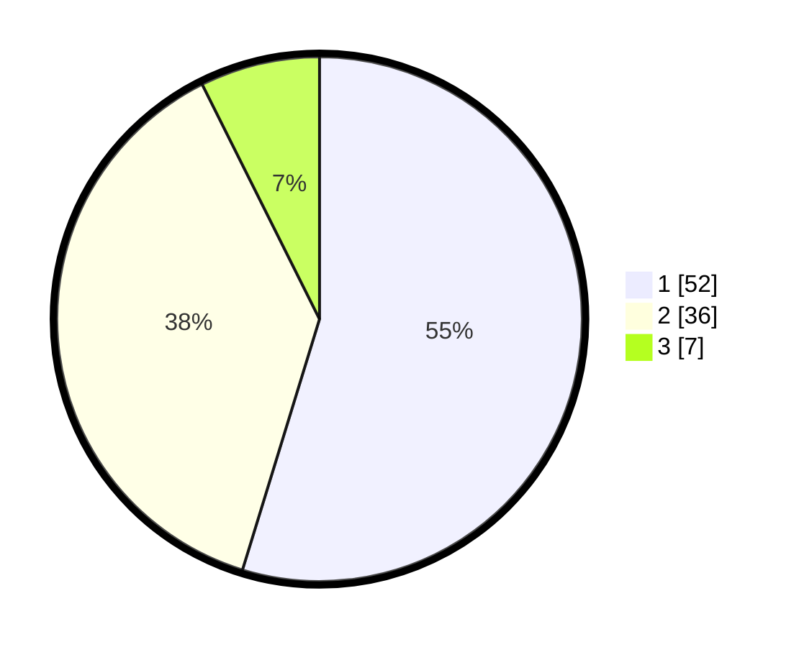

# Hasil

## Grafik

## Tabel

| No. | Nama Paslon    | Suara | Suara (raw) | Persentase |
|:--- |:-------------- | -----:| -----------:| ----------:|
| 1   | ANIES MUHAIMIN | 52    | [52][p-1]   | 54,74      |
| 2   | PRABOWO GIBRAN | 36    | [36][p-2]   | 37,89      |
| 3   | GANJAR MAHFUD  | 7     | [7][p-3]    | 7,37       |

[p-1]: https://github.com/gigit-pemilu/pemilu-2024-32-jawa-barat/blob/main/pilpres/hitung-suara/sub/32-jawa-barat/sub/01-bogor/sub/21-nanggung/sub/2005-hambaro/sub/004-tps/sub/paslon-1.txt
[p-2]: https://github.com/gigit-pemilu/pemilu-2024-32-jawa-barat/blob/main/pilpres/hitung-suara/sub/32-jawa-barat/sub/01-bogor/sub/21-nanggung/sub/2005-hambaro/sub/004-tps/sub/paslon-2.txt
[p-3]: https://github.com/gigit-pemilu/pemilu-2024-32-jawa-barat/blob/main/pilpres/hitung-suara/sub/32-jawa-barat/sub/01-bogor/sub/21-nanggung/sub/2005-hambaro/sub/004-tps/sub/paslon-3.txt

## Foto C Plano

https://sirekap-obj-formc.kpu.go.id/e7d1/pemilu/ppwp/32/01/21/20/05/3201212005004-20240214-233330--c223406d-9843-4229-9008-f91dfecc4456.jpg

https://sirekap-obj-formc.kpu.go.id/e7d1/pemilu/ppwp/32/01/21/20/05/3201212005004-20240214-233408--71dfa896-a08c-45b2-89be-9584a263e522.jpg

https://sirekap-obj-formc.kpu.go.id/e7d1/pemilu/ppwp/32/01/21/20/05/3201212005004-20240214-233539--32148145-5721-45c8-817f-58c3e85bba67.jpg

## Metadata

| Key        | Value               |
| ---------- | ------------------- |
| Time Stamp | 2024-02-16 10:30:29 |

