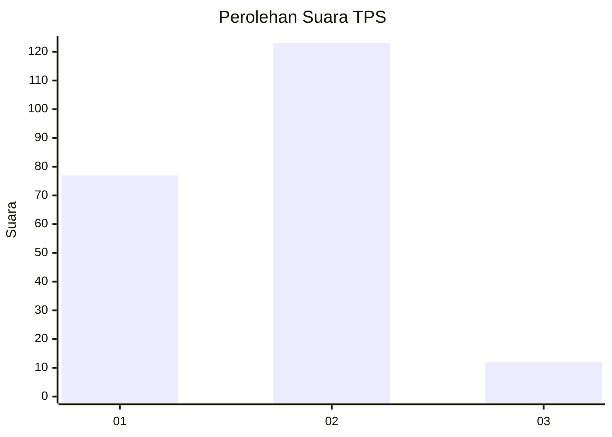
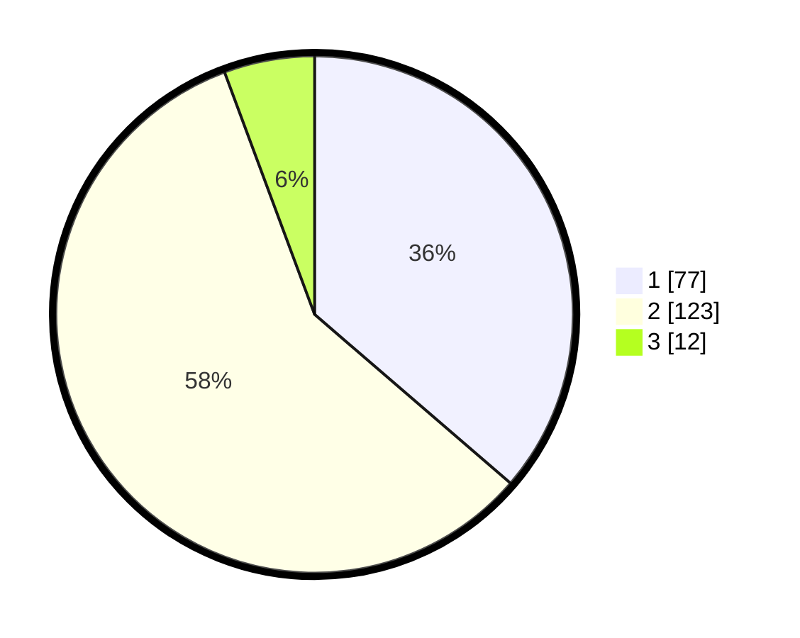

# Hasil

## Grafik

## Tabel

| No. | Nama Paslon    | Suara | Suara (raw) | Persentase |
|:--- |:-------------- | -----:| -----------:| ----------:|
| 1   | ANIES MUHAIMIN | 77    | [77][p-1]   | 36,32      |
| 2   | PRABOWO GIBRAN | 123   | [123][p-2]  | 58,02      |
| 3   | GANJAR MAHFUD  | 12    | [12][p-3]   | 5,66       |

[p-1]: https://github.com/gigit-pemilu/pemilu-2024/blob/main/pilpres/hitung-suara/sub/32-jawa-barat/sub/01-bogor/sub/21-nanggung/sub/2005-hambaro/sub/007-tps/sub/paslon-1.txt
[p-2]: https://github.com/gigit-pemilu/pemilu-2024/blob/main/pilpres/hitung-suara/sub/32-jawa-barat/sub/01-bogor/sub/21-nanggung/sub/2005-hambaro/sub/007-tps/sub/paslon-2.txt
[p-3]: https://github.com/gigit-pemilu/pemilu-2024/blob/main/pilpres/hitung-suara/sub/32-jawa-barat/sub/01-bogor/sub/21-nanggung/sub/2005-hambaro/sub/007-tps/sub/paslon-3.txt

## Foto C Plano

https://sirekap-obj-formc.kpu.go.id/4c64/pemilu/ppwp/32/01/21/20/05/3201212005007-20240214-225025--01c924d5-d519-4ea7-a7d9-bb36b9b5706c.jpg

https://sirekap-obj-formc.kpu.go.id/4c64/pemilu/ppwp/32/01/21/20/05/3201212005007-20240215-080043--bc4e3ece-83f0-45a6-ad01-ec182bb852da.jpg

https://sirekap-obj-formc.kpu.go.id/4c64/pemilu/ppwp/32/01/21/20/05/3201212005007-20240215-080152--62f49d6a-5a89-438c-a8fd-b059e6585959.jpg

## Metadata

| Key        | Value               |
| ---------- | ------------------- |
| Time Stamp | 2024-02-16 10:30:29 |

