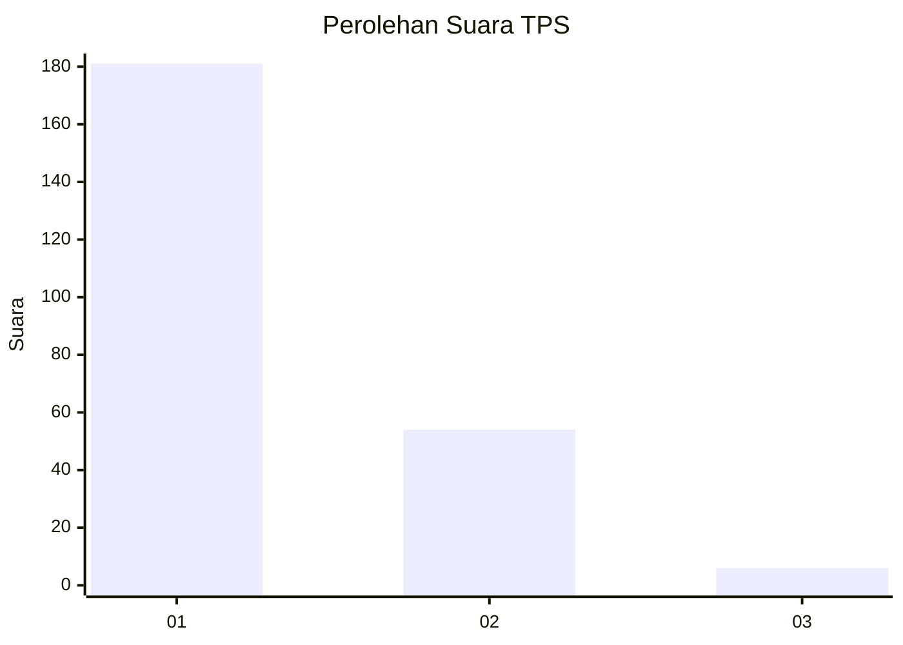
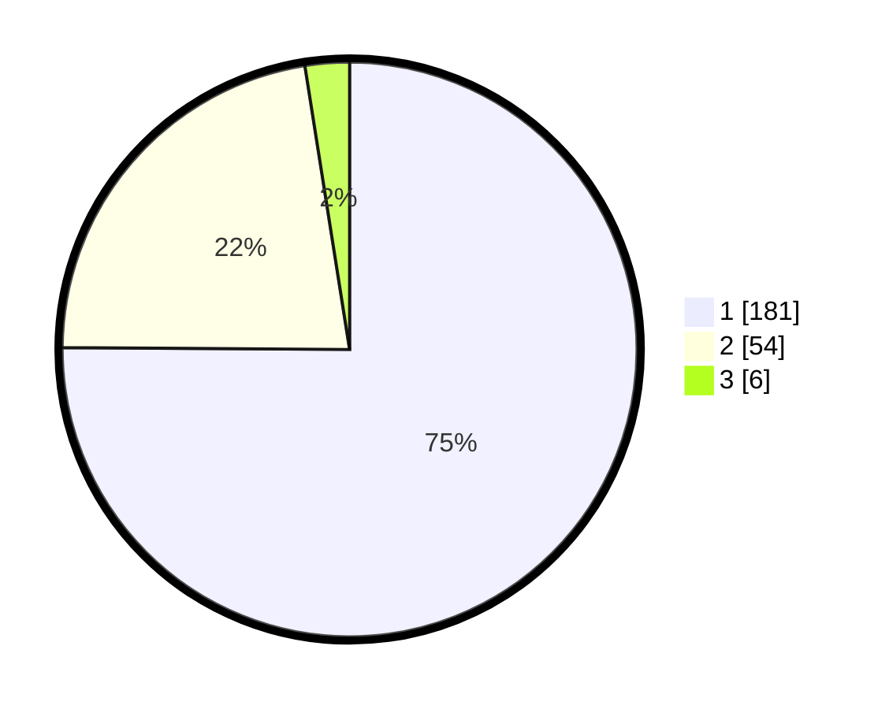

# Hasil

## Grafik

## Tabel

| No. | Nama Paslon    | Suara | Suara (raw) | Persentase |
|:--- |:-------------- | -----:| -----------:| ----------:|
| 1   | ANIES MUHAIMIN | 181   | [181][p-1]  | 75,10      |
| 2   | PRABOWO GIBRAN | 54    | [54][p-2]   | 22,41      |
| 3   | GANJAR MAHFUD  | 6     | [6][p-3]    | 2,49       |

[p-1]: https://github.com/gigit-pemilu/pemilu-2024-32-jawa-barat/blob/main/pilpres/hitung-suara/sub/32-jawa-barat/sub/01-bogor/sub/21-nanggung/sub/2005-hambaro/sub/014-tps/sub/paslon-1.txt
[p-2]: https://github.com/gigit-pemilu/pemilu-2024-32-jawa-barat/blob/main/pilpres/hitung-suara/sub/32-jawa-barat/sub/01-bogor/sub/21-nanggung/sub/2005-hambaro/sub/014-tps/sub/paslon-2.txt
[p-3]: https://github.com/gigit-pemilu/pemilu-2024-32-jawa-barat/blob/main/pilpres/hitung-suara/sub/32-jawa-barat/sub/01-bogor/sub/21-nanggung/sub/2005-hambaro/sub/014-tps/sub/paslon-3.txt

## Foto C Plano

https://sirekap-obj-formc.kpu.go.id/a466/pemilu/ppwp/32/01/21/20/05/3201212005014-20240215-093516--440b713a-4771-4f6a-978e-20b66af92245.jpg

https://sirekap-obj-formc.kpu.go.id/a466/pemilu/ppwp/32/01/21/20/05/3201212005014-20240215-093855--be7c8a20-46e1-4d0e-abe3-d7abe4204d60.jpg

https://sirekap-obj-formc.kpu.go.id/a466/pemilu/ppwp/32/01/21/20/05/3201212005014-20240215-094154--417585a0-4c4d-4de7-99d5-93901c1732c5.jpg

## Metadata

| Key        | Value               |
| ---------- | ------------------- |
| Time Stamp | 2024-02-16 10:30:29 |

