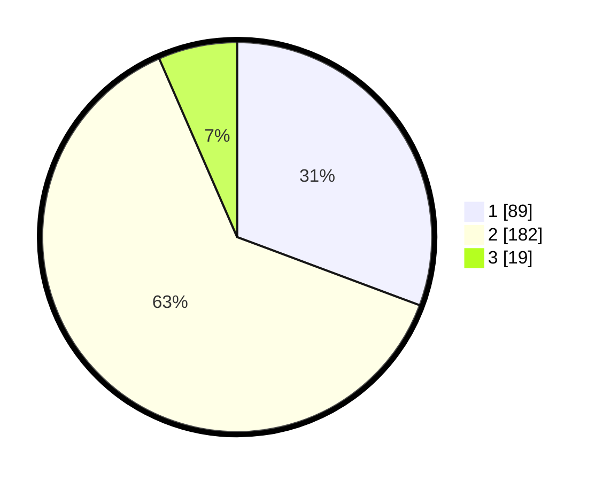

# Hasil

## Grafik

## Tabel

| No. | Nama Paslon    | Suara | Suara (raw) | Persentase |
|:--- |:-------------- | -----:| -----------:| ----------:|
| 1   | ANIES MUHAIMIN | 89    | [89][p-1]   | 30,69      |
| 2   | PRABOWO GIBRAN | 182   | [182][p-2]  | 62,76      |
| 3   | GANJAR MAHFUD  | 19    | [19][p-3]   | 6,55       |

[p-1]: https://github.com/gigit-pemilu/pemilu-2024-32-jawa-barat/blob/main/pilpres/hitung-suara/sub/32-jawa-barat/sub/01-bogor/sub/21-nanggung/sub/2006-kalongliud/sub/012-tps/sub/paslon-1.txt
[p-2]: https://github.com/gigit-pemilu/pemilu-2024-32-jawa-barat/blob/main/pilpres/hitung-suara/sub/32-jawa-barat/sub/01-bogor/sub/21-nanggung/sub/2006-kalongliud/sub/012-tps/sub/paslon-2.txt
[p-3]: https://github.com/gigit-pemilu/pemilu-2024-32-jawa-barat/blob/main/pilpres/hitung-suara/sub/32-jawa-barat/sub/01-bogor/sub/21-nanggung/sub/2006-kalongliud/sub/012-tps/sub/paslon-3.txt

## Foto C Plano

https://sirekap-obj-formc.kpu.go.id/c45a/pemilu/ppwp/32/01/21/20/06/3201212006012-20240215-022747--92dc499e-ff94-42b6-92d1-51702aaeb0d3.jpg

https://sirekap-obj-formc.kpu.go.id/c45a/pemilu/ppwp/32/01/21/20/06/3201212006012-20240215-015702--61fa1c4a-b9a5-4de0-bc2e-a52c9644c075.jpg

https://sirekap-obj-formc.kpu.go.id/c45a/pemilu/ppwp/32/01/21/20/06/3201212006012-20240216-144739--c4119726-a304-413e-ab5e-3ad0bf4ece0b.jpg

## Metadata

| Key        | Value               |
| ---------- | ------------------- |
| Time Stamp | 2024-02-16 16:25:10 |

