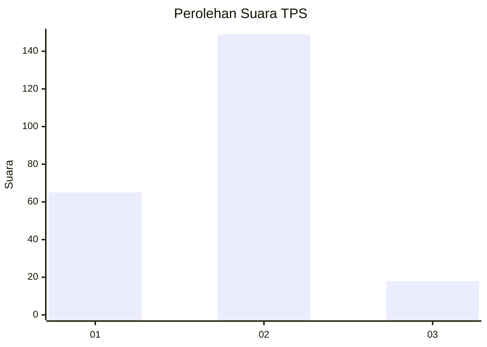
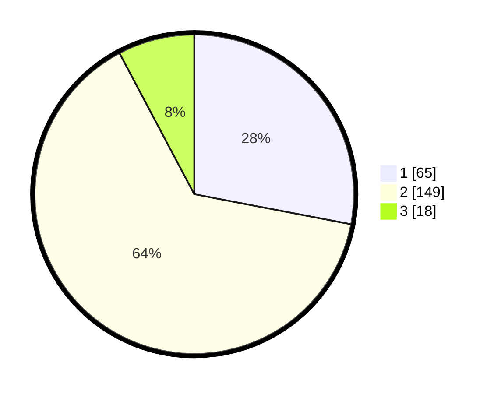

# Hasil

## Grafik

## Tabel

| No. | Nama Paslon    | Suara | Suara (raw) | Persentase |
|:--- |:-------------- | -----:| -----------:| ----------:|
| 1   | ANIES MUHAIMIN | 65    | [65][p-1]   | 28,02      |
| 2   | PRABOWO GIBRAN | 149   | [149][p-2]  | 64,22      |
| 3   | GANJAR MAHFUD  | 18    | [18][p-3]   | 7,76       |

[p-1]: https://github.com/gigit-pemilu/pemilu-2024/blob/main/pilpres/hitung-suara/sub/32-jawa-barat/sub/01-bogor/sub/22-cigudeg/sub/2001-sukamaju/sub/001-tps/sub/paslon-1.txt
[p-2]: https://github.com/gigit-pemilu/pemilu-2024/blob/main/pilpres/hitung-suara/sub/32-jawa-barat/sub/01-bogor/sub/22-cigudeg/sub/2001-sukamaju/sub/001-tps/sub/paslon-2.txt
[p-3]: https://github.com/gigit-pemilu/pemilu-2024/blob/main/pilpres/hitung-suara/sub/32-jawa-barat/sub/01-bogor/sub/22-cigudeg/sub/2001-sukamaju/sub/001-tps/sub/paslon-3.txt

## Foto C Plano

https://sirekap-obj-formc.kpu.go.id/3fc2/pemilu/ppwp/32/01/22/20/01/3201222001001-20240214-211524--d613d1b4-1f96-42ab-bfea-50219ee08f44.jpg

https://sirekap-obj-formc.kpu.go.id/3fc2/pemilu/ppwp/32/01/22/20/01/3201222001001-20240214-211510--fc1ee6c6-4b35-4481-a12a-a57c2eadf832.jpg

https://sirekap-obj-formc.kpu.go.id/3fc2/pemilu/ppwp/32/01/22/20/01/3201222001001-20240214-191737--6338aeb9-5f38-45c8-ae87-6d42535d324c.jpg

## Metadata

| Key        | Value               |
| ---------- | ------------------- |
| Time Stamp | 2024-02-17 14:45:18 |

