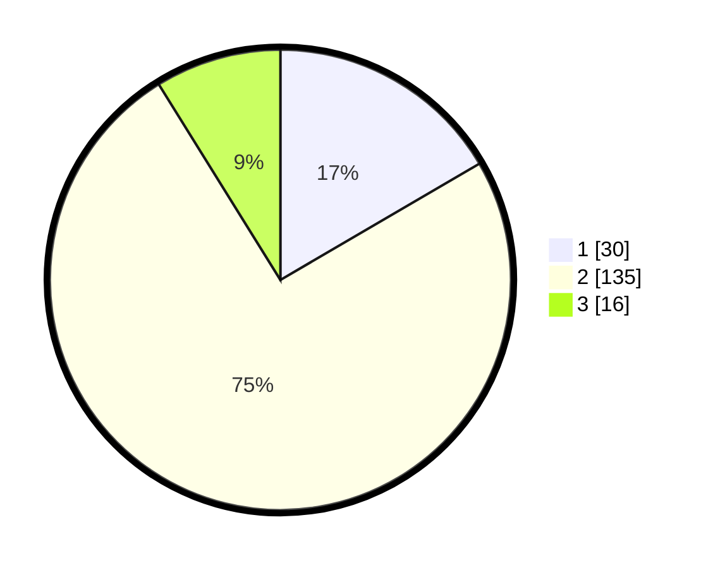

# Hasil

## Grafik

## Tabel

| No. | Nama Paslon    | Suara | Suara (raw) | Persentase |
|:--- |:-------------- | -----:| -----------:| ----------:|
| 1   | ANIES MUHAIMIN | 30    | [30][p-1]   | 16,57      |
| 2   | PRABOWO GIBRAN | 135   | [135][p-2]  | 74,59      |
| 3   | GANJAR MAHFUD  | 16    | [16][p-3]   | 8,84       |

[p-1]: https://github.com/gigit-pemilu/pemilu-2024/blob/main/pilpres/hitung-suara/sub/32-jawa-barat/sub/01-bogor/sub/22-cigudeg/sub/2008-rengasjajar/sub/001-tps/sub/paslon-1.txt
[p-2]: https://github.com/gigit-pemilu/pemilu-2024/blob/main/pilpres/hitung-suara/sub/32-jawa-barat/sub/01-bogor/sub/22-cigudeg/sub/2008-rengasjajar/sub/001-tps/sub/paslon-2.txt
[p-3]: https://github.com/gigit-pemilu/pemilu-2024/blob/main/pilpres/hitung-suara/sub/32-jawa-barat/sub/01-bogor/sub/22-cigudeg/sub/2008-rengasjajar/sub/001-tps/sub/paslon-3.txt

## Foto C Plano

https://sirekap-obj-formc.kpu.go.id/3de3/pemilu/ppwp/32/01/22/20/08/3201222008001-20240215-020645--ae33ebf1-558a-41a9-bc83-435994448ab6.jpg

https://sirekap-obj-formc.kpu.go.id/3de3/pemilu/ppwp/32/01/22/20/08/3201222008001-20240215-020752--98ddafe1-98bd-4016-9f61-230c5e0745ed.jpg

https://sirekap-obj-formc.kpu.go.id/3de3/pemilu/ppwp/32/01/22/20/08/3201222008001-20240215-020906--5e9d60e6-d6b0-4d60-9a5b-e8e66ee74846.jpg

## Metadata

| Key        | Value               |
| ---------- | ------------------- |
| Time Stamp | 2024-02-16 12:51:22 |

