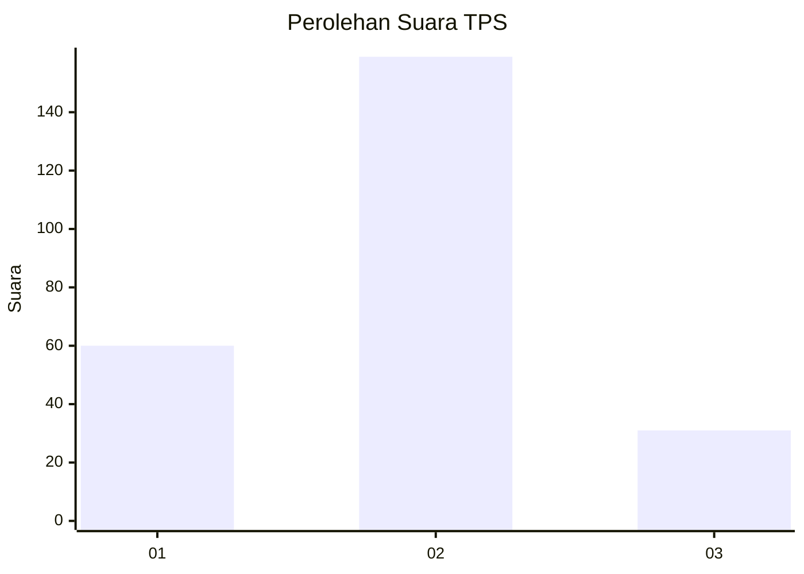
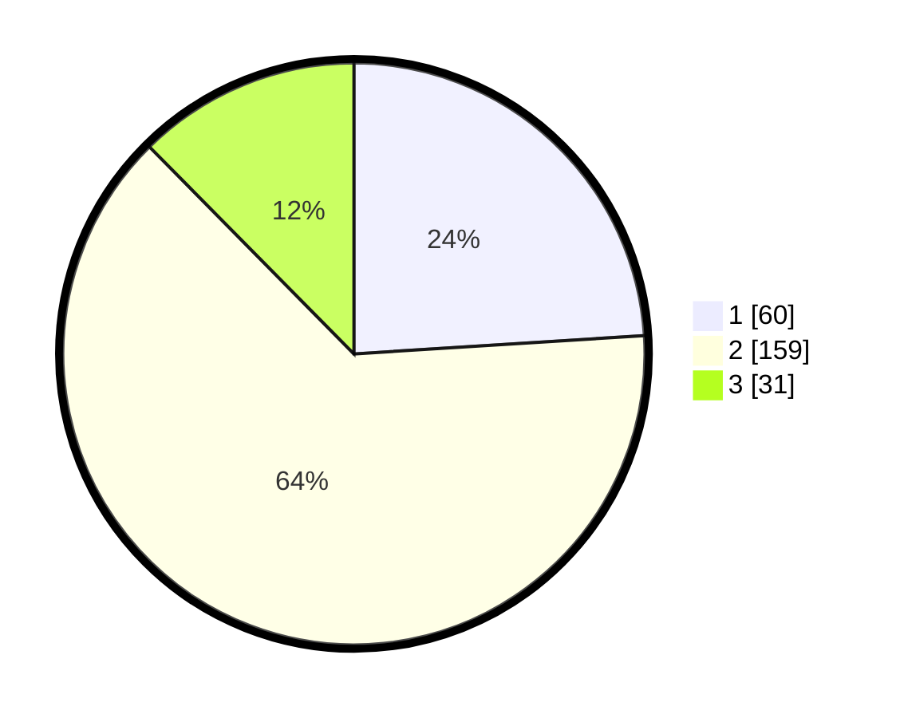

# Hasil

## Grafik

## Tabel

| No. | Nama Paslon    | Suara | Suara (raw) | Persentase |
|:--- |:-------------- | -----:| -----------:| ----------:|
| 1   | ANIES MUHAIMIN | 60    | [60][p-1]   | 24,00      |
| 2   | PRABOWO GIBRAN | 159   | [159][p-2]  | 63,60      |
| 3   | GANJAR MAHFUD  | 31    | [31][p-3]   | 12,40      |

[p-1]: https://github.com/gigit-pemilu/pemilu-2024-32-jawa-barat/blob/main/pilpres/hitung-suara/sub/32-jawa-barat/sub/01-bogor/sub/23-tenjo/sub/2001-tapos/sub/003-tps/sub/paslon-1.txt
[p-2]: https://github.com/gigit-pemilu/pemilu-2024-32-jawa-barat/blob/main/pilpres/hitung-suara/sub/32-jawa-barat/sub/01-bogor/sub/23-tenjo/sub/2001-tapos/sub/003-tps/sub/paslon-2.txt
[p-3]: https://github.com/gigit-pemilu/pemilu-2024-32-jawa-barat/blob/main/pilpres/hitung-suara/sub/32-jawa-barat/sub/01-bogor/sub/23-tenjo/sub/2001-tapos/sub/003-tps/sub/paslon-3.txt

## Foto C Plano

https://sirekap-obj-formc.kpu.go.id/146b/pemilu/ppwp/32/01/23/20/01/3201232001003-20240215-042147--ada44838-f50f-43a5-ac29-80e7a165097b.jpg

https://sirekap-obj-formc.kpu.go.id/146b/pemilu/ppwp/32/01/23/20/01/3201232001003-20240215-042302--40cb8515-7550-4d22-b199-15e8155f7fe9.jpg

https://sirekap-obj-formc.kpu.go.id/146b/pemilu/ppwp/32/01/23/20/01/3201232001003-20240215-042611--60c00a7f-ff4d-461f-ba7f-8ef126d9a954.jpg

## Metadata

| Key        | Value               |
| ---------- | ------------------- |
| Time Stamp | 2024-02-15 22:00:27 |

