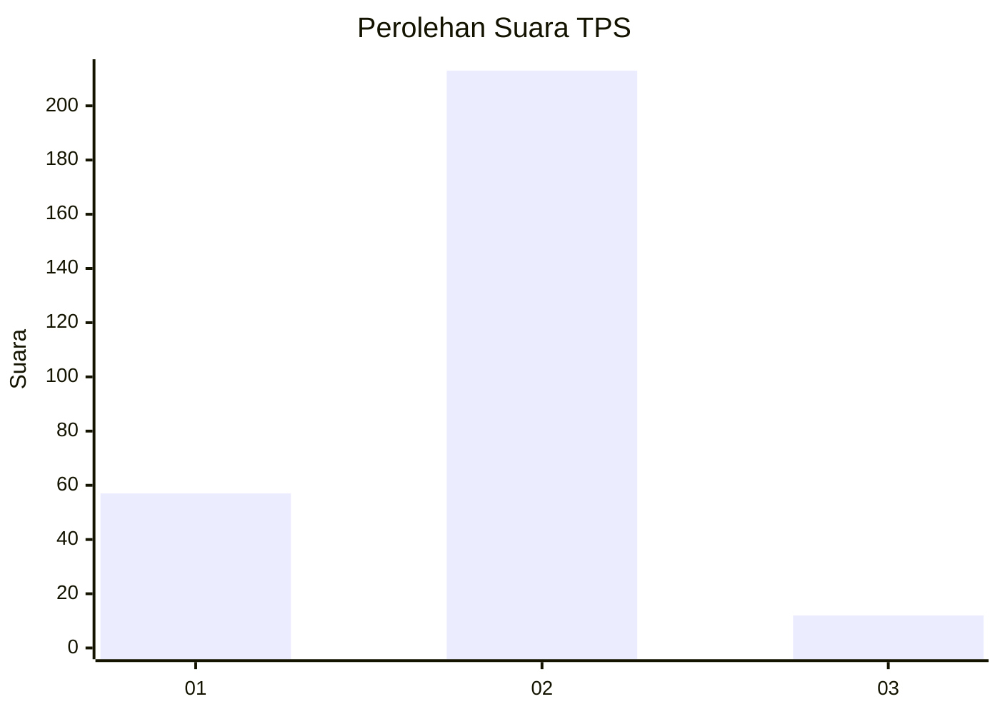
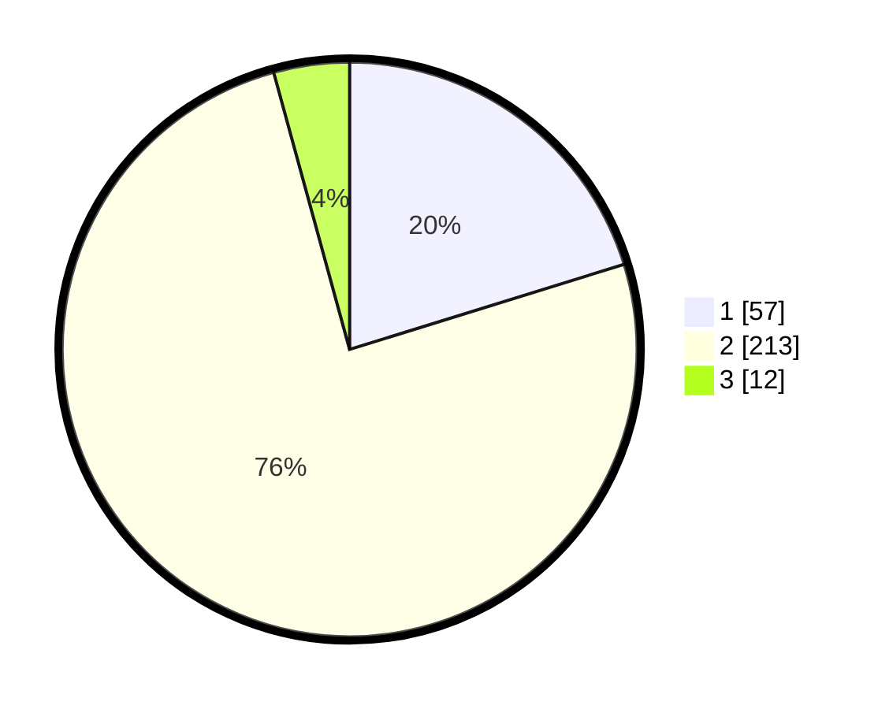

# Hasil

## Grafik

## Tabel

| No. | Nama Paslon    | Suara | Suara (raw) | Persentase |
|:--- |:-------------- | -----:| -----------:| ----------:|
| 1   | ANIES MUHAIMIN | 57    | [57][p-1]   | 20,21      |
| 2   | PRABOWO GIBRAN | 213   | [213][p-2]  | 75,53      |
| 3   | GANJAR MAHFUD  | 12    | [12][p-3]   | 4,26       |

[p-1]: https://github.com/gigit-pemilu/pemilu-2024/blob/main/pilpres/hitung-suara/sub/32-jawa-barat/sub/01-bogor/sub/23-tenjo/sub/2003-batok/sub/003-tps/sub/paslon-1.txt
[p-2]: https://github.com/gigit-pemilu/pemilu-2024/blob/main/pilpres/hitung-suara/sub/32-jawa-barat/sub/01-bogor/sub/23-tenjo/sub/2003-batok/sub/003-tps/sub/paslon-2.txt
[p-3]: https://github.com/gigit-pemilu/pemilu-2024/blob/main/pilpres/hitung-suara/sub/32-jawa-barat/sub/01-bogor/sub/23-tenjo/sub/2003-batok/sub/003-tps/sub/paslon-3.txt

## Foto C Plano

https://sirekap-obj-formc.kpu.go.id/ce6a/pemilu/ppwp/32/01/23/20/03/3201232003003-20240219-103059--19f08310-99d5-435b-97cd-f24dccb3cfb6.jpg

https://sirekap-obj-formc.kpu.go.id/ce6a/pemilu/ppwp/32/01/23/20/03/3201232003003-20240219-103642--7ac87eb5-50a6-4ead-ab81-4b7a7c0e0e39.jpg

https://sirekap-obj-formc.kpu.go.id/ce6a/pemilu/ppwp/32/01/23/20/03/3201232003003-20240219-103809--9d7b59a2-faaf-4bf2-80b3-4a15ecaa86ca.jpg

## Metadata

| Key        | Value               |
| ---------- | ------------------- |
| Time Stamp | 2024-02-24 22:31:28 |

